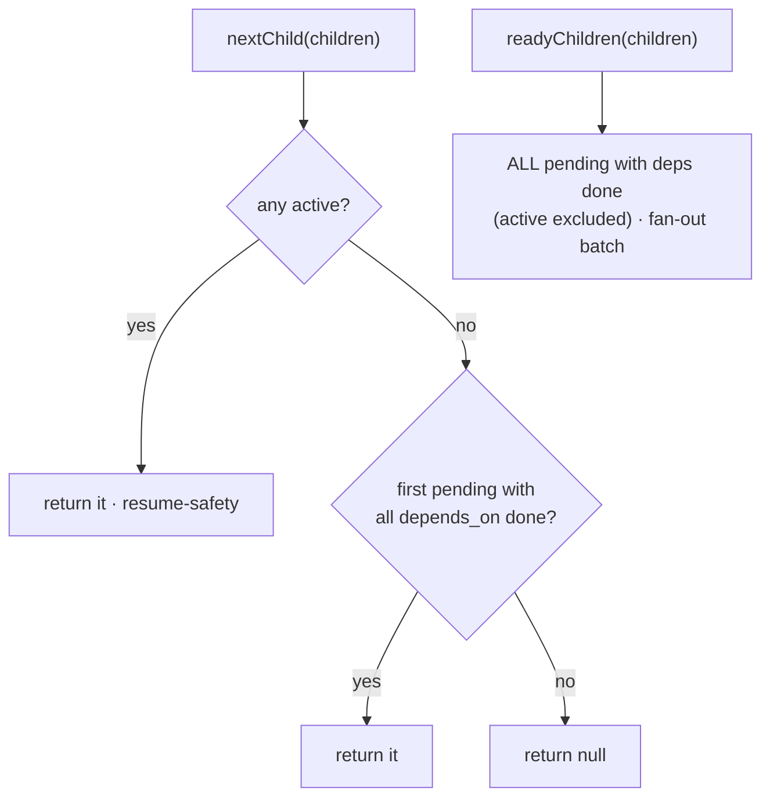

← [store](../_store.md)

# children

Pure child-list helpers — no factory, no effect, just functions over a `ChildLike[]`
(`{ slug, status, depends_on? }`). They answer "what runs next?" for the build loop
and "what's added/reordered?" for the child collection. The [node-store](../node-store/node-store.md)
verbs delegate to them.

## What

- **`nextChild(children) → child | null`** — the **sequential** pick: an active
  child (`in-progress`/`active`) wins first (resume-safety); else the first
  `pending` child whose every `depends_on` is `done`; else `null` (nothing
  runnable).
- **`readyChildren(children) → child[]`** — the **fan-out batch**: every `pending`
  child with all dependencies `done`. Drives the epic build loop's parallel launch.
  Distinct from `nextChild` (single, sequential); already-active children are
  **excluded** (in flight, not to launch).
- **`addChild(children, child) → child[]`** — append, throwing `DuplicateSlug` on a
  collision.
- **`moveChild(children, slug, toIndex) → child[]`** — reorder; throws
  `UnknownChild` if the slug is absent.

## How



Usage signature:

```ts
const next = nextChild(node.phases)        // one for the sequential path
const batch = readyChildren(node.tasks)    // all for the epic parallel fan-out
```

## Why

Dependency-aware selection is what makes the rolling-wave build work: `nextChild`
preferring an active child first is resume-safety (a crashed loop picks up where it
left off), and `readyChildren` is the parallel-fan-out counterpart for the epic
tier.
