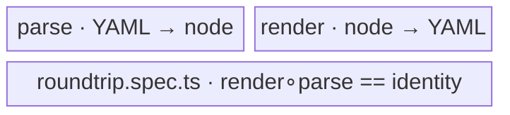

← [store](../_store.md)

# codec

The YAML↔node **codec** — the two directions of the on-disk representation:
[parse](parse/parse.md) turns YAML text into a typed, schema-validated node;
[render](render/render.md) turns a node back into a YAML string with the schema
directive. A root-level roundtrip spec (`roundtrip.spec.ts`) locks the two together:
what `render` writes, `parse` must read back unchanged.

| Area | Responsibility (scope boundary) |
|---|---|
| [parse](parse/parse.md) | `createParser(deps)` — YAML → typed node. Two profiles (`task-file` no-alias + version-gated, `anchored.yml` alias-ok), size cap, schema validation. |
| [render](render/render.md) | `createRenderer(deps)` — node → YAML string. Auto-injects the schema directive on line 1; prose → block-scalar; no FS write. |
