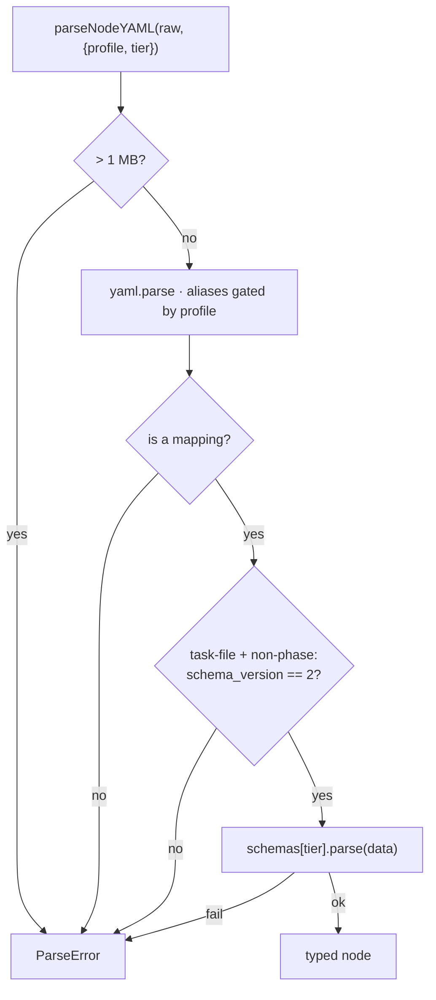

← [store](../../_store.md) ▸ [codec](../_codec.md)

# parse

`createParser(deps)` — YAML text → typed, schema-validated node. The `yaml` parser
and the per-tier `schemas` are injected seams (fakeable; no FS, no effects). Two
**profiles** govern the parse: `task-file` (node files — no aliases, version-gated)
and `anchored.yml` (config — aliases allowed for `_lib` reuse).

## What

- **`createParser({ yaml, schemas }) → { parseNodeYAML(raw, { profile, tier }) }`** —
  one parse entry point parametrised by profile + tier.
- **Size cap** — input over `SIZE_CAP` (1 MB) throws `ParseError` (guard against
  pathological inputs), checked first.
- **Profile-gated aliases** — `task-file` parses with `maxAliasCount: 0` (forbids
  YAML aliases — alias-bomb / reference trickery); `anchored.yml` allows them. A
  YAML failure is wrapped as `ParseError (profile)`.
- **Must be a mapping** — a non-object / array / null top level throws `ParseError`.
- **`schema_version` gate** — node files (`task-file`, non-`phase` tier) must carry
  `schema_version: 2`; a missing or mismatched version throws `ParseError`. Runs
  **before** generic schema validation.
- **Tier schema validation** — looks up `schemas[tier]` (unknown tier → `ParseError`
  listing known tiers), then `schema.parse(data)`; a failure is wrapped as
  `ParseError (tier)`. Returns the parsed node.

## How



Usage signature:

```ts
const parser = createParser({ yaml, schemas })
const node = parser.parseNodeYAML(raw, { profile: 'task-file', tier: 'task' })
```

## Why

The two profiles encode a security/flexibility split: untrusted-shaped node files
get the hardened no-alias, version-gated read; the config the user authors gets the
ergonomic alias-allowed read. Injecting `yaml` + `schemas` keeps the codec pure and
fully fakeable.
