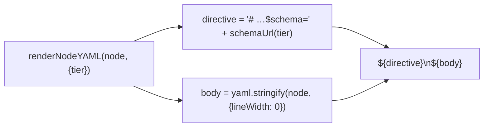

← [store](../../_store.md) ▸ [codec](../_codec.md)

# render

`createRenderer(deps)` — node → YAML string. The inverse of [parse](../parse/parse.md).
It auto-injects the schema directive on line 1 and emits prose as block-scalars.
Pure — it produces a string; the FS write is [io](../../io/io.md), not here.

## What

- **`createRenderer({ yaml, schemaUrl }) → { renderNodeYAML(node, { tier }) }`** —
  the `yaml` stringifier and the `schemaUrl(tier)` resolver are injected.
- **Schema directive on line 1** — prepends
  `# yaml-language-server: $schema=<schemaUrl(tier)>`. Because comments don't
  round-trip through the parser, the renderer is the **single canonical injection
  point** for the directive. `defaultSchemaUrl(tier)` points at the published
  per-tier JSON schema.
- **Stringify settings** — `yaml.stringify(node, { lineWidth: 0 })`: wrapping
  disabled (long scalars stay intact), multiline strings emit as literal
  block-scalars (`|`), key order preserved, output ends with a single newline.

## How



Usage signature:

```ts
const renderer = createRenderer({ yaml, schemaUrl: defaultSchemaUrl })
const text = renderer.renderNodeYAML(node, { tier: 'task' })   // → io.atomicWrite(...)
```

## Why

The directive must survive every write, and since the parser strips comments the
renderer is the one place that can guarantee it — so editors keep their schema
hints. `lineWidth: 0` + block-scalars keep authored prose readable and stable
across rewrites (no surprise re-wrapping), which is what makes the roundtrip spec
hold.
