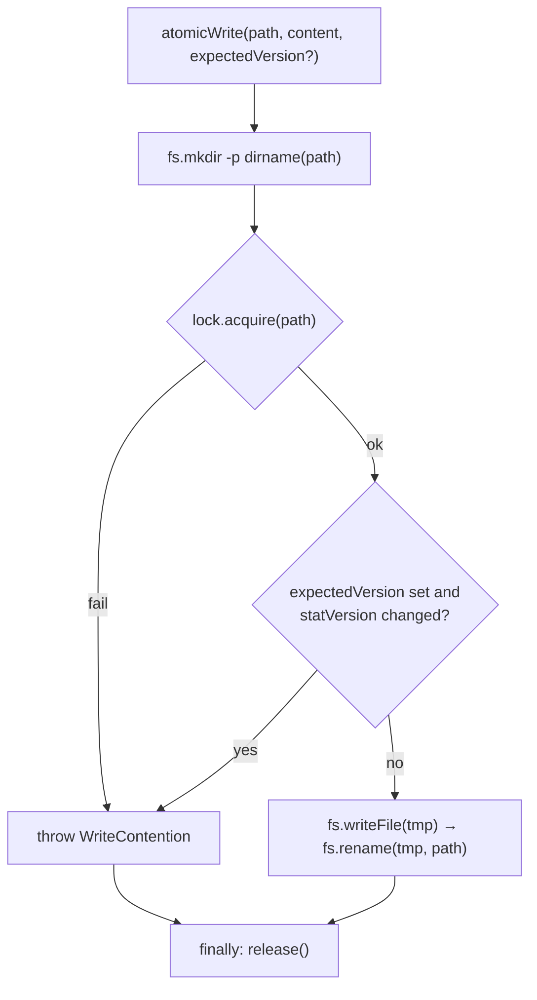

← [store](../_store.md)

# io

`createIo(deps)` — the atomic-write substrate, the only thing in the store that
touches the filesystem (through injected seams). `fs`, `lock`, `rand`, `pid` are all
injected (fakeable in tests; no `node:fs` in the write logic). `node:path.dirname`
is a pure utility, so importing it is fine.

## What

- **`createIo({ fs, lock, rand, pid }) → { atomicWrite, readFile, remove, move,
  statVersion }`**.
- **`atomicWrite(path, content, expectedVersion?)`** — the safe write:
  1. `fs.mkdir(dirname(path), { recursive: true })` — parent dir lazily (nested
     `<epic>/<slug>`).
  2. `lock.acquire(path)` — cross-process lock; a failure throws `WriteContention`.
  3. **compare-and-swap** — under the lock, if `expectedVersion` is set and
     `fs.statVersion(path)` differs, a concurrent write landed → throw
     `WriteContention` (**no write performed**); the caller re-reads + retries.
  4. write a temp sibling `${path}.tmp.${pid}.${rand}`, then `fs.rename(tmp, path)`
     — POSIX rename is atomic, so a half-written file is never visible.
  5. **always** release the lock (`finally`).
- **`readFile(path)`** — pass-through to `fs.readFile`.
- **`remove(path)`** — delete a file outright (task `reset`), behind the seam.
- **`move(from, to)`** — relocate a file (task `archive`): `mkdir -p` the
  destination dir first (the `archive/` subdir may not exist), then atomic rename.
- **`statVersion(path)`** — the cheap version token (mtime+size) used for the
  compare-and-swap; `undefined` when the fake fs lacks it (disables CAS).

## How



Usage signature:

```ts
const io = createIo({ fs, lock, rand, pid })
await io.atomicWrite(path, render(node), expectedVersion)   // lock + CAS + rename
```

## Why

The lock alone can't prevent the real hazard. Temp+rename is already atomic, so the
danger is a **stale read-modify-write** in the parallel epic fan-out — a writer that
read an old version and would clobber a concurrent update. Compare-and-swap is what
catches that and rejects it loudly, so the kernel's "write the ORIGINAL node" stance
([node-store](../node-store/node-store.md)) never silently overwrites a peer.
