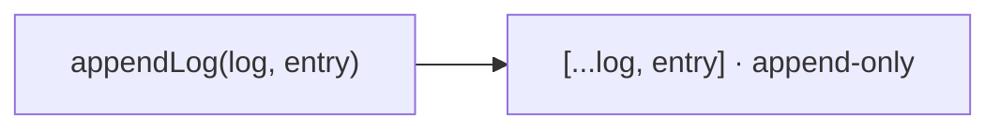

← [store](_store.md)

# log

Append-only audit trail — one pure function over a `LogEntry[]`
(`{ at, kind, note }`). A single file (no folder), the smallest unit in the store.

## What

- **`appendLog(log, entry) → LogEntry[]`** — returns a new array with `entry`
  appended. An entry is **only ever appended**; existing entries are never mutated
  or removed.

## How



Usage signature:

```ts
const next = appendLog(node.log, { at: now(), kind: 'transition', note: 'plan→refine' })
```

## Why

Append-only is the audit guarantee: the history of what happened to a node can be
read forward and never silently rewritten — the same integrity stance as
forward-only transitions, applied to the trail.
