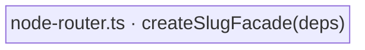

← [store](../_store.md)

# node-router

The slug→tier→op **router** — `createSlugFacade(deps)`. It wraps the tier-generic
[node-store](../node-store/node-store.md) behind a flat slug-verb surface the CLI
drives: take a slug, derive its tier from the file shape, read the node, apply the
verb, persist. All the await-bearing glue lives here (not in `index.ts`, which
stays a pure await-free wiring factory). It also **defines** the `NodeOpsFacade`
type — the CLI imports it FROM here (cli → store, downward).

| Area | Responsibility (scope boundary) |
|---|---|
| [node-router](node-router.md) | The facade factory, the `NodeOpsFacade` surface, the read-then-apply pattern, tier derivation, auto-id helpers, and the file-only lifecycle ops (`archive` / `reset`). |
