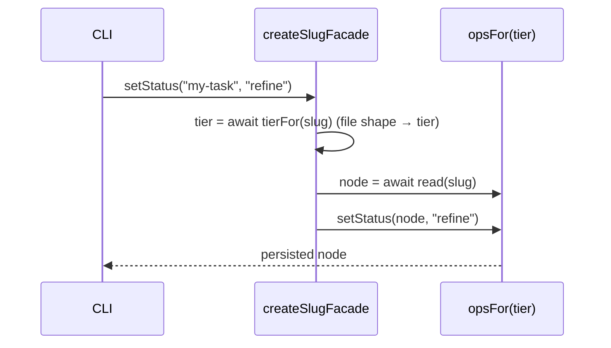

← [store](../_store.md) ▸ [node-router](_node-router.md)

# node-router

`createSlugFacade(deps) → NodeOpsFacade` — the slug-based surface the CLI drives.
Where [node-store](../node-store/node-store.md) operates on an already-loaded
`AnyNode`, the facade operates on a **slug**: it derives the tier, reads the node,
applies the matching tier-op, and returns the persisted result. It is the seam
where the await glue lives, so `index.ts` can stay a pure, await-free wiring
factory.

## What

- **`NodeOpsFacade` is defined HERE** — the flat verb surface (`create`, `read`,
  `setStatus`, `addChild`, `addEvidence`, `addPhase`, `addAc`, `addChildEvidence`,
  `setChildFailures`, `setPhaseRules`, `archive`, `reset`, …). The CLI imports the
  type from the store so the dependency runs downward (cli → store); it previously
  lived in `cli/cli.ts` and was imported upward — relocated by q15, type-only.
- **Every verb is read-then-apply** — the shape is uniform:
  `o = opsFor(await tierFor(slug)); return o.<verb>(await o.read(slug), …)`.
  `tierFor(slug)` derives the tier from the persisted **file shape** (`tasks[]` →
  epic, `phases[]` → task) — the file is the SSOT, no slug-default guessing.
- **`create` is told its tier explicitly** — the file doesn't exist yet to derive
  from. It seeds the tier shape (`schema_version: 2`, `title`, `created` via the
  injected `now` clock seam; `tasks: []` for an epic) so later reads can derive the
  tier from content. `tier` itself is **not** a stored field.
- **Auto-id ergonomics** — `addAc` fills the next free `a<N>` id (`nextAcId`) when
  the caller omits one; `addPhase` / `addChild` default the child status to
  `pending` and pass through `goal` / `depends_on` (seeding the dependency edge at
  creation, F2).
- **Lifecycle ops bypass the tier-ops on purpose** — `archive(slug)` MOVES the
  task-file to `archive/<slug>.yml` (freeze it out of the active set);
  `reset(slug)` REMOVES it (back to before it existed). They move/delete the file
  as a unit via the injected `io.move`/`io.remove`, they do not mutate its
  contents. `archivePathFor` derives the destination from `pathFor` (no hardcoded
  `.claude/tasks`); `requireExists` makes both fail LOUD on a missing node
  (`UnknownNode`, never a silent no-op).

## How



Usage signature:

```ts
const facade = createSlugFacade({ opsFor, tierFor, defaultStatus, now, pathFor, io })
await facade.addEvidence('my-task', 'a1', 'tests green')   // read-derive-apply-persist
await facade.archive('old-task')                            // file move, no content mutation
```

## Why

One flat slug surface is what a CLI-only transport
([cli-only-transport](../../../../.claude/rules/cli-only-transport.md)) needs: a verb +
a slug is all an agent over Bash can pass. Concentrating the `await` glue here keeps
the wiring root pure and fakeable; deriving the tier from file shape rather than a
slug convention keeps the file the single source of truth.
