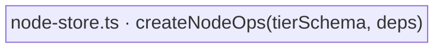

← [store](../_store.md)

# node-store

The read-modify-write **kernel** of the store — `createNodeOps(tierSchema, deps)`.
One tier-generic op core, parametrised over a tier descriptor (no per-tier
duplication), exposing the verbs that mutate a single node. This is the seat of the
two guarantees the whole substrate exists to protect: the **hard invariant** (no
`ac → done` without `evidence`) and **forward-only transitions** — both enforced
HERE, at the writing op, never in a step that could be skipped.

| Area | Responsibility (scope boundary) |
|---|---|
| [node-store](node-store.md) | The factory, its `persist` core (validate-then-write), the verb roster (status / AC / evidence / children / questions / concerns / log), and the guards each verb enforces before any write. |
