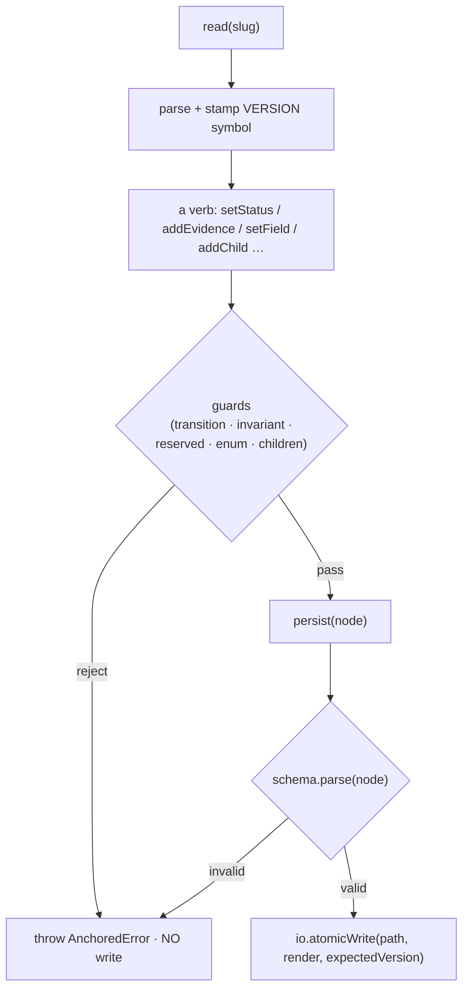

← [store](../_store.md) ▸ [node-store](_node-store.md)

# node-store

`createNodeOps(tierSchema, deps)` — the tier-generic read-modify-write kernel. One
factory serves every tier; the `tierSchema` (a `TierDescriptor`: tier name, status
enum, child tier, Zod schema) parametrises it. Every mutation is **read → modify →
validate → persist** through the injected `io.atomicWrite` seam, so the node is
never left in partial state, and the hard invariant + transitions are checked at
the write — the one place they cannot be bypassed.

## What

- **`createNodeOps(tierSchema, deps) → { read, create, setStatus, … }`** — the
  factory returns a flat object of mutation verbs over an `AnyNode`. The only
  injected effect is `io`; `render`, `parse`, `pathFor` are also injected.
- **`persist(node)` is the single write path** — it `tierSchema.schema.parse(node)`
  **before** writing (fail-closed: an invalid mutation surfaces here, never bricks
  the node for the next reader), then `io.atomicWrite(pathFor(slug), render(node),
  expectedVersion)`. A schema failure is flattened into a located `InvalidNode`
  error (`tier 'slug' is invalid at <field>: <msg>`); **no write is performed**.
- **`setStatus` enforces forward-only transitions** — `assertTransition` first, and
  on `→ done` a three-part completion gate: `assertNodeCompletable` (every AC
  evidence-backed), **no open concern** (`ConcernsOpen`), and **every child
  terminal-OK** (`ChildrenIncomplete`; `done`/`deferred` for phases, `done` for
  task/epic stubs).
- **The hard invariant lives in the AC verbs** — `setAcStatus` / `setChildAcStatus`
  call `assertAcDoneHasEvidence` before persisting a `→ done`; `addEvidence` /
  `addChildEvidence` append evidence and flip the AC `done` **atomically** (single
  write), retiring any prior `failures` (H4). `setAcceptanceStatus` applies the
  same floor one tier up (`assertEpicAcHasEvidence` on an epic DoD item).
- **The failures-driven re-do loop** — `setChildFailures` writes failures + flips a
  child AC back to `pending` (prior evidence survives as history); a later
  `addChildEvidence` re-passes it and retires the failures. `clearChildFailures` is
  the manual escape hatch.
- **Reserved-field guard** — `setField` / `setChildField` refuse `RESERVED_FIELDS`
  (`status`, `executor`, `acceptance*`, `evidence`, `failures`, `phases`, `tasks`,
  `questions`, `log`) on the **top** path segment, so a generic `set-field` can
  never teleport a status or shadow a managed collection. Dotted paths set nested
  fields immutably (`context.wrap` without clobbering `context.plan`).
- **`setChildStatus` double-guards** — the value must be in the child tier's status
  enum (`CHILD_STATUS`, `InvalidChildStatus`), and a `→ done` requires the child's
  own ACs all `done` (`ChildIncomplete`) — defence-in-depth alongside `persist`'s
  full-node validation.
- **Child / question / concern / log verbs delegate to the pure helpers** —
  `addChild`/`moveChild`/`nextChild`/`readyChildren` → `children/`, `addQuestion`/
  `resolveQuestion` (and `addConcern`/`resolveConcern`, same machinery, `c`-prefix
  ids) → `questions/`, `appendLog` → `log`.
- **Compare-and-swap (M4)** — `read` stamps the file's version (from
  `io.statVersion`) onto the node via a private `VERSION` symbol (invisible to
  schema + render); `persist` threads it into `atomicWrite` as `expectedVersion`,
  so a stale read-modify-write is rejected loudly instead of clobbering a
  concurrent writer.

## How



Usage signature:

```ts
const ops = createNodeOps(taskDescriptor, { io, render, parse, pathFor })
const node = await ops.read('my-task')
await ops.addEvidence(node, 'a1', ['tests green: 42 pass'])  // → flips a1 done, atomic
```

## Why

Tier-generic so a new tier is a descriptor, not a copied op file
([factory-functions](../../../../.claude/rules/factory-functions.md)). Validate-then-write
in one `persist` is the integrity floor: the schema, the transition check, and the
evidence invariant all sit on the only path to disk — there is no second way to
write a node, so there is no way to skip them.
