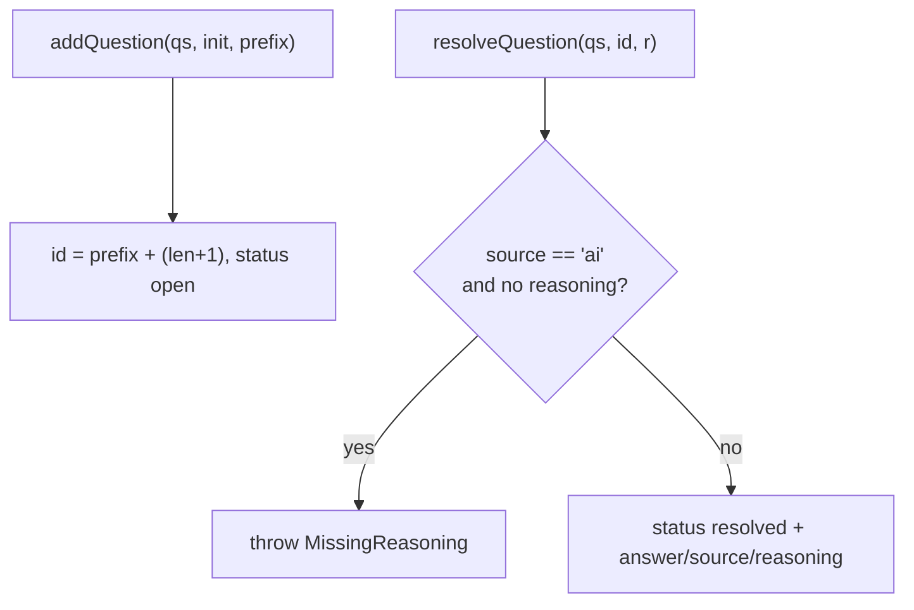

← [store](../_store.md)

# questions

Pure Q&A helpers — functions over a `Question[]`. `add` assigns a sequential id +
`status: open`; `resolve` records answer/source/reasoning + `status: resolved`. The
same machinery backs **concerns** (the [node-store](../node-store/node-store.md)
calls `addQuestion` with a `c` id-prefix for `addConcern`).

## What

- **`addQuestion(questions, init, idPrefix = 'q') → Question[]`** — appends a
  question with id `${idPrefix}${len+1}` (so `q1, q2, …` for questions, `c1, c2, …`
  for concerns), `status: open`, carrying `text` + `priority` (+ optional `origin`).
- **`resolveQuestion(questions, id, resolution) → Question[]`** — flips the matching
  question to `resolved`, writing `answer` + `source` (+ optional `reasoning`).
- **Decision-trail invariant** — a `source: 'ai'` resolution with no `reasoning`
  throws `MissingReasoning`. An AI decision must record WHY (read by `/a:wrap`); a
  user decision needn't.

## How



Usage signature:

```ts
const qs = addQuestion(node.questions, { text: 'wrap or refactor?', priority: 'high' })
const done = resolveQuestion(qs, 'q1', { answer: 'wrap', source: 'ai', reasoning: '…' })
```

## Why

The reasoning floor on AI answers is the decision-trail value: an autonomous
resolution that leaves no trail of why is exactly what `/a:wrap` needs to surface —
so the substrate refuses to record one.
