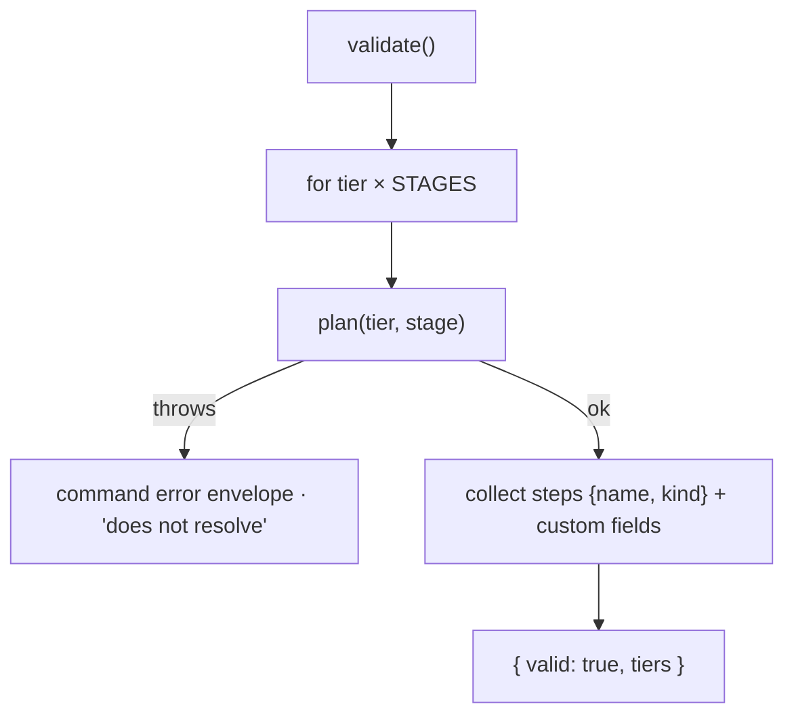

← [store](../_store.md)

# validate

`createValidator(config, plan)` — the validation **surface** behind `anchored
validate`. It proves the merged `anchored.yml` resolves across every tier×stage and
reports the resolved step shape + declared custom fields. It imports `STAGES` from
the domain (`domain/lifecycle/stages`).

## What

- **`createValidator(config, plan) → { validate() }`** — `config` is the merged
  per-tier config (for the custom `fields`); `plan(tier, stage)` is the step-plan
  resolver.
- **`validate() → ValidationReport`** — for each tier in `['phase','task','epic']`
  × each stage in `STAGES` (`plan`/`refine`/`build`/`wrap`), it calls
  `plan(tier, stage)` and collects each step's `{ name, kind }`, plus the tier's
  declared custom `fields`. Returns `{ valid: true, tiers }`.
- **Resolution failure IS the validation signal** — `plan()` throws on a malformed
  tier/stage step config; that surfaces as the command's error envelope, which is
  exactly the "your yml doesn't resolve" report. Bootstrap already parsed the Config
  schema, so a structurally invalid yml never reaches here (`bin.ts` catches the
  `ConfigError` first).

## How



Usage signature:

```ts
const validator = createValidator(effectiveConfig, stepsPlanner.plan)
const report = validator.validate()   // the setup-skill's final check
```

## Why

The verifier the setup-skill runs as its final check: it lets a user see what a
possibly very large yml actually expands to per tier×stage, and turns a
non-resolving config into a loud error instead of a runtime surprise mid-build.
