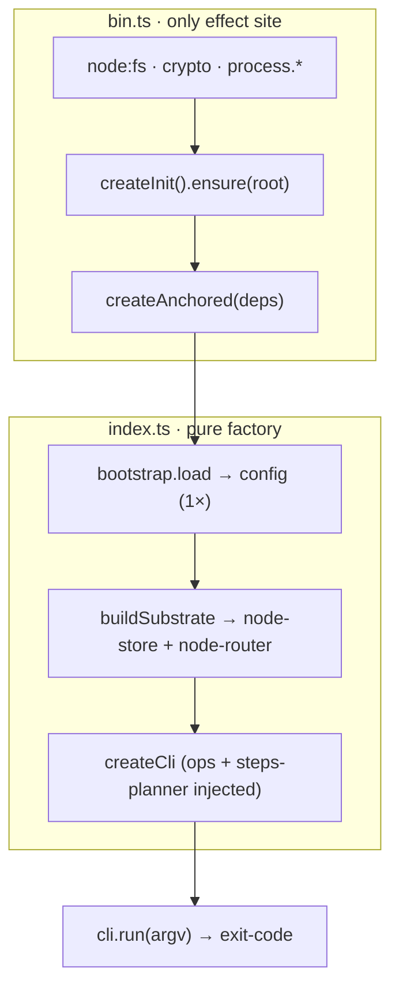

← [core](_core.md)

# wiring (Composition-Root)

The **composition** of the package — two files, one hard dividing line: `index.ts` is
the **pure wiring factory** (no effect), `bin.ts` is the **only effect site**
(`process.*`, `node:fs`, `crypto`, top-level `await`). `bin.ts` wires the real
Node effects into `createAnchored` and drives the CLI — that is precisely what keeps
`index.ts` pure and thus fakeable.

## What

- **`index.ts` — `createAnchored(deps) → { cli, ops, config }`:** bootstraps
  the merged config **exactly once** (base dependency) and wires the layers
  in **deps-graph order**: `store (codec/io → node-store → node-router) →
  orchestration → cli`. No top-level side
  effect, no classes, no runtime access. Every effect (fs, yaml, merge) comes
  through an injected seam → the whole graph is fakeable (wiring tests inject
  spy sub-factories via `deps.wiring`). There is no engine in the graph: the
  headless engine-run chain was removed, the in-session skill orchestrates
  through the CLI.
- **`buildCli(WireDeps)`:** the leaner slug facade + cli wiring for the
  e2e harness.
- **`bin.ts`:** builds the real `io`/`fs`/`lock`/`rand`/`pid` effects, calls
  [`createInit(...).ensure(root)`](config/init.md) (lazy-init) **before**
  `createAnchored`, then `anchored.cli.run(process.argv.slice(2))` → `process.exit`.
  Shebang `#!/usr/bin/env node` (Node compatibility, no `Bun.*`).

## How

Order is a contract: config first, then store → orchestration → cli; each stage
is fed the previous one as a dep. `createAnchoredFn` overrides
(`merge`/`createNodeOps`/`createCli`) allow spy injection.

## Why

Makes the top-level architecture principle concrete: [Factory-Functions](../../.claude/rules/factory-functions.md)
everywhere, effects behind seams. By isolating **all** `process.*`/`fs`/top-level-await in
`bin.ts`, `index.ts` stays a deterministic, fully
fakeable graph — the foundation that lets the [node-router](store/node-router/node-router.md)
carry its await glue, while `index.ts` may not.
