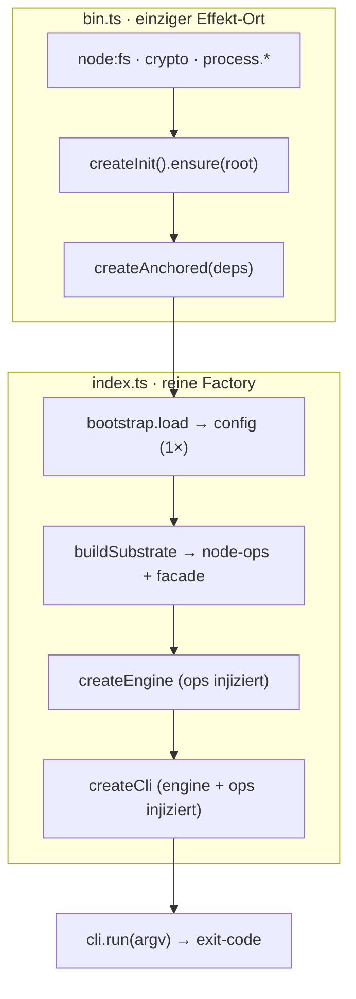

← [core](_core.md)

# wiring (Composition-Root)

Die **Komposition** des Pakets — zwei Dateien, eine harte Trennlinie: `index.ts` ist
die **reine Wiring-Factory** (kein Effekt), `bin.ts` ist der **einzige Effekt-Ort**
(`process.*`, `node:fs`, `crypto`, top-level `await`). `bin.ts` verdrahtet die echten
Node-Effekte in `createAnchored` und fährt die CLI — genau das hält `index.ts` rein
und damit fakebar.

## Was

- **`index.ts` — `createAnchored(deps) → { cli, engine, ops, config }`:** bootstrappt
  die gemergte Config **genau einmal** (Base-Dependency) und verdrahtet das Substrat
  in **deps-Graph-Reihenfolge**: `parser/render/io → ops → engine → cli`. Kein
  Top-Level-Seiteneffekt, keine Klassen, kein Runtime-Zugriff. Jeder Effekt (fs, yaml,
  spawn, merge) kommt durch eine injizierte Naht → der ganze Graph ist fakebar
  (Wiring-Tests injizieren Spy-Sub-Factories über `deps.wiring`).
- **`buildCli(WireDeps)`:** die schlankere slug-facade + cli-Verdrahtung für die
  e2e-Harness (Engine optional gestubbt).
- **`bin.ts`:** baut die realen `io`/`fs`/`lock`/`rand`/`pid`-Effekte, ruft
  [`createInit(...).ensure(root)`](config/init.md) (lazy-init) **vor**
  `createAnchored`, dann `anchored.cli.run(process.argv.slice(2))` → `process.exit`.
  Shebang `#!/usr/bin/env node` (Node-Kompatibilität, kein `Bun.*`).

## Wie

Reihenfolge ist Vertrag: Config zuerst, dann Substrat → ops → engine → cli; jede
Stufe bekommt die vorige als Dep gefüttert. `createAnchoredFn`-Overrides
(`merge`/`createNodeOps`/`createEngine`/`createCli`) erlauben Spy-Injektion.

## Warum

Macht das oberste Architektur-Prinzip konkret: [Factory-Functions](../../.claude/rules/factory-functions.md)
überall, Effekte hinter Nähten. Indem **alle** `process.*`/`fs`/top-level-await in
`bin.ts` isoliert sind, bleibt `index.ts` ein deterministischer, vollständig
fakebarer Graph — die Grundlage dafür, dass [engine-ops](ops/engine-ops.md) und
[facade](ops/facade.md) ihre await-Glue tragen dürfen, `index.ts` aber nicht.
