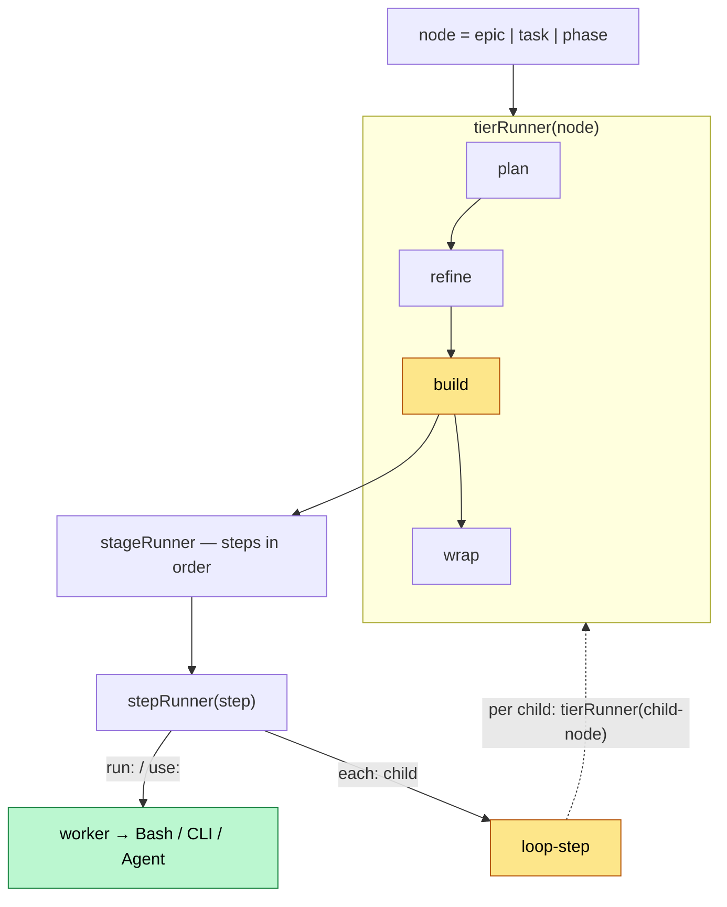
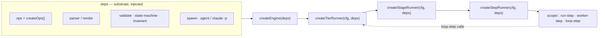

# Engine architecture — fractal factory functions

> Draft / design spec (Item 3). How we build the lifecycle engine: the same
> `createX(cfg, deps) → { run(input) → output }` pattern as the trader modules,
> just applied to the fractal lifecycle.

## The core idea in one sentence

There are **two fractals with the same form**: the **runtime fractal** (what runs
at runtime) and the **code fractal** (how the code is structured). Both nest
`tier → stage → step`, and at the `each` edge the recursion closes.

## Important separation: deterministic engine vs. AI effects

- **Engine = pure code** (testable, robust): control flow (which stage, which
  step), state transitions, `retry`, `stop`, atomic-writes, the substrate
  invariant.
- **Worker steps = AI effects** that the engine *triggers* (via `spawn` →
  agent or `claude -p`). The AI hangs behind an injected `spawn` dep — i.e.
  swappable and replaceable by a fake in tests.

The code part is the core that we test fully; the AI is a pluggable effect.

## Runtime fractal — what runs



Read it like this: a `tierRunner` drives the four stages of a node. A stage
drives its `steps` in order. A step is **either** a worker
(`run:`/`use:` → Bash/CLI/Agent) **or** the loop (`each:`), which per child
recursively calls the `tierRunner` of the child tier. At the leaf (`phase`)
there is no loop — only workers (implement/validate).

## Code fractal — how it's built

Each runtime layer = a **factory function** `createX(cfg, deps)` that returns a
`{ run(input) → output }`. Deeper helpers live in the module's `scope/` folder,
also with a clear input/output.



Sketch (pseudo-TS) to make input/output tangible:

```ts
// each layer: createX(deps) → { run(input) → output }
export function createStepRunner(deps) {
  const { spawn, ops } = deps
  return {
    async run(step, node) {                 // input: step-config + current node
      if (step.run)  return runStep(step, deps)           // scope/run-step.ts
      if (step.use)  return workerStep(step, node, deps)  // scope/worker-step.ts → spawn()
      if (step.each) return loopStep(step, node, deps)    // scope/loop-step.ts → per child: body-steps, then advance+stop
    },                                        // output: { node', status, evidence }
  }
}
```

The `loopStep` is the point where the code fractal closes: it calls the
`tierRunner` of the child tier → recursion. Exactly like the runtime fractal.

## The loop-step has a body (interleaved)

A loop-step carries `each: <tier>` **+ a `steps` body**. Per child the
`loopStep` drives the body in order — **interleaved**: all body-steps for
child A, then all for child B, … (NOT first step-1 across all, then step-2 across
all). For this the `loopStep` reuses the same `stepRunner` on the body → fractal
again, just one layer deeper.

```yaml
epic:
  build:
    steps:
      - { name: setup,  run: '...' }        # once, before the loop
      - name: loop
        each: task
        steps:                               # BODY — per task in order
          - { name: run }                    # built-in: drive this task (headless spawn)
          - { name: commit, run: '...' }     # right after, still on THIS task
      - { name: report, run: '...' }        # once, afterwards
```

Per task: `run → commit`, then the next one. The per-iteration mechanics
(advance the stub status, log, stop-check) the `loopStep` does after the body of
each iteration — built-in. Shorthand `build: { each: task }` = loop with an
implicit body `[run]`.

## What this gives us

- **Testability**: `createStepRunner({ spawn: fakeSpawn, ops: fakeOps })` →
  call `run(step, node)`, assert the output. No real CC needed.
- **Swappability**: switch `spawn` from agent to `claude -p`, or a worker-step
  from MCP to CLI — without touching the tier/stage runners.
- **Extensibility**: a new step type = one file in `scope/`, the contracts
  above stay the same.
- **Robustness**: each layer has input/output contracts; the hard invariant
  (no `done` without `evidence`) sits in `val`/`ops` and bites exactly at the
  step that writes.

## Folder sketch

```
core/
  engine/
    engine.ts               createEngine(deps)
    tier-runner.ts          createTierRunner(cfg, deps)
    stage-runner.ts         createStageRunner(cfg, deps)
    step-runner.ts          createStepRunner(cfg, deps)
    scope/
      run-step.ts           run: → Bash
      worker-step.ts        use: → spawn(agent | claude -p)
      loop-step.ts          each: → createTierRunner(child)
      resolve-steps.ts      inject built-in defaults from anchored.default.yml
  ops/                      createOps() — the existing substrate (stays)
  parser/  validate/  io/   substrate (stays)
```
