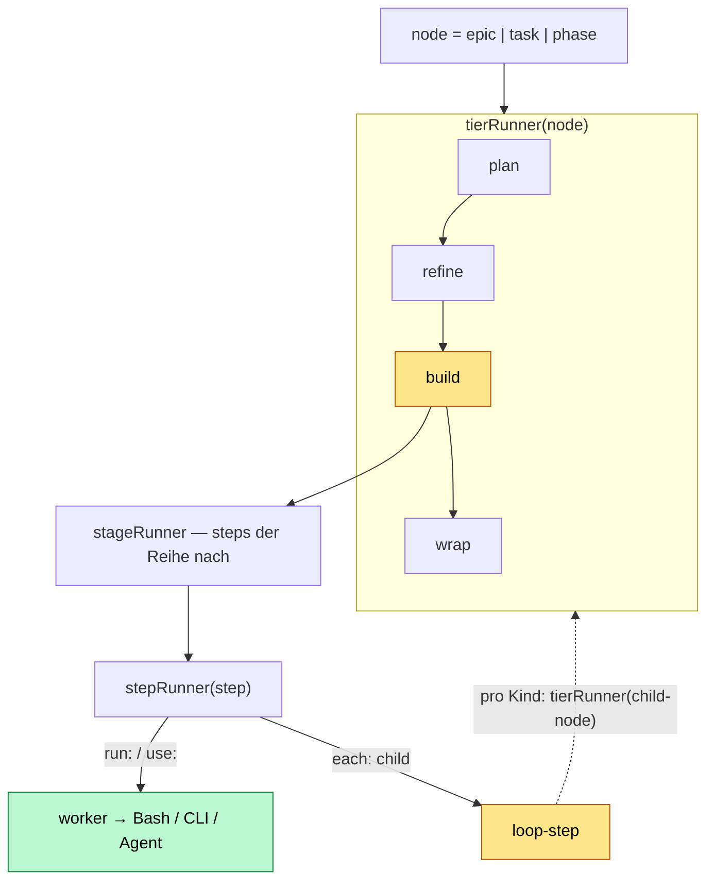
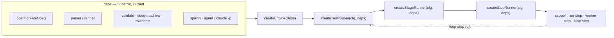

# Engine-Architektur — fraktale Factory-Functions

> Draft / Design-Spec (Item 3). Wie wir die Lifecycle-Engine bauen: dasselbe
> `createX(cfg, deps) → { run(input) → output }`-Pattern wie die trader-Module,
> nur auf den fraktalen Lifecycle angewandt.

## Die Grundidee in einem Satz

Es gibt **zwei Fraktale mit derselben Form**: das **Runtime-Fraktal** (was zur
Laufzeit läuft) und das **Code-Fraktal** (wie der Code aufgebaut ist). Beide
schachteln `tier → stage → step`, und an der `each`-Kante schließt sich die
Rekursion.

## Wichtige Trennung: deterministische Engine vs. AI-Effekte

- **Engine = reiner Code** (testbar, robust): Kontrollfluss (welche Stage,
  welcher Step), State-Transitions, `retry`, `stop`, atomic-writes, die
  Substrat-Invariante.
- **Worker-Steps = AI-Effekte**, die die Engine *triggert* (über `spawn` →
  Agent bzw. `claude -p`). Die AI hängt hinter einer injizierten `spawn`-Dep —
  also austauschbar und im Test durch ein Fake ersetzbar.

Der Code-Teil ist der Kern, den wir voll testen; die AI ist ein pluggable Effekt.

## Runtime-Fraktal — was läuft



Lies es so: ein `tierRunner` fährt die vier Stages eines Knotens. Eine Stage
fährt ihre `steps` in Reihenfolge. Ein Step ist **entweder** ein Worker
(`run:`/`use:` → Bash/CLI/Agent) **oder** der Loop (`each:`), der pro Kind
rekursiv den `tierRunner` der Kind-Etage ruft. Am Leaf (`phase`) gibt's keinen
Loop — nur Worker (implement/validate).

## Code-Fraktal — wie's gebaut ist

Jede Runtime-Ebene = eine **Factory-Function** `createX(cfg, deps)`, die ein
`{ run(input) → output }` zurückgibt. Tiefer liegende Helfer liegen im
`scope/`-Ordner des Moduls, auch mit klarem input/output.



Skizze (Pseudo-TS), damit input/output greifbar ist:

```ts
// jede Ebene: createX(deps) → { run(input) → output }
export function createStepRunner(deps) {
  const { spawn, ops } = deps
  return {
    async run(step, node) {                 // input: step-config + aktueller node
      if (step.run)  return runStep(step, deps)           // scope/run-step.ts
      if (step.use)  return workerStep(step, node, deps)  // scope/worker-step.ts → spawn()
      if (step.each) return loopStep(step, node, deps)    // scope/loop-step.ts → pro Kind: Body-steps, dann advance+stop
    },                                        // output: { node', status, evidence }
  }
}
```

Die `loopStep` ist der Punkt, an dem sich das Code-Fraktal schließt: sie ruft
den `tierRunner` der Kind-Etage → Rekursion. Genau wie das Runtime-Fraktal.

## Der loop-Step hat einen Body (interleaved)

Ein loop-Step trägt `each: <tier>` **+ einen `steps`-Body**. Pro Kind fährt die
`loopStep` den Body der Reihe nach durch — **interleaved**: alle Body-Steps für
Kind A, dann alle für Kind B, … (NICHT erst Step-1 über alle, dann Step-2 über
alle). Dafür reused `loopStep` denselben `stepRunner` auf den Body → wieder
fraktal, nur eine Ebene tiefer.

```yaml
epic:
  build:
    steps:
      - { name: setup,  run: '...' }        # einmal, vor dem Loop
      - name: loop
        each: task
        steps:                               # BODY — pro Task der Reihe nach
          - { name: run }                    # built-in: diese Task fahren (headless spawn)
          - { name: commit, run: '...' }     # direkt danach, noch bei DIESER Task
      - { name: report, run: '...' }        # einmal, danach
```

Pro Task: `run → commit`, dann die nächste. Die Per-Iteration-Mechanik
(Stub-Status fortschreiben, log, stop-check) macht die `loopStep` nach dem Body
jeder Iteration — built-in. Kurzform `build: { each: task }` = loop mit
implizitem Body `[run]`.

## Was uns das bringt

- **Testbarkeit**: `createStepRunner({ spawn: fakeSpawn, ops: fakeOps })` →
  `run(step, node)` aufrufen, Output asserten. Kein echtes CC nötig.
- **Austauschbarkeit**: `spawn` von Agent auf `claude -p` umstellen, oder ein
  Worker-Step von MCP auf CLI — ohne die tier/stage-Runner anzufassen.
- **Erweiterbarkeit**: neuer Step-Typ = eine Datei in `scope/`, die Verträge
  oben bleiben gleich.
- **Robustheit**: jede Ebene hat input/output-Verträge; die harte Invariante
  (kein `done` ohne `evidence`) sitzt in `val`/`ops` und greift genau am Step,
  der schreibt.

## Ordner-Skizze

```
core/
  engine/
    engine.ts               createEngine(deps)
    tier-runner.ts          createTierRunner(cfg, deps)
    stage-runner.ts         createStageRunner(cfg, deps)
    step-runner.ts          createStepRunner(cfg, deps)
    scope/
      run-step.ts           run: → Bash
      worker-step.ts        use: → spawn(agent | claude -p)
      loop-step.ts          each: → createTierRunner(child)
      resolve-steps.ts      Built-in-Defaults aus anchored.default.yml einsetzen
  ops/                      createOps() — das bestehende Substrat (bleibt)
  parser/  validate/  io/   Substrat (bleibt)
```
