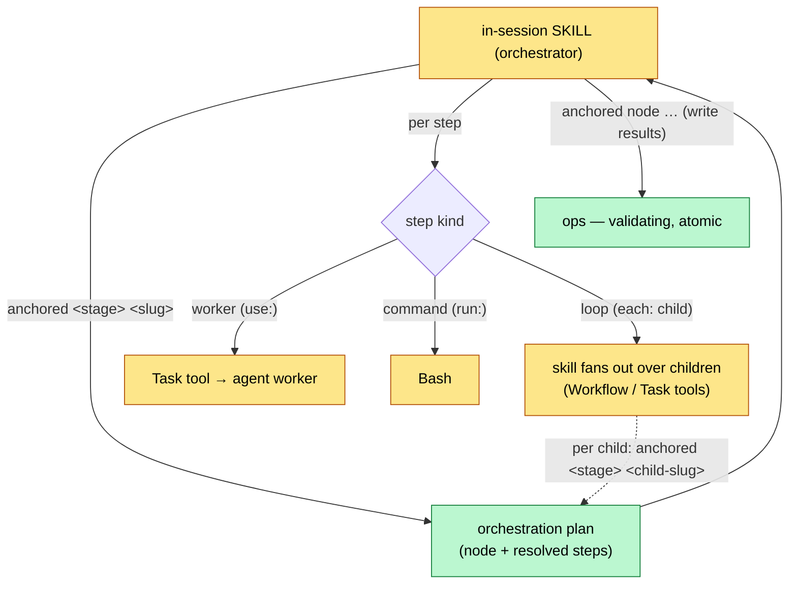
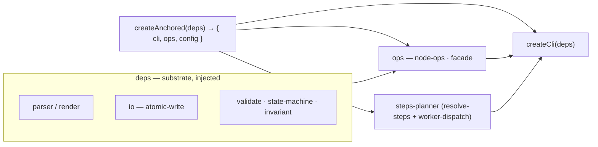

# Engine architecture — skill-orchestrated, factory-function core

> Design spec (Item 3). How the lifecycle runs: the same
> `createX(cfg, deps) → { run(input) → output }` factory pattern as the trader
> modules, applied to the substrate and ops — **driven by the in-session skill,
> not by a headless engine.**
>
> **History note (ABANDONED — `remove-headless-engine-path`):** the original
> design (below, in its first form) had a deterministic *engine* that drove the
> AI: `engine.run → tier-runner → stage-runner → step-runner → worker-step →
> spawn`, with the loop-step recursing into the child tier and `spawn` running a
> headless `claude -p` per task-file. That entire engine-drives-AI path was
> **removed**. Rationale: a headless `claude -p` subprocess can't reach the
> in-session Task / Workflow tools, so it could never actually spawn the workers
> it was designed to orchestrate (dogfood finding F11 / architecture-cleanup A8,
> mirrored in `cli/commands/refine.ts`). The orchestrator is the **in-session
> skill**; the core is the substrate + ops + the `anchored` CLI it calls.

## The core idea in one sentence

The **in-session skill is the orchestrator.** It drives `plan → refine → build →
wrap` by calling the `anchored` CLI over Bash; the CLI returns deterministic,
config-driven **orchestration plans** (which steps, which worker per step) and
performs the **ops** (the substrate mutations). The skill then runs the actual
fan-out — spawning workers, looping over children — itself, via Claude Code's
Task / Workflow tools. AI never lives inside the core; the core is pure,
testable code behind the CLI.

## Who does what

- **Skill (in-session, the orchestrator):** asks the CLI what to do
  (`anchored <stage> <slug>` → an orchestration plan), executes each step —
  running a worker via the Task tool, or fanning out over children itself — and
  writes results back through the ops (`anchored node …`). The loop and the
  spawn live in the skill, where the Task / Workflow tools are reachable.
- **CLI + core (deterministic code, the substrate):** parse the node, resolve
  the config-driven step sequence (steps-planner → resolve-steps), validate, and
  perform every mutation atomically with the hard invariant enforced. Returns
  JSON. Never spawns anything.

## Runtime — what runs



Read it like this: the skill asks the CLI for the stage's orchestration plan
(the node plus its resolved, config-driven steps). For each step it either runs
a worker (the Task tool spawns an agent), runs a Bash command, or — for the
loop (`each: child`) — fans out over the children itself, asking the CLI for
each child's plan in turn. At the leaf (`phase`) there is no loop, only workers
(implement / validate). Every result is written back through the ops, where the
hard invariant bites.

## The core — how it's built (factory functions)

What remains in `core/` is pure substrate + ops, each a **factory function**
`createX(cfg, deps)` returning a `{ run(input) → output }` (engine layers) or
named verbs (ops). Deeper helpers live in the module's `scope/` folder, also
with a clear input/output.



Sketch (pseudo-TS) of the orchestration surface the CLI exposes to the skill:

```ts
// `anchored <stage> <slug>` → the orchestration plan; the SKILL executes it.
export async function runStage(stage, args, deps) {
  const node = await deps.nodeOps.read(slug)
  const steps = deps.steps(node, stage)   // steps-planner: resolve-steps + worker per step
  return { node, stage, steps }           // plan only — the CLI spawns NOTHING
}
```

The step resolution (which steps a stage runs, and which worker each `use:` step
maps to) is the only "engine" logic left, and it is pure config logic:
`ops/steps-planner` calls `engine/scope/resolve-steps` to fill in the default
template's steps, and `ops/scope/worker-dispatch` (the `DEFAULT_WORKERS` roster)
to name the worker per step. No control flow, no spawn — just a deterministic
plan the skill reads.

## The loop is the skill's job (interleaved body)

A loop step carries `each: <tier>` **+ a `steps` body**. The skill drives the
body per child **interleaved**: all body steps for child A, then all for child B
(NOT first one step across all children, then the next). The CLI still resolves
the body's steps per child (the same steps-planner call, one tier deeper), but
the iteration — fanning out, advancing each child's status, the stop-check — is
the skill's, because that is where the Task / Workflow tools live.

```yaml
epic:
  build:
    steps:
      - { name: setup,  run: '...' }        # once, before the loop
      - name: loop
        each: task
        steps:                               # BODY — per task, interleaved
          - { name: run }                    # skill drives this task (Task / Workflow tool)
          - { name: commit, run: '...' }     # right after, still on THIS task
      - { name: report, run: '...' }        # once, afterwards
```

Per task: `run → commit`, then the next one. Shorthand `build: { each: task }` =
a loop with an implicit body `[run]`.

> **Note on `executor`:** the optional `executor` field on a node survives (kept
> per design question q1). It is a hint the build skill reads to choose its own
> fan-out mechanism — for example `executor: workflow` tells the skill to drive
> the children through the Workflow tool. It is a flag the *skill* honors, not an
> engine that runs anything.

## What this gives us

- **Testability**: the core is pure — `createNodeOps`, `createStepsPlanner`,
  `createValidator` take faked seams (`io`, `parse`, `render`) and assert
  outputs. No real Claude Code, no headless subprocess needed.
- **Right place for spawn**: the fan-out lives in the session where the Task /
  Workflow tools actually exist — not in a headless subprocess that can't reach
  them.
- **Extensibility**: a new step type is config in the default template; the
  steps-planner resolves it and the skill executes it.
- **Robustness**: the hard invariant (no `done` without `evidence`) sits in
  `validate`/`ops` and bites at the op that writes — independent of any
  orchestrator.

## Folder sketch

```
core/
  engine/
    scope/
      resolve-steps/          inject the default template's steps + normalize order
                              (the only surviving "engine" logic — pure config)
  ops/                        createNodeOps / facade / steps-planner / validate (the substrate)
    steps-planner/            resolve the concrete step sequence + worker per step for a stage
    scope/worker-dispatch/    DEFAULT_WORKERS roster: which agent a use: step maps to
  parser/  state/  io/        substrate (parser/render, transitions/invariants, atomic-write)
  cli/                        the `anchored` CLI — the only transport (no MCP, no spawn)
```

> The engine-run chain (`engine.ts`, `tier-runner`, `stage-runner`,
> `step-runner`, `run-step`, `worker-step`, `loop-step`, `loop-workflow`) and
> the `spawn/` seam were **removed** with `remove-headless-engine-path`. Only
> `engine/scope/resolve-steps/` remains.
