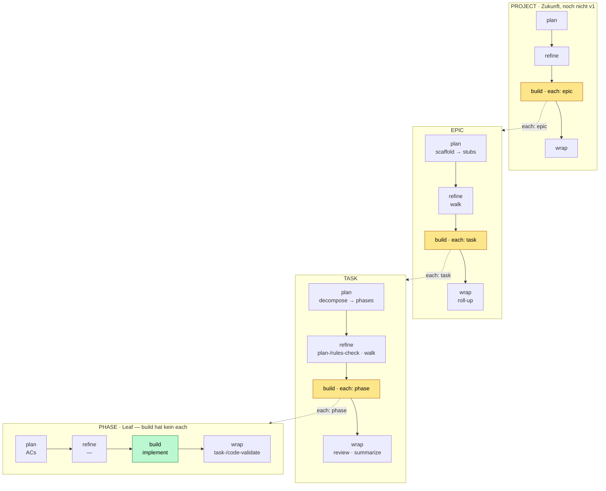

# Fraktaler Lifecycle — project ▸ epic ▸ task ▸ phase

> Draft / Design-Spec. Gehört in dieselbe Familie wie
> `anchored.epic.example.yml` + `_epic.example.yml`, ersetzt aber deren
> Grundannahme: **es gibt nur *eine* Form — `plan/refine/build/wrap` mit
> `steps` — und sie gilt auf *jeder* Etage gleich, von `project` bis `phase`.**

## Die Kernidee

Es gibt **eine** Lebenszyklus-Form, und sie wiederholt sich auf jeder Etage —
inklusive `phase`:

```
plan ─▶ refine ─▶ build ─▶ wrap        (jede Stage = eine steps-Liste)
```

Der **einzige** strukturelle Unterschied zwischen den Etagen: ob `build` ein
`each: <tier>` hat (dann loopt es die Etage darunter) oder nicht (dann ist es
der Leaf und läuft einmal). Sonst ist alles identisch — add/override/
instructions funktioniert überall gleich, nur der *Ort* unterscheidet sich.

| Etage     | `build.each` →  | Loop-Body / Verhalten         |
|-----------|-----------------|-------------------------------|
| project   | `epic`          | loopt den `epic`-Block        |
| epic      | `task`          | loopt den `task`-Block        |
| task      | `phase`         | loopt den `phase`-Block       |
| phase     | *(kein each)*   | **Leaf** — `build` läuft einmal, hier entsteht Code |

`build` auf Etage N = „für jedes Kind: fahre den Tier-Block N−1". Die Rekursion
endet bei `phase`, weil dessen `build` kein `each` hat. **`stop` + `retry_limit`
sind Eigenschaften eines loopenden `build`** (eins *mit* `each`) → man hält auf
jeder Granularität an. Der Leaf-`build` braucht keins.

## Dieselben vier Stages, pro Etage anders gefüllt

Die Built-in-Defaults jeder Stage machen tier-spezifisch „dasselbe in grün".
Alles unten ist **Default** — schreibst du nichts, läuft genau das:

| Stage      | phase                       | task                              | epic                  |
|------------|-----------------------------|-----------------------------------|-----------------------|
| **plan**   | ACs (Definition-of-Done)    | discover → rules-scan → decompose | scaffold (→ stubs)    |
| **refine** | — (leer)                    | plan-check → rules-check → walk    | walk (Stubs klären)   |
| **build**  | `implement`                 | `each: phase`                      | `each: task`          |
| **wrap**   | `task-validate` `code-validate` | review → summarize             | roll-up (DoD + Retro) |

> `project` (später): plan=scope→epics · refine=walk · build=`each: epic` · wrap=roll-up.

Die Semantik ist fraktal stabil:
- **plan** = die Kinder / die Definition-of-Done *erzeugen*
- **refine** = prüfen + offene Fragen *walken*
- **build** = *tun* (Leaf) bzw. die Kinder *abarbeiten* (`each`) — hält bei `stop`
- **wrap** = *reviewen* + abschließen (auf Leaf-Ebene: die Validatoren)

Das frühere `scaffold/walk/loop/roll-up` der epic-Stage verteilt sich verlustfrei
auf epic's vier Stages; und `implement`+Validatoren der heutigen build-Schleife
verteilen sich sauber auf `phase.build` (tun) + `phase.wrap` (reviewen).

## Der Prozess als Diagramm



Jede Etage ist dieselbe Einheit `plan ─▶ refine ─▶ build ─▶ wrap`. Ein `build`
mit `each` (gelb) iteriert die Etage darunter; der Leaf-`build` (grün, `phase`)
läuft einmal und macht echte Arbeit. `stop`/`retry_limit` liegen in jedem
loopenden `build` → Halt auf jeder Granularität.

## Das anchored.yml-Modell

Schlüssel gegen die 10×-Wiederholung: **was du *nicht* schreibst, kommt aus dem
Framework.** Die Built-ins jeder Stage + ihre kanonische Reihenfolge sind fix
(nur per `instructions` erweiterbar, nie entfernbar). Die fraktale Form lebt im
Schema — deine Datei enthält nur Deltas. Die Step-Grammatik aus `step-anatomy`
(name + run XOR use+type + instructions; `involve` auf `walk`) gilt unverändert
*innerhalb* jeder `steps`-Liste.

Das Folgende ist die **vollständige Default-Form** — ein User, der nichts
schreibt, bekommt genau das. Wer will, greift in jede einzelne Stage jeder
Etage ein.

```yaml
# ── phase ▸ Leaf: build hat kein each, läuft einmal ──
phase:
  plan:
    steps: []                         # default: keine — die ACs sind die "Plan"-Daten
  refine:
    steps: []                         # default: leer
  build:
    steps:
      - { name: implement }           # Built-in · die Arbeit
    # kein `each` → Rekursion endet hier
  wrap:
    steps:
      - { name: task-validate }       # Built-in · extend-only, nicht entfernbar
      - { name: code-validate }       # Built-in · extend-only, nicht entfernbar

# ── task ▸ build loopt phases ──
task:
  plan:
    steps:                            # Built-ins
      - { name: discover }
      - { name: rules-scan }
      - { name: decompose }
  refine:
    steps:
      - { name: plan-check }
      - { name: rules-check }
      - { name: walk, involve: high-only }
  build:
    each: phase                       # Loop-Body = der phase-Block oben
    stop:
      - 'a decision deviates from the plan'
    retry_limit: 3                    # so oft wird eine fehlschlagende Phase neu gefahren
  wrap:
    steps:
      - { name: review }
      - { name: summarize }

# ── epic ▸ build loopt tasks ──
epic:
  plan:
    steps:
      - { name: scaffold }            # goal-Prosa → coarse stubs
  refine:
    steps:
      - { name: walk, involve: high-only }
  build:
    each: task                        # Loop-Body = der task-Block oben
    stop:
      - 'an architectural boundary is crossed (layer, DAG, contract)'
    retry_limit: 3
  wrap:
    steps:
      - { name: roll-up }             # DoD gegen epic.acceptance + Retro

# ── project ▸ später — exakt dieselbe Form ──
# project:
#   build: { each: epic }
```

In der Praxis schreibt der User fast nichts (alles Default) und ergänzt
punktuell — z.B. ein `lint`-Step in `phase.build` zwischen implement und
validate, oder ein `instructions:` an `implement`. Die Macht liegt darin, dass
**dieselbe** Mechanik auf jeder Etage greift.

### Offen: `steps` neben `each` im loopenden build

Ein loopender `build` kann `each` *und* eigene `steps` haben. Frage: laufen die
`steps` **einmal** (Setup/Teardown um den Loop) oder **pro Kind**?

Vorschlag (q17-konsistent): Der Loop ist ein **positionierbarer Built-in-Step**
in der `steps`-Liste — du legst eigene Steps davor/danach, genau wie um
`implement`. Per-Kind-Logik gehört in die *Kind-Etage* (z.B. ein custom Step in
`task.wrap` läuft nach jeder Task). Die Kurzform `build: { each: task }` ist
Zucker für „nur der `loop`-Step, keine Wrapper".

```yaml
epic:
  build:
    steps:
      - { name: notify-start, run: '…' }   # einmal, vor dem Loop
      - { name: loop, each: task }          # der Loop-Built-in
      - { name: epic-report, run: '…' }     # einmal, nach dem Loop
    stop: [...]
```

**→ zu bestätigen.**

> Verworfene Alternativen: ein `tiers:`-Namespace (gleiche Form, eine
> Schema-Definition) und geteilte `lifecycle:`-Defaults + Tier-Deltas (maximal
> DRY, aber Merge-Semantik nötig). Beide optimieren ein Problem, das
> „omit → Built-ins" ohnehin löst — auf Kosten von Indirektion. Top-Level-Blöcke
> bleiben am lesbarsten.

## Scope

- **v1 baut**: die Tiers `phase`, `task`, `epic`. `task.build.each: phase` ist
  der bestehende Per-Phase-Build (heute schon da, nur jetzt als eigener
  phase-Block sichtbar). `epic.build.each: task` ist der neue Loop.
- **Schema-reserviert, nicht gebaut**: `project` (und jede tiefere Etage) — das
  Schema akzeptiert die Form, ein Executor kommt später.

## Auswirkung auf den gelockten Plan (`impl-epic-layer`)

Dieses Modell reframed Teile des refined Plans und sollte vor `/impl-build`
eingearbeitet werden (Task zurück auf `drafted`):

- **Phase 1 (unified-step-schema)**: Stage-Form bleibt (Single-List pro Stage),
  aber das Schema bekommt die **Tier-Ebene** darüber (Top-Level-Blöcke
  `phase/task/epic/project`, jeder mit `plan/refine/build/wrap`; `build.each:
  <tier>` optional). Validatoren wandern von `build` nach `phase.wrap`.
- **Phase 3 (epic-manifest-schema)**: unverändert gültig — `_epic.yml` bleibt
  der *Daten*-Layer; das hier ist der *Config/Ausführungs*-Layer.
- **Phase 5 (skill-wiring)**: `epic` ist eine Etage mit vier Stages —
  `/impl-epic` orchestriert `plan/refine/build/wrap` auf epic-Ebene, und
  `epic.build` ruft pro Stub die task-Etage (`/impl-task`).
- **q5/q17**: `plan` bleibt `plan` (kein Stage-Rename); die fraktale Tier-Idee
  ersetzt die „epic-als-eine-Stage"-Annahme.
