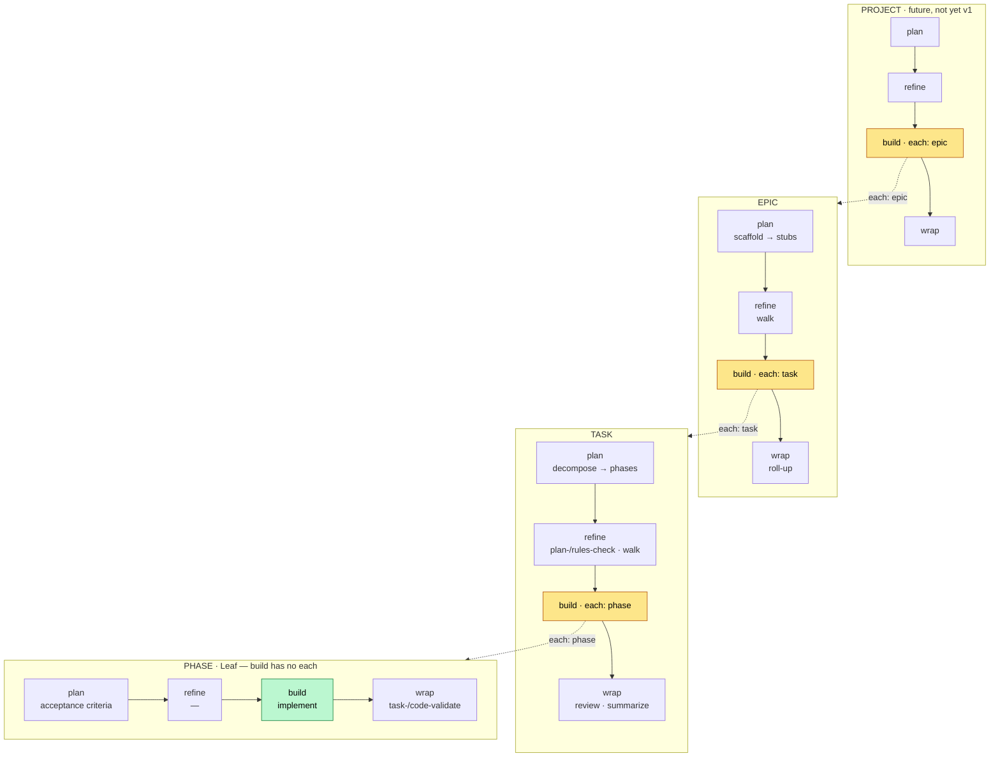

# Fractal Lifecycle — project ▸ epic ▸ task ▸ phase

> Draft / Design-Spec. Belongs to the same family as
> `anchored.epic.example.yml` + `_epic.example.yml`, but replaces their
> core assumption: **there is only *one* form — `plan/refine/build/wrap` with
> `steps` — and it holds on *every* tier alike, from `project` to `phase`.**

## The core idea

There is **one** lifecycle form, and it repeats on every tier —
including `phase`:

```
plan ─▶ refine ─▶ build ─▶ wrap        (each stage = one steps list)
```

The **only** structural difference between the tiers: whether `build` has an
`each: <tier>` (then it loops the tier below) or not (then it is
the leaf and runs once). Otherwise everything is identical — add/override/
instructions work the same everywhere, only the *place* differs.

| Tier      | `build.each` →  | Loop body / behavior          |
|-----------|-----------------|-------------------------------|
| project   | `epic`          | loops the `epic` block        |
| epic      | `task`          | loops the `task` block        |
| task      | `phase`         | loops the `phase` block       |
| phase     | *(no each)*     | **Leaf** — `build` runs once, this is where code is produced |

`build` on tier N = "for each child: run the tier block N−1". The recursion
ends at `phase`, because its `build` has no `each`. **`stop` + `retry_limit`
are properties of a looping `build`** (one *with* `each`) → you can stop on
any granularity. The leaf `build` needs none.

## The same four stages, filled differently per tier

The built-in defaults of each stage do the tier-specific "same thing in green".
Everything below is **default** — if you write nothing, exactly that runs:

| Stage      | phase                       | task                              | epic                  |
|------------|-----------------------------|-----------------------------------|-----------------------|
| **plan**   | acceptance criteria (definition of done)    | discover → rules-scan → decompose | scaffold (→ stubs)    |
| **refine** | — (empty)                   | plan-check → rules-check → walk    | walk (clarify stubs)  |
| **build**  | `implement`                 | `each: phase`                      | `each: task`          |
| **wrap**   | `task-validate` `code-validate` | review → summarize             | roll-up (definition of done + retro) |

> `project` (later): plan=scope→epics · refine=walk · build=`each: epic` · wrap=roll-up.

The semantics are fractally stable:
- **plan** = *produce* the children / the definition of done
- **refine** = check + *walk* open questions
- **build** = *do* (leaf) or *work through* the children (`each`) — stops on `stop`
- **wrap** = *review* + finalize (on leaf level: the validators)

The former `scaffold/walk/loop/roll-up` of the epic stage distributes losslessly
across epic's four stages; and `implement`+validators of today's build loop
distribute cleanly across `phase.build` (do) + `phase.wrap` (review).

## The process as a diagram



Every tier is the same unit `plan ─▶ refine ─▶ build ─▶ wrap`. A `build`
with `each` (yellow) iterates the tier below; the leaf `build` (green, `phase`)
runs once and does real work. `stop`/`retry_limit` live in every
looping `build` → stop on any granularity.

## The anchored.yml model

The key against the 10× repetition: **what you do *not* write comes from the
framework.** The built-ins of each stage + their canonical order are fixed
(only extensible via `instructions`, never removable). The fractal form lives in
the schema — your file contains only deltas. The step grammar from `step-anatomy`
(name + run XOR use+type + instructions; `involve` on `walk`) holds unchanged
*within* each `steps` list.

The following is the **complete default form** — a user who writes nothing
gets exactly that. Whoever wants to can reach into every single stage of every
tier.

```yaml
# ── phase ▸ Leaf: build has no each, runs once ──
phase:
  plan:
    steps: []                         # default: none — the acceptance criteria are the "plan" data
  refine:
    steps: []                         # default: empty
  build:
    steps:
      - { name: implement }           # built-in · the work
    # no `each` → recursion ends here
  wrap:
    steps:
      - { name: task-validate }       # built-in · extend-only, not removable
      - { name: code-validate }       # built-in · extend-only, not removable

# ── task ▸ build loops phases ──
task:
  plan:
    steps:                            # built-ins
      - { name: discover }
      - { name: rules-scan }
      - { name: decompose }
  refine:
    steps:
      - { name: plan-check }
      - { name: rules-check }
      - { name: walk, involve: high-only }
  build:
    each: phase                       # loop body = the phase block above
    stop:
      - 'a decision deviates from the plan'
    retry_limit: 3                    # how often a failing phase is re-run
  wrap:
    steps:
      - { name: review }
      - { name: summarize }

# ── epic ▸ build loops tasks ──
epic:
  plan:
    steps:
      - { name: scaffold }            # goal prose → coarse stubs
  refine:
    steps:
      - { name: walk, involve: high-only }
  build:
    each: task                        # loop body = the task block above
    stop:
      - 'an architectural boundary is crossed (layer, dependency graph, contract)'
    retry_limit: 3
  wrap:
    steps:
      - { name: roll-up }             # definition of done against epic.acceptance + retro

# ── project ▸ later — exactly the same form ──
# project:
#   build: { each: epic }
```

In practice the user writes almost nothing (all default) and supplements
selectively — e.g. a `lint` step in `phase.build` between implement and
validate, or an `instructions:` on `implement`. The power lies in the fact that
**the same** mechanics apply on every tier.

### Open: `steps` alongside `each` in the looping build

A looping `build` can have `each` *and* its own `steps`. Question: do the
`steps` run **once** (setup/teardown around the loop) or **per child**?

Proposal (q17-consistent): the loop is a **positionable built-in step**
in the `steps` list — you place your own steps before/after it, just like around
`implement`. Per-child logic belongs in the *child tier* (e.g. a custom step in
`task.wrap` runs after each task). The shorthand `build: { each: task }` is
sugar for "only the `loop` step, no wrappers".

```yaml
epic:
  build:
    steps:
      - { name: notify-start, run: '…' }   # once, before the loop
      - { name: loop, each: task }          # the loop built-in
      - { name: epic-report, run: '…' }     # once, after the loop
    stop: [...]
```

**→ to be confirmed.**

> Rejected alternatives: a `tiers:` namespace (same form, one
> schema definition) and shared `lifecycle:` defaults + tier deltas (maximally
> DRY, but merge semantics needed). Both optimize a problem that
> "omit → built-ins" already solves anyway — at the cost of indirection. Top-level blocks
> remain the most readable.

## Scope

- **v1 builds**: the tiers `phase`, `task`, `epic`. `task.build.each: phase` is
  the existing per-phase build (already there today, just now visible as its own
  phase block). `epic.build.each: task` is the new loop.
- **Schema-reserved, not built**: `project` (and every deeper tier) — the
  schema accepts the form, an executor comes later.

## Impact on the locked plan (`impl-epic-layer`)

This model reframes parts of the refined plan and should be incorporated before
`/impl-build` (task back to `drafted`):

- **Phase 1 (unified-step-schema)**: the stage form stays (single list per stage),
  but the schema gets the **tier level** above it (top-level blocks
  `phase/task/epic/project`, each with `plan/refine/build/wrap`; `build.each:
  <tier>` optional). Validators move from `build` to `phase.wrap`.
- **Phase 3 (epic-manifest-schema)**: unchanged and valid — `_epic.yml` stays
  the *data* layer; this here is the *config/execution* layer.
- **Phase 5 (skill-wiring)**: `epic` is a tier with four stages —
  `/impl-epic` orchestrates `plan/refine/build/wrap` on the epic level, and
  `epic.build` calls the task tier per stub (`/impl-task`).
- **q5/q17**: `plan` stays `plan` (no stage rename); the fractal tier idea
  replaces the "epic-as-one-stage" assumption.
