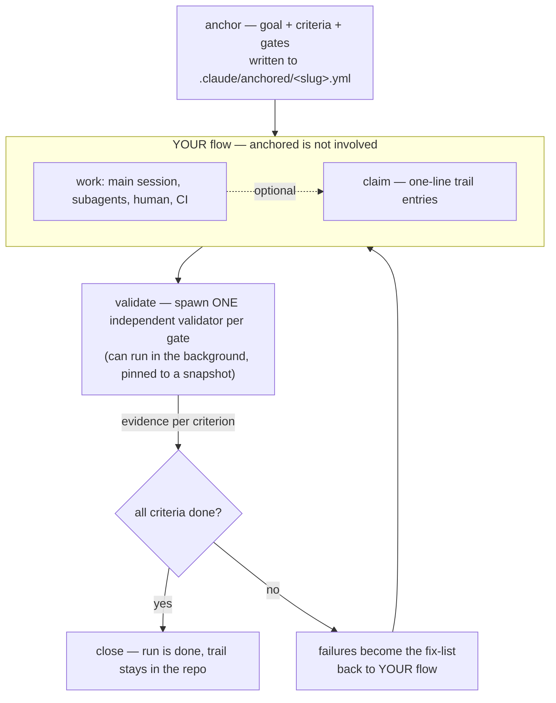

← [docs](../_docs.md)

# North Star — anchored v3

> The design contract for v3. Everything in the codebase must be derivable from
> this page. When a feature idea conflicts with it, the feature loses.

v3 inverts v2. v2 was a **workflow engine** that owned the process (tiers,
stages, an agent fleet) and verified inside it. v3 is a **verification gate**
that owns nothing but the proof: the AI works however the user's flow works —
main session, subagent, CI — and anchored is the boundary it cannot pass
without an independent validator authoring evidence. The core thesis is
unchanged since the v2 experiment: **generation without proof does not scale.**
What changed is the price of the proof.

## What v2 taught us

The measured value of v2 was never the orchestration — it was three things:

1. **The evidence invariant** — no criterion reaches `done` without attached
   evidence, enforced by schema, unskippable.
2. **Role separation** — the agent that writes the work never authors the
   proof; an independent instance does.
3. **The versioned trail** — the process lives as files in the repo, not in a
   chat history.

Everything else — three tiers, four stages, per-stage agent fleets, the
template/step engine — was structure the user paid for in tokens and latency
without it adding proof. v2's own mechanism-vs-policy rule had the right idea;
v3 applies it radically: **the mechanism shrinks to the three points above.
Even plan, refine and wrap stop being mechanism** — they are whatever the
user's flow does before and after the gate.

## The model — one skill, one file, one CLI, one validator



- **anchor** — the main thread writes the run file in one breath: goal,
  testable criteria (distilled from a spec, a ticket, or the chat itself), and
  the gate layout it sized to satisfy the demanded rigor (see below). Minimal
  ceremony — seconds, near-zero tokens.
- **work** — anchored does not orchestrate, spawn, or sequence anything here.
  Optional `claim` calls append one-line trail entries.
- **validate** — the only place tokens are deliberately spent: one independent
  validator agent per gate. It authors evidence or fails criteria.
- **close** — the CLI refuses to close a run while any criterion is not
  `done`-with-evidence. This is the one hard gate.

## Mechanism vs. policy (the v3 cut)

| | Mechanism (code, fixed) | Policy (config/plan, yours) |
| --- | --- | --- |
| Evidence invariant | ✅ schema-enforced: `done` requires evidence | |
| Role separation | ✅ validator authors evidence, never the implementer | |
| Atomic, validated file writes via CLI | ✅ | |
| Close gate (no open/failed criteria) | ✅ | |
| Snapshot binding of a validation | ✅ | |
| What the plan and criteria are | | ✅ run file — the plan verbatim, criteria derived from it |
| How high the quality bar is (`rigor`) | | ✅ run file, per task — set at anchor time from the user's own words |
| Which setup verifies a criterion | | ✅ per criterion in the run file (criterion-only; no setup → `defaults`) |
| How the gates are sliced | | ✅ the AI decides, automatically, to satisfy the rigor — recorded in the run file |
| What happens before/after a validation | | ✅ `anchored.yml` hooks (`before`/`after` instructions) |
| Extra run data (commit shas, ticket links, …) | | ✅ top-level custom `fields` (`name: type`), written via `set` |
| Extra validator instructions | | ✅ `anchored.yml` setups |
| Architecture/conventions | | ✅ `.claude/rules/` (not anchored's concern — the validator reads them) |

## Rigor — one dial; the AI slices the gates itself

There are no validation *modes* and no gate-layout config. The mechanism can
do exactly one thing: *validate a subset of criteria now*. Everything above it
hangs off a single dial: **`rigor` — how high the quality bar is, i.e. how
tightly the result must adhere to the plan.** The plan itself can come from
anywhere — a feature spec, a ticket, or simply the chat that led here;
`anchor` just distills it into criteria.

The AI **always chooses the concrete step/gate size itself**, automatically,
sized to satisfy the demanded rigor — and writes that layout into the run
file, where it is visible in the diff and in the trail. Rigor is the demand;
gates are its implementation. One dial drives three axes:

| `rigor` | gates (AI-chosen) | evidence bar | plan fidelity |
| --- | --- | --- | --- |
| `light` | a single final gate | prose verdicts acceptable; ground when cheap | deviations fine, just trailed |
| `standard` | sliced by risk, mid-run where warranted | executable wherever possible | deviations recorded in the trail |
| `high` | fine-grained, validated as work lands | executable required | a deviation must update the anchor (re-anchor) before work continues |
| `max` | one gate per criterion | executable only; reject on doubt | any unagreed deviation fails the gate |

Rigor lives **only in the run file** — it is a property of the task, never of
the project. Its interface is natural language: the skill sets it at anchor
time from the user's own words ("keep it simple" → `light`; "it is really
important this feature is clean" → `high`). Because the chosen level sits in
the file, the interpretation is visible and correctable. Setups carry no
rigor.

## Setups sit on the criterion — the domain axis

A setup answers *how to verify a kind of work* (frontend needs a browser
check, backend needs a real test run). That is a property of the **criterion
only — there is no run-level setup**: the AI tags each criterion at anchor
time with the setup that knows how to verify it (a task spanning db → api →
ui gets each layer tagged accordingly). A criterion without a setup falls
back to `defaults`. "/a:run frontend …" is merely a tagging hint, never a
file field.

One rule keeps the mechanism simple: **a gate is always setup-homogeneous.**
The validation unit is the gate spawn — one validator, one instruction set,
one `before` hook. Since the AI slices the gates itself anyway, it simply
slices along setup boundaries too:

```yaml
criteria:
  - text: migration adds avatar_url, rollback-safe
    setup: backend
    gate: db
  - text: upload UI shows a preview, mobile ok
    setup: frontend
    gate: ui
```

Hooks attach accordingly: a setup's `before`/`after` fire around *its* gates;
close-time hooks come from `defaults`. Hooks are **instructions the agent
executes**, not harness-run commands — a v2 lesson: the agent running the CLI
call lets you wrap context around it ("run `bun run typecheck` and treat red
as a failed gate"). Top-level **`fields`** (record form `name: type`, 1:1 the
v2 mechanism) declare additive custom criterion fields available to every
setup, filled by hooks via `anchored set` — this is how users build their own
enrichment (commit shas, ticket links) without anchored ever knowing git
or CI.

## The plan is first-class — verbatim, immutable, amended

anchored never shapes how the user plans. The plan is written freely — in
Claude Code's plan mode, in a spec, or in chat — and on acceptance it is
copied **verbatim** into the run file. The criteria are derived from it. That
gives the repo a persistent log of *what the user asked for* next to *what
they got*.

- **The original plan block is immutable.** When the AI has to change course
  mid-run, it never edits the plan — it appends an **amendment** (timestamped,
  with the reason) and adjusts the criteria: new ones are added, obsolete ones
  flip to `superseded` or `rejected`. **Criteria are never deleted.** A course
  change is thereby validation and log at once: the diff shows exactly what
  was re-decided and why.
- **`close` counts only active criteria** — `superseded`/`rejected` ones stay
  visible in the file but do not block.
- **Plan-mode integration** (Claude Code): no toggle, no config. An
  `ExitPlanMode` hook simply makes "anchor this plan" an ever-present option
  at plan acceptance — the user picks it or doesn't. Outside plan mode the
  main thread takes the plan from whatever source there is (spec, ticket,
  chat); the origin never matters. Planning itself stays untouched and
  free-form.
- **Task-list mirroring**: after anchor, the skill creates session tasks
  *from* the criteria (`[<slug>/<id>] <text>` — the link is by name, so it
  self-heals across resumes). A task is checked off only when its criterion
  is `done`-with-evidence: **a checkbox means proven, not claimed.** The run
  file is the SSOT; the task list is a disposable view of it — display, never
  mechanism. A run behaves identically without it (headless, CI, other
  harnesses).

## The validator contract

One validator agent, spawned by the skill per gate (parallel, in the
background, while the main thread keeps working):

1. **Snapshot-bound, git-free by default** — `validate` mints an opaque token
   (`snap-<iso>-<rand>`) unless the caller passes `--snapshot <ref>`; the core
   never interprets the string. The validator's contract: if the snapshot
   resolves as a ref it can check out (e.g. a git sha), verify exactly that
   state and scope to its diff; otherwise run the simpler **outcome check**
   against the current working tree — the criterion itself is the scope,
   trail claims are soft hints. Users wire the sharp git variant purely via
   setup instructions (`before`: commit + pass the sha; `validator`: scope to
   the diff) — the setup skill offers to generate this when it detects a git
   repo. Git stays policy, never mechanism.
2. **Independent** — it is never the session that produced the work. It reads
   the run file, the diff, and `.claude/rules/`.
3. **Grounds evidence in execution** — wherever a criterion is checkable by
   running something (tests, lint, curl, a build), the validator runs it and
   attaches the output as evidence. Prose judgment is the fallback for what
   cannot be executed (pattern fidelity, copy quality), not the default.
4. **Writes through the CLI** — `evidence` flips a criterion to `done`,
   `fail` records a reasoned rejection. Nothing else can flip a criterion.
5. **Failures are a queue, not a blocker** — the main thread keeps working;
   it just cannot `close` until the queue is empty.

## Not code-only

A run file carries no assumption that the work is code. A launch article, a
Terraform change, a docs sweep — each has a goal, criteria, and a validator
that grounds what it can (`linkcheck`, `terraform plan`) and judges the rest.
The evidence invariant is universal.

## What got deleted from v2 — and why

| Deleted | Why |
| --- | --- |
| Tiers (epic ▸ task ▸ phase) | Structure without proof. A run is a run; scale lives in how many runs you anchor. |
| Four lifecycle stages + status state machine | The flow belongs to the user. anchored keeps only open → closed, per criterion and per run. |
| The agent fleet (plan/refine/build/wrap workers) | The token sink. v3 spawns exactly one kind of agent: the validator. |
| Template/step engine (`template.steps`, inline workers) | Replaced by two hooks: `before_validate`, `after_validate`. |
| Questions/decisions walk, stop-conditions, roll-up | Conversation-layer concerns; the user's flow handles them. |
| Pre-planned phases | Replaced by gates — checkpoint boundaries declared per task in the run file. |

## Naming

- **Files**: `anchored.yml` (project config, optional) ·
  `.claude/anchored/<slug>.yml` (one run).
- **Skills**: `run` (execute a task under the verify loop) · `setup`
  (author `anchored.yml`).
- **CLI verbs** (all reads/writes go through the CLI, never raw file edits
  during a run): `anchor` · `claim` · `amend` (append an amendment + add/
  supersede criteria — the course-change verb) · `validate` (returns the
  gate's validation packet + snapshot ref — the skill spawns, the CLI never
  does) · `evidence` · `fail` · `set` (write a declared custom field on a
  criterion) · `status` · `close`.

## Hard constraints (carry-over + new)

- **Evidence invariant in the schema** — unchanged from v2, still the heart.
- **Token budget as a design rule** — a default run costs the work itself plus
  **one validator spawn per gate**. Any feature that adds a spawn needs to
  justify itself against this line.
- **A setup has exactly the fields of the top-level config** — no `extends`,
  no nesting, flat `defaults + setup` merge. The moment a setup contains a
  step sequence, we have rebuilt v2.
- **Two hooks only** — `before`, `after`. Both are instruction blocks the
  agent executes, nothing else. anchored ships no git/CI/commit built-ins —
  everything around the loop is user-wired through hooks + custom `fields`.
- **The plan block is immutable; criteria are never deleted** — course
  changes go through `amend` (amendment + superseded/new criteria), so the
  what-was-asked vs. what-was-delivered log can be trusted.
- **Task-list mirroring is display, never mechanism** — no part of the
  invariant may depend on it; a run without it behaves identically.

## Reference

`../examples/anchored.yml` · `../examples/fix-navbar.yml` · [run](../run.md) ·
[setup](../setup.md). v2 post-mortem context: the launch article
(*The Missing Half of Trust in AI Coding*) — its thesis holds, its engine
does not.
