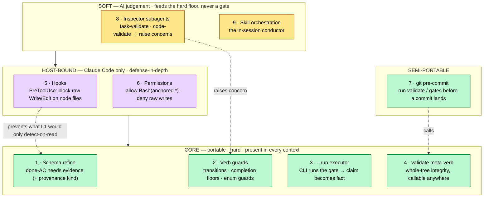
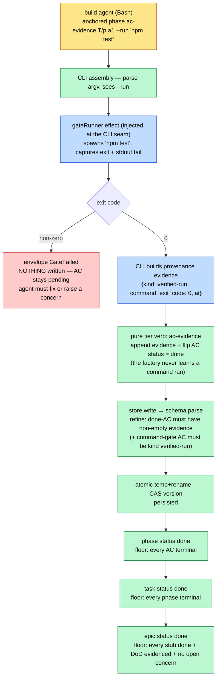
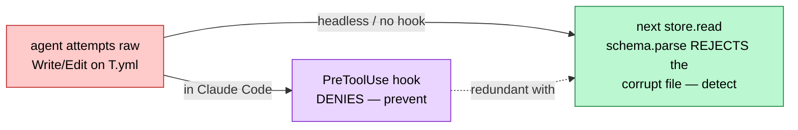

# anchored v3 — the enforcement model (perfect-world flow)

> Companion to `architecture.md` (the code layout) and `requirements-2.md` (the binding
> model). This document answers one question: **where does each guarantee live, and how
> does a mutation pass through the gates in a perfect world.**
>
> ⚠️ **PARTIALLY SUPERSEDED by `requirements-3.md`.** The taxonomy + the layered stack
> below still hold and are the useful map. But two things sketched here are **dropped** by
> requirements-3: the **`--run` command-gate executor** (layer 3) and **evidence
> provenance / `kind`** — a gate command is policy, not substrate; the core never executes
> it. The **hook** layer (5) is also dropped (schema detect-on-read replaces it). Read the
> "perfect-world flow" diagram as the *rejected* maximal-enforcement design; the **adopted**
> model is the slimmer canon in `requirements-3.md` (ACs `done`/`deferred(reason)`, stage
> order, tier floors, questions-block-build — all schema/verb, no `--run`, no hook).
>
> Status: today the core enforces layers 1–2 (schema + verb guards). The adopted additions
> (`deferred` + reason, questions-block-build) are in `requirements-3.md`.

## The one principle

> **Enforce in the lowest, most-portable, hardest layer that can express the guarantee.**

The core (CLI + substrate) is the *only* thing present in **every** execution context —
main session, subagent, headless, CI. So any guarantee that must always hold lives in the
core. Host-bound layers (Claude Code hooks, permissions) are **defense-in-depth for the one
thing the core structurally cannot see** (a raw write that never reaches the store), never
the sole home of a guarantee. AI inspectors are a **second opinion that feeds the hard
floor**, never a gate themselves.

| Hardness | Meaning | Layers |
|---|---|---|
| **Hard** | deterministic; the AI cannot route around it | core schema · core verb guards · `--run` executor · `validate` · hooks · permissions · git-hook |
| **Soft** | AI judgement; probabilistic | inspector subagents · skill orchestration prose |

| Portability | Meaning | Layers |
|---|---|---|
| **Portable** | runs wherever the CLI runs (CI, headless, any host) | everything in the **core** (1–4) |
| **Host-bound** | only inside Claude Code | hooks · permissions · inspectors · skill |

## The enforcement stack — where each guarantee lives

Read it top-down by **trust**: a guarantee should sink as far into `CORE` as it can. Soft
inspectors (8) don't *block* — they raise a **concern**, and the hard completion floor (2)
refuses `done` while a concern is open. That's the bridge: AI suspicion becomes a hard gate
*because it lands as data the core checks*.

## The perfect-world flow — one acceptance criterion reaches `done`

The canonical path: a build agent claims a command-verifiable AC is satisfied. In a perfect
world the agent never *asserts* green — it asks the CLI to **run** the gate, and the result
is enforced and recorded with provenance.

What makes this *perfect*: every diamond is a deterministic check the AI cannot talk its way
past. The only soft node is the agent at the top — and even its honesty is moot, because the
**CLI runs the command itself** (it doesn't trust the agent's "it passed"). The evidence on
disk carries provenance, so a downstream reader can tell a `verified-run` from a hand-typed
claim.

## Two guarantees the core cannot see alone

**Raw-write prevention** is the one place a host-bound hook earns its keep: a `Write` that
bypasses the store is invisible to the core *at write time*. The hook **prevents** it; the
schema **detects** it on the next read. Two layers, but the load-bearing one (detect) is
portable — headless still catches it, just later.

## The decision frame (what to build, in this model)

| Guarantee | Home | Status |
|---|---|---|
| done-AC needs evidence | core schema (1) | ✅ shipped |
| valid transitions · completion floors | core verb guards (2) | ✅ shipped |
| stub outcome-ACs gate the stub | core verb guards (2) | ✅ shipped |
| **command-gate ran green (claim → fact)** | core `--run` executor (3) | ⬜ open |
| **evidence provenance** (`verified-run` vs `prose`) | core schema (1) | ⬜ open |
| whole-tree sanity in CI / pre-commit | core `validate` (4) + git-hook (7) | ⬜ open |
| no raw writes | hook (5) prevent · schema (1) detect | partial |
| rule adherence · evidence honesty | inspector (8, soft) → concern → floor (2, hard) | ✅ shipped (soft) |

The open work, in priority order, is all **core**: the `--run` executor (3) plus evidence
**provenance** (1) — together they turn the build's central claim ("the gate passed") from
trusted into enforced, portably. `validate` (4) + a git pre-commit (7) extend the same
floor to the commit boundary. Hooks (5) stay a thin, optional prevent-layer over the
portable detect-on-read the schema already gives us.
