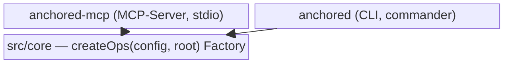

← [anchored](../_docs.md)

# mcp

Das npm-Paket `@chaafoo/anchored-mcp`: die **typisierte Service-Schicht** hinter dem
Plugin. Liefert zwei Binaries über einer gemeinsamen Logik-Factory — den
`anchored-mcp` MCP-Server (für die Agents) und das `anchored` CLI (für Shell/Skripte).
Beide sind dünner Transport; die gesamte Mutations- und Validierungslogik lebt in
`src/core`.

| Bereich | Verantwortung (Scope-Grenze) |
|---|---|
| [src](src/_src.md) | Der gesamte TypeScript-Quellcode: Schema, Logik-Factory, beide Transport-Binaries, Parser. Alles außer Tests/Build-Config. |

> Tests (`mcp/tests/`, 484 Tests über 36 Files) und Build-Config (`build.mjs`,
> `tsconfig*`) sind bewusst **nicht** in der Doku gespiegelt — sie tragen keine
> Architektur-Aussage, die nicht schon im Quellcode steht.
