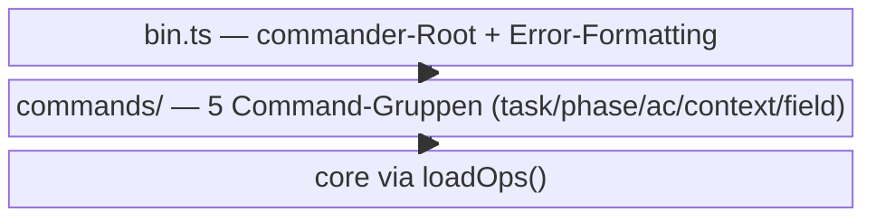

← [src](../_src.md)

# cli

Das **`anchored`-CLI-Binary**: eine commander.js-Verdrahtung, die die MCP-Tool-Fläche
1:1 als Subcommands für Ad-hoc-Nutzung und Shell-Skripte spiegelt. Reiner Transport —
Args parsen, `loadOps()`, typisierte Op aufrufen, Ergebnis rendern. Keine Domänenlogik.

| Bereich / Datei | Rolle | Verantwortung (Scope-Grenze) |
|---|---|---|
| [cli-entrypoint](cli-entrypoint.md) | medio | `bin.ts` + `helpers.ts`: commander-Root, TTY-bewusstes ANSI-Error-Formatting, Output-Formatter + Arg-Parser. |
| [commands](commands/_commands.md) | macro | Die fünf Command-Module + der vollständige Subcommand-Katalog. |
