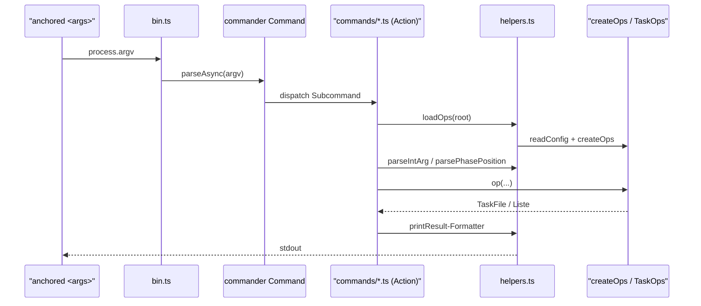
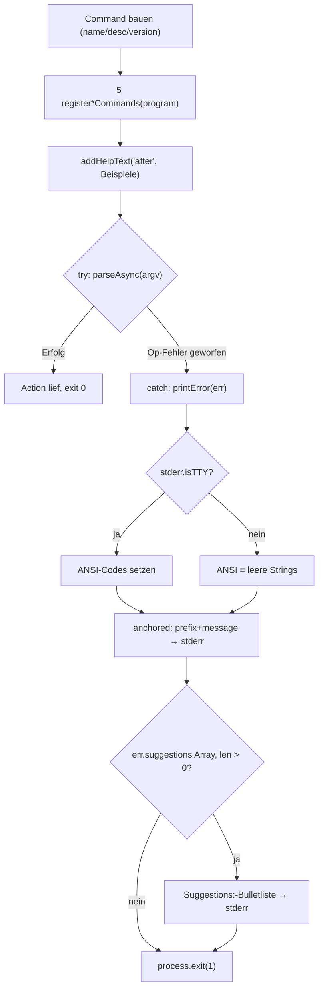

← [cli](_cli.md)

# CLI-Entrypoint (`bin.ts` + `helpers.ts`)

Der `anchored`-CLI-Einstiegspunkt verdrahtet commander.js: er baut ein `Command`-Top-Level-Programm, registriert fünf Command-Gruppen, parst `process.argv` und gibt typisierte Op-Fehler TTY-bewusst aus. `helpers.ts` liefert die geteilten Bausteine, die jede Subcommand-Action nutzt: einen Ops-Loader, Output-Formatter und Argument-Parser. Die CLI ist ein dünner Transport über die V0.2-Ops-Factory (`createOps`) — derselbe Code-Pfad wie die MCP-Tools, nur anderer Transport.

## Was

- `bin.ts` erzeugt ein commander-`Command`-Objekt mit `.name('anchored')`, einer `.description(...)` und `.version('0.2.0')`.
- Es registriert genau fünf Command-Gruppen über importierte Register-Funktionen: `registerTaskCommands`, `registerContextCommands`, `registerPhaseCommands`, `registerAcCommands`, `registerFieldCommands` (Domänen task / context / phase / ac / field).
- Über `program.addHelpText('after', ...)` hängt es einen Beispiel-Block an die Top-Level-Hilfe an (z. B. `anchored task create`, `phase add`, `ac evidence set`, `phase next`).
- Das Parsen läuft über `await program.parseAsync(process.argv)` in einem `try`-Block.
- Op-Level-Fehler (laut Kommentar `InvalidTransition`, `NotFound` etc.) werden im `catch` von `printError(err)` formatiert; danach folgt `process.exit(1)`.
- Laut Kommentar druckt commander seine eigenen Arg-Parsing-Fehler bereits selbst; `printError` fängt nur die Op-Level-Fehler ab.
- `printError` setzt ANSI-Codes (`RED`, `BOLD`, `DIM`, `RESET`) nur, wenn `process.stderr.isTTY === true`; andernfalls sind sie leere Strings (Plaintext bei Pipe).
- Ein `errorName` wird nur vorangestellt, wenn `err instanceof Error` und `err.name` gesetzt und `!== 'Error'` ist; die Meldung geht auf `stderr` als `anchored: <prefix><message>`.
- Trägt der Fehler ein Array-Feld `suggestions` (laut Kommentar `AnchoredError` + Subklassen) mit Länge > 0, rendert `printError` es als `Suggestions:`-Liste mit `- `-Bullets auf `stderr`.
- `helpers.loadOps(root)` liest die Config via `readConfig(root)` und ruft `createOps(config, root)` auf; gibt ein `TaskOps` zurück.
- `printUpdated(file)` schreibt `Updated: <file.slug>` auf `stdout` (Default-Rendering für Mutationen ohne eigene Ausgabe).
- `printTaskFile(file)` schreibt das `TaskFile` als YAML (`yamlStringify`) auf `stdout` (für `task read`).
- `printPhaseList(phases)` druckt eine 3-Spalten-Plaintext-Tabelle (name | slug | status); bei leerer Liste `(no phases)`. Spaltenbreiten werden aus dem Maximum von Inhalt und Header berechnet, aufgefüllt via `pad`.
- `parseIntArg(arg, fieldName)` parst mit `parseInt(arg, 10)` und wirft `Error`, wenn das Ergebnis kein `Number.isInteger` ist — die Meldung nennt `fieldName` statt NaN.
- `parsePhasePosition(opts)` mappt das Options-Tripel `--after | --before | --to` auf `{ after }` / `{ before }` / `{ to: 'start' | 'end' }` oder `undefined`; bei mehreren gesetzten gewinnt die höchste Präzedenz (after > before > to); ungültiges `--to` wirft `Error`.

## Wie

### Benutzung

`bin.ts` ist die ausführbare Datei der CLI; ein Aufruf läuft als `anchored <gruppe> <subcommand> [args] [--options]`. Die Command-Gruppen werden vom Entrypoint nur registriert — die konkreten Subcommands und ihre Actions liegen in den jeweiligen `commands/*.ts`-Dateien. Diese Actions verwenden die `helpers.ts`-Bausteine:

- `loadOps(root): Promise<TaskOps>` — liefert die Ops-Factory (derselbe Surface wie die MCP-Tools).
- `printUpdated(file)` / `printTaskFile(file)` / `printPhaseList(phases)` — Output-Formatter auf `stdout`.
- `parseIntArg(arg, fieldName)` / `parsePhasePosition(opts)` — Argument-/Options-Parser, die bei Ungültigkeit werfen.

### Funktion

Der Entrypoint selbst ist eine lineare Verdrahtungs- und Fehler-Routine: bauen, registrieren, parsen, im Fehlerfall formatieren und mit Exit-Code 1 beenden. Reads beenden mit 0 (kein Fehler geworfen).

## Warum

- ANSI-Codes werden nur bei TTY gesetzt und bei Pipe gestrippt, damit Logs und scriptende Aufrufer sauberen Plaintext erhalten (Kommentar in `printError`).
- `helpers.ts` bündelt Config-Read + Factory-Call in `loadOps`, um die Action-Funktionen unter 15 LOC zu halten (Kommentar im Datei-Header).
- `printTaskFile` nutzt YAML, weil Block-Scalars mehrzeilige Strings lesbar halten und sauber durch den v2-Parser round-trippen (Kommentar).
- `parseIntArg` wirft mit feldbenannter Meldung, damit kein NaN durch nachgelagerte Logik propagiert (Kommentar).
- Die CLI ist laut Datei-Header für Menschen (ad-hoc) und Shell-Hooks (`run:`-Steps in anchored.yml) gedacht; für Agenten wird der MCP-Server bevorzugt, der dieselben Ops als typisierte Tools exponiert.
