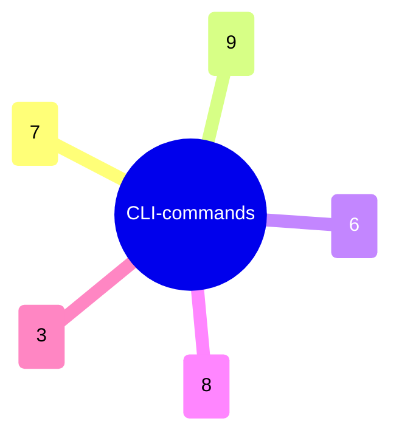

← [cli](../_cli.md)

# commands

Fünf Files, eines pro Command-Gruppe (task/phase/ac/context/field), jedes registriert
3–9 Subcommands via commander.js. Jede Action ist gleich geformt: Flags parsen,
`loadOps(root)`, typisierte Op aufrufen, Print-Helfer. Kein Logik — reiner Transport,
spiegelt die MCP-Tools.

| Datei | Rolle | Verantwortung (Scope-Grenze) |
|---|---|---|
| [commands.catalog](commands.catalog.md) | micro | Erschöpfende Aufzählung aller CLI-Subcommands über die fünf Gruppen, mit Flags. |

> Die Verhaltens-Semantik der Commands lebt nicht hier, sondern in
> [core/ops](../../core/ops/_ops.md) — CLI und MCP-Tools sind beide nur Transport
> über dieselbe Factory.
