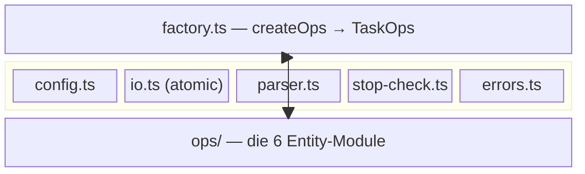

← [src](../_src.md)

# core

Die **Task-File-Mutations-Engine**. Die `createOps(config, root)`-Factory komponiert
sechs Entity-Op-Module zur verschachtelten `TaskOps`-Oberfläche; jede Mutation läuft
durch `atomicWrite` und passiert Schema-Validierung + State-Machine-Gates. Daneben die
Fundamente: Config laden, YAML sicher parsen, Fehlertypen, Stop-Check-Routing.

| Bereich / Datei | Rolle | Verantwortung (Scope-Grenze) |
|---|---|---|
| [ops](ops/_ops.md) | macro | Die sechs Entity-Op-Module (task, question, context, phase, ac, field) — wo die eigentliche Mutations-Semantik lebt. |
| [factory](factory.md) | medio | Komponiert die Op-Module zu `TaskOps`; jede Mutation routet durch `atomicWrite` + Validierung. |
| [config](config.md) | medio | Liest `anchored.yml` aus dem Projekt-Root, fällt auf Empty-Defaults zurück. Einmal beim Start vor Factory-Bau. |
| [atomic-write](atomic-write.md) | medio | Sichere Cross-Process-Writes via `proper-lockfile` + POSIX-Rename; wirft `WriteContention` bei Lock-Timeout. |
| [yaml-parser](yaml-parser.md) | medio | Zentraler YAML-Parser für untrusted Input: 1-MB-Cap, Billion-Laughs-Guard, keine Custom-Tags. |
| [stop-check-routing](stop-check-routing.md) | medio | Mappt Stop-Check-Verdikte (stop/proceed) deterministisch in MCP-Ops (Eskalation vs. autonome Doku). |
| [errors](errors.md) | micro | Der Katalog der typisierten Fehlerklassen der Ops-Schicht (Name + suggestions[]). |
