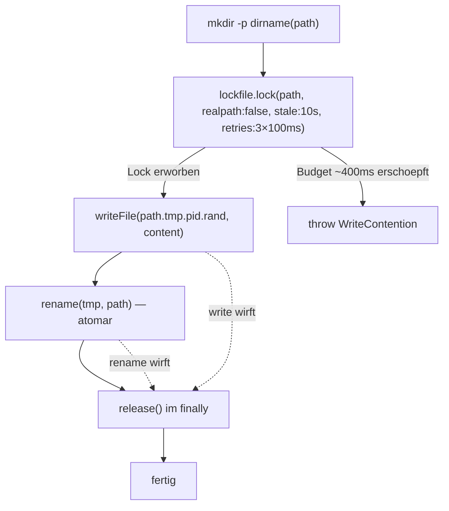
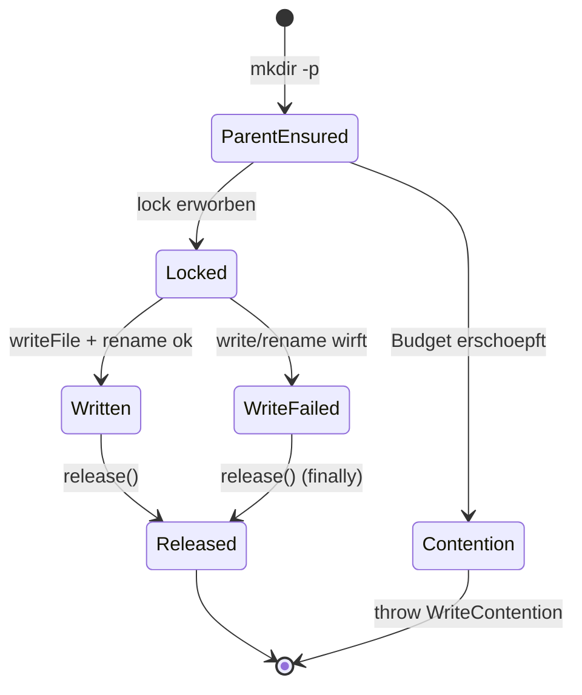

← [core](_core.md)

# atomic-write (`io.ts`)

`atomicWrite(path, content)` ist der einzige Schreibpfad aller v2-Factory-Ops: Es kombiniert einen Cross-Process-Lock (proper-lockfile), einen atomaren POSIX-`rename` und ein vorausgehendes `mkdir -p` des Parent-Verzeichnisses. Damit serialisieren zwei anchored-Prozesse, die dieselbe Task-Datei schreiben, und ein Absturz mitten im Schreiben kann die Zieldatei nie halb beschreiben. Bei Lock-Timeout wirft die Funktion [`WriteContention`](./errors.md).

## Was

- `atomicWrite(path: string, content: string): Promise<void>` ist die einzige exportierte Funktion des Moduls.
- Jede v2-Factory-Op schreibt laut Modul-Doku durch `atomicWrite` (siehe [factory](./factory.md)).
- **Schritt 1 — Parent anlegen:** `mkdir(dirname(path), { recursive: true })` wird vor dem Lock ausgeführt, weil der Lock ein Unterverzeichnis `<path>.lock` des Parents ist.
- **Schritt 2 — Lock erwerben:** `lockfile.lock(path, …)` mit `retries: { retries: 3, minTimeout: 100, maxTimeout: 100 }`, `stale: 10_000` und `realpath: false`.
- Der Retry-Budget beträgt 3 Retries × 100ms → **~400ms worst case** bis zum Throw.
- `realpath: false` ist load-bearing: Der Default `true` ruft `fs.realpath(path)` auf und scheitert bei Erst-Schreibvorgängen (z. B. initiales `task.create`, Datei existiert noch nicht) mit `ENOENT`.
- Scheitert der Lock-Erwerb, wird `WriteContention` mit der Original-Fehlermeldung plus drei `suggestions` (anderer Prozess hält Lock / Stale-`.lock`-Verzeichnis manuell löschen / pro aktiver Task ein git-worktree) geworfen.
- **Stale-Reclaim:** Ein Lock, dessen mtime seit > 10s (`STALE_THRESHOLD_MS = 10_000`) nicht refresht wurde, gilt beim nächsten Erwerb als verwaist und wird gestohlen. proper-lockfile refresht die mtime alle `stale/2` ms (~5s), solange der Lock gehalten wird.
- **Schritt 3 — Temp-Write:** Geschrieben wird nach `<path>.tmp.<pid>.<random>`, wobei der Suffix aus `process.pid` und `randomBytes(6).toString('hex')` (12 Hex-Zeichen) besteht.
- **Schritt 4 — Rename:** `rename(tmp, path)` ist auf POSIX-Dateisystemen atomar; Leser sehen entweder die alte oder die neue Datei, nie eine halbe.
- **Schritt 5 — Release:** Der Lock wird im `finally` immer freigegeben — auch wenn `writeFile`/`rename` werfen.
- Ein Absturz zwischen Schritt 3 und 4 hinterlässt nur eine Temp-Sibling-Datei, korrumpiert `path` aber nie; übrig gebliebene Temp-Dateien werden organisch nicht aufgeräumt, sondern bleiben liegen (nur der jeweils eigene Temp-Pfad wird per atomarem `rename` überschrieben).

## Wie

### Benutzung

`atomicWrite` ist `async` und nimmt zwei Strings: den Zielpfad und den vollständigen Datei-Inhalt (in der Praxis ein serialisiertes YAML-Dokument). Es gibt keinen Rückgabewert; Erfolg = Promise resolved, Contention = `WriteContention`-Throw.

```ts
import { atomicWrite } from './io.js';

await atomicWrite('.anchored/tasks/my-task.yml', yamlString);
```

### Funktion



Der `try/finally`-Block um Schritt 3–4 stellt sicher, dass `release()` in jedem Fall läuft: Wirft `writeFile` oder `rename`, wird der Fehler propagiert, der Lock aber zuvor freigegeben.

## Warum

- **`realpath: false`:** Ohne diese Option würde proper-lockfile `fs.realpath` auf einen noch nicht existierenden Pfad anwenden und `ENOENT` werfen — Erst-Schreibvorgänge wie `task.create` wären unmöglich (Code-Kommentar Z. 86–89).
- **Kurzes Retry-Budget (~400ms):** anchored-Writes dauern laut Kommentar < 50ms; ein gesunder konkurrierender Writer gibt deutlich innerhalb des Budgets frei. Wird die Grenze erreicht, liegt etwas Abnormales vor (hängender Prozess, eingefrorenes NFS-Volume), und schnelles Surfacen ist besser als das Blockieren des Orchestrators (Kommentar Z. 35–42).
- **Immer freigeben:** Würde der Lock bei einem Write-Fehler nicht freigegeben, müsste der nächste Versuch entweder das volle Budget abwarten oder per Stale-Reclaim stehlen (Kommentar Z. 116–119).

## Wann

`atomicWrite` läuft pro Schreib-Op genau einmal und durchläuft dabei eine feste Lock-Lebensphase:



Konkurrenz-Auslöser ist ein zweiter anchored-Prozess, der dieselbe Task-Datei schreibt — er wartet am Lock bzw. läuft (nach > 10s Inaktivität des Vorgängers) in den Stale-Reclaim.
