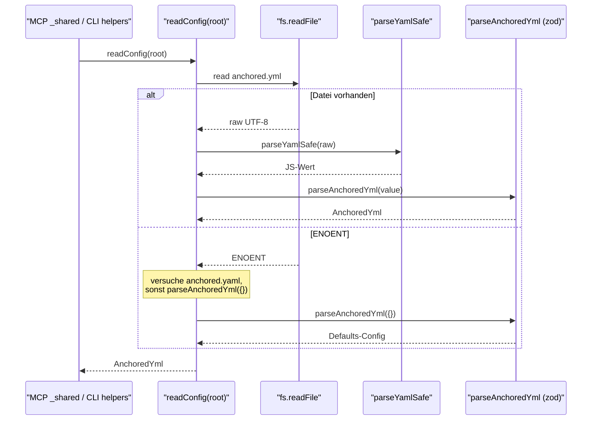
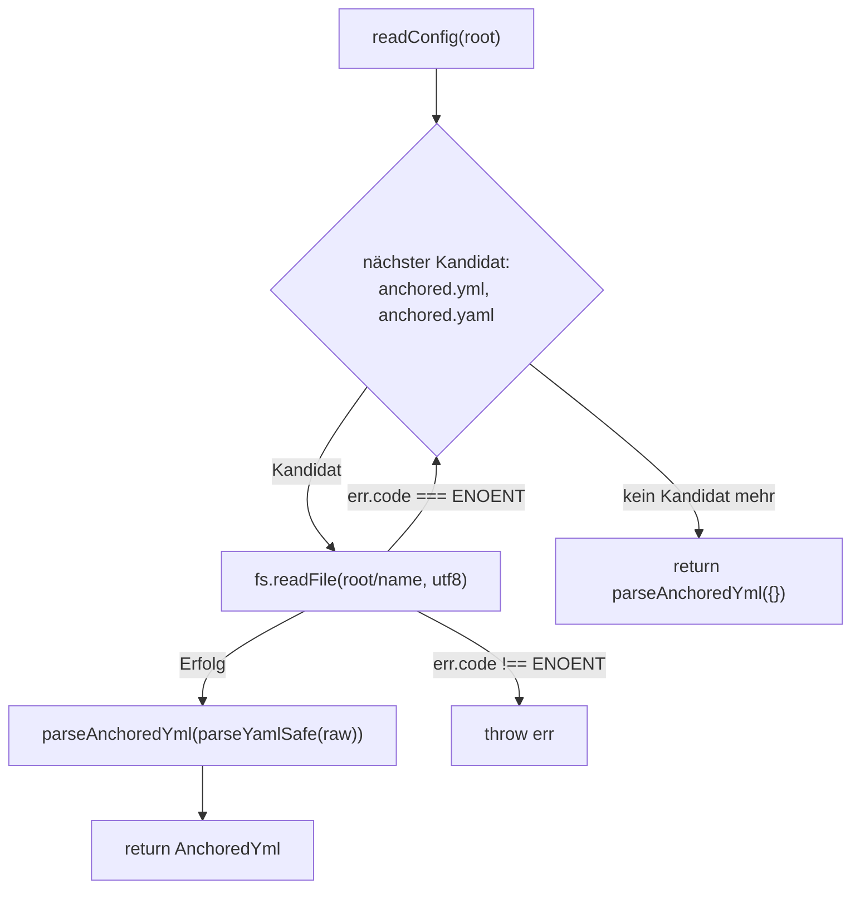

← [core](_core.md)

# config — anchored.yml laden

`readConfig(root)` liest die Datei `anchored.yml` (oder `anchored.yaml`) aus dem Projekt-Root, parst sie über den sicheren YAML-Parser und das zod-Schema und liefert eine vollständig validierte `AnchoredYml`-Config. Fehlt die Datei, ist das **kein** Fehler — es werden die Schema-Defaults (leere Felder etc.) zurückgegeben. Aufgerufen wird die Funktion einmal, bevor die [Factory](./factory.md) gebaut wird.

## Was

- Exportiert genau eine Funktion: `readConfig(root: string): Promise<AnchoredYml>`.
- Sucht im Verzeichnis `root` nach zwei Dateinamen, in dieser Reihenfolge: `anchored.yml`, dann `anchored.yaml`.
- Liest die erste existierende Kandidatendatei als UTF-8 (`fs.readFile(..., 'utf8')`).
- Der rohe Dateiinhalt geht durch `parseYamlSafe` (siehe [yaml-parser](./yaml-parser.md)) — also inklusive 1-MB-Größenkappe, Billion-Laughs-Schutz und Verbot von Custom-Tags.
- Das Ergebnis des YAML-Parsers wird an `parseAnchoredYml` (zod-Schema) übergeben; dieses füllt fehlende Felder mit Defaults und liefert eine validierte `AnchoredYml`.
- Existiert **keine** der beiden Dateien, wird `parseAnchoredYml({})` zurückgegeben — die reine Empty-Defaults-Config.
- Ein Lesefehler mit dem Code `ENOENT` (Datei nicht vorhanden) wird verschluckt und führt zum nächsten Kandidaten bzw. zu den Defaults.
- Jeder andere Lesefehler (`code !== 'ENOENT'`) wird unverändert weitergeworfen.
- Parse- oder Validierungsfehler aus `parseYamlSafe`/`parseAnchoredYml` werden nicht abgefangen und propagieren an den Aufrufer (siehe [errors](./errors.md), [stop-check-routing](./stop-check-routing.md) für nachgelagerte Schema-Nutzung).

## Wie

### Benutzung

`readConfig` ist die Lade-Schicht, die beide Frontends vor dem Factory-Bau aufrufen:

- MCP-Transport: `src/mcp/tools/_shared.ts` ruft `await readConfig(project_root)`.
- CLI: `src/cli/helpers.ts` ruft `await readConfig(root)`.

### Funktion

Intern ist `readConfig` eine Schleife über die Kandidatenliste mit gezieltem Fehler-Filtern: nur `ENOENT` ist „weiterprobieren", alles andere fliegt hoch.

## Warum

Der Modul-Docstring nennt den Grund explizit: Eine fehlende Config ist absichtlich kein Fehler, damit anchored „out-of-the-box" ohne Config-Datei funktioniert — der Fallback sind die Schema-Defaults (leere Feldliste etc.). Die zwei Kandidatennamen decken beide gängigen Endungen `.yml`/`.yaml` ab.

## Wann

`readConfig` läuft einmal beim Start eines Frontend-Aufrufs, bevor die `TaskOps`-Factory konstruiert wird (laut Modul-Docstring durch die MCP-Transport-Schicht bzw. die CLI). Die Config wird also vor dem Factory-Bau eingelesen, nicht währenddessen.
