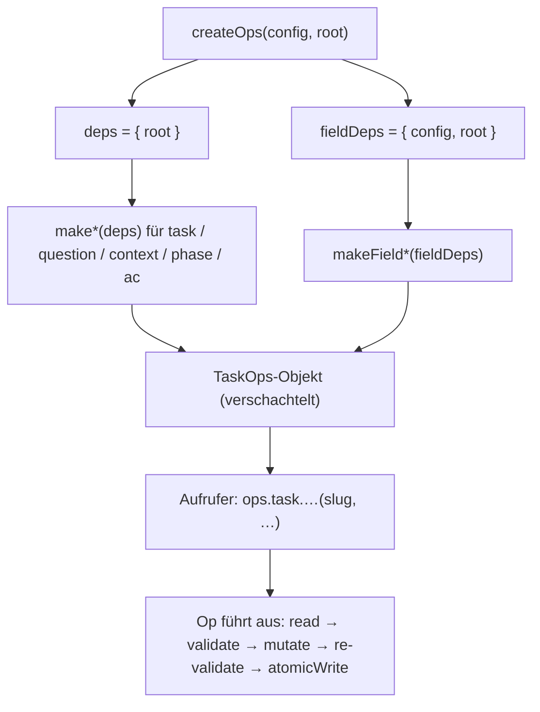

← [core](_core.md)

# factory.ts — `createOps`

`createOps(config, root)` komponiert die sechs Op-Module zu einem einzigen, verschachtelten `TaskOps`-Objekt. Es ist die einzige Quelle für Task-Datei-Mutationen; MCP-Tools und CLI-Befehle sind nur dünne Transporte über diese Oberfläche. Die Datei selbst enthält keine Mutationslogik — sie verdrahtet die `make*`-Builder mit ihren Dependencies.

## Was

- `createOps(config: AnchoredYml, root: string): TaskOps` ist die einzige exportierte Funktion neben dem `TaskOps`-Interface und den re-exportierten Input-Typen.
- Die Factory baut zwei Dependency-Objekte und gibt sie an die Builder weiter:
  - `deps = { root }` — geht an **alle** Op-Builder außer den `field`-Ops.
  - `fieldDeps = { config, root }` — geht **nur** an `makeFieldList`, `makeFieldSet`, `makeFieldGet`. Nur diese drei Ops sehen die `config`.
- Komponiert werden genau sechs Op-Module aus `./ops/`:

  | Modul | Sub-Tree in `TaskOps` |
  | --- | --- |
  | `task.ts` | `task.create/read/status/title` |
  | `question.ts` | `task.question.add/list/resolve/retag` |
  | `context.ts` | `task.context.intro/plan/build/wrap` |
  | `phase.ts` | `task.phase.list/next/add/remove/move/status/name/context/rules/retry_count` |
  | `ac.ts` | `task.phase.ac.add/remove/text/evidence/failures/status` |
  | `field.ts` | `task.phase.field.list/set/get` |

- `createOps` ruft die `make*`-Builder **eager** beim Aufruf auf (nicht lazy beim ersten Zugriff) und legt die fertigen Funktionen in die `TaskOps`-Struktur.
- Die Factory führt selbst **keine** Validierung, kein `atomicWrite` und keine State-Machine-Prüfung aus — diese laufen in den Ops. Jede Mutation in den Ops folgt dem Muster read → validate → mutate → re-validate → `atomicWrite` (siehe `task.ts`-Doc-Kommentar; z. B. nutzt `writeTask` `TaskFile.parse` vor [atomicWrite](./atomic-write.md)).
- State-Transition-Gates liegen ebenfalls in den Ops (z. B. `assertTaskTransition` und die `IncompletePhases`-Prüfung für den `wrap`-Übergang in `task.ts`), nicht in der Factory.
- `createOps` ist eine reine Funktion ohne Kenntnis von MCP oder CLI (laut Doc-Kommentar „No knowledge of MCP or CLI").
- `task.phase.context.subsection` und `task.context.build/wrap.subsection` sind **Funktionen höherer Ordnung**: `subsection(name)` liefert ein Objekt mit `append`/`set`. Die Factory bindet hier den Builder (`makeContextBuildSubsection(deps)`) direkt als `subsection` ein.
- Re-exportiert die Input-Shapes `TaskCreateInput`, `PhaseInit`, `PhasePosition`, `AcInit`, `QuestionAddInput`, `QuestionResolveInput`, `QuestionListFilter`, damit Aufrufer sie ohne Tiefen-Import nutzen können.

## Wie

### Benutzung

Aufruf einmalig pro Server-/CLI-Instanz, danach werden Ops über das verschachtelte Objekt aufgerufen:

```ts
const ops = createOps(config, root);
await ops.task.create('my-slug', { title: '…' });
const file = await ops.task.read('my-slug');
await ops.task.status.set('my-slug', 'wrap');
await ops.task.phase.ac.evidence.add('my-slug', 'phase-1', 0, '…');
await ops.task.context.build.subsection('Notes').append('my-slug', '…');
```

Jeder Op nimmt den `slug` als erstes Argument (`field.list()` ist die einzige Ausnahme — ohne `slug`, da rein konfigurationsbasiert).

### Funktion

`createOps` ist reine Verdrahtung: Es erzeugt die Dependency-Objekte und ruft jeden `make*`-Builder auf, der eine fertige Op-Funktion zurückgibt. Die zurückgegebenen Funktionen kapseln `root` (bzw. `config`) per Closure.



Der Block `read → validate → mutate → re-validate → atomicWrite` und die State-Gates passieren in den Op-Modulen, nicht in der Factory. Validierung und Persistenz nutzen [config](./config.md)-Schema (über `AnchoredYml`), den [yaml-parser](./yaml-parser.md), [atomic-write](./atomic-write.md) und typisierte [errors](./errors.md).

## Warum

Der Doc-Kommentar nennt zwei explizite Gründe für diese Faktorisierung:

- `factory.ts` ist die **SINGLE source of truth** für Task-Datei-Mutationen, damit MCP- und CLI-Schicht nur dünne Transporte bleiben und keine eigene Mutationslogik duplizieren.
- Die Ops sind **reine Funktionen ohne MCP-/CLI-Kenntnis**, was beide Transport-Schichten auf dieselbe geprüfte Oberfläche zwingt.
- Nur die `field`-Ops bekommen `config` (`fieldDeps`): sie sind **schema-getrieben** — sie validieren und coercieren die in `anchored.yml.task.phase.fields` deklarierten Custom-Felder. Jede andere Op arbeitet allein auf der Task-File-Struktur, daher genügt `{ root }` (Doc-Kommentar in `createOps`).
