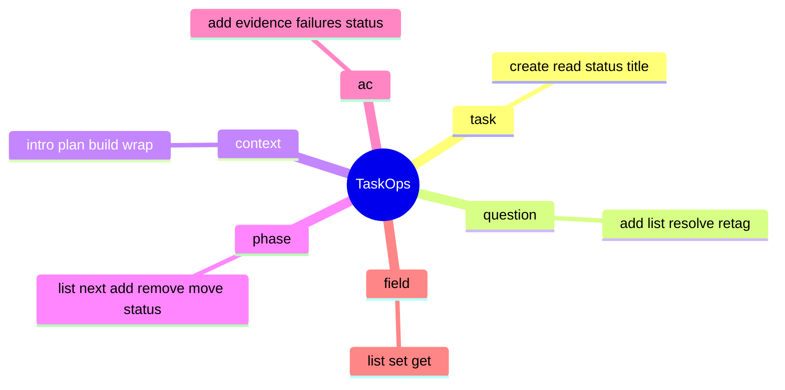

← [core](../_core.md)

# ops

Die sechs **Entity-Op-Module** — hier lebt die eigentliche Mutations-Semantik des
Task-Files. Jedes Modul exportiert `make*()`-Builder, die async Ops zurückgeben; jede
Op liest das ganze File, validiert, mutiert, re-validiert, schreibt atomar. Keine
Cross-Modul-Mutationen.

| Datei | Rolle | Verantwortung (Scope-Grenze) |
|---|---|---|
| [task-level-ops](task-level-ops.md) | medio | Task-Ebene: create (kein Clobber), read, status.set (Task-State-Machine), title.set. |
| [question-ops](question-ops.md) | medio | Die Questions-Array: add (auto-id q1/q2…), list (Filter), resolve (ai/user-Quellregeln), retag. |
| [context-ops](context-ops.md) | medio | Das Context-Objekt: intro, plan (+ Refinement-Marker-Resolution), build/wrap-Subsections. |
| [phase-ops](phase-ops.md) | medio | Phasen: list/next (resume-safe), add/remove/move, status.set (AC-Completeness-Gate), retry_count. |
| [ac-ops](ac-ops.md) | medio | Acceptance Criteria: add/remove/text + die Atomaritäts-Contracts von Evidence/Failures. |
| [custom-field-ops](custom-field-ops.md) | medio | Custom Per-Phase-Felder aus `anchored.yml`: list/set/get mit reserved-Name- + Typ-Guards. |
