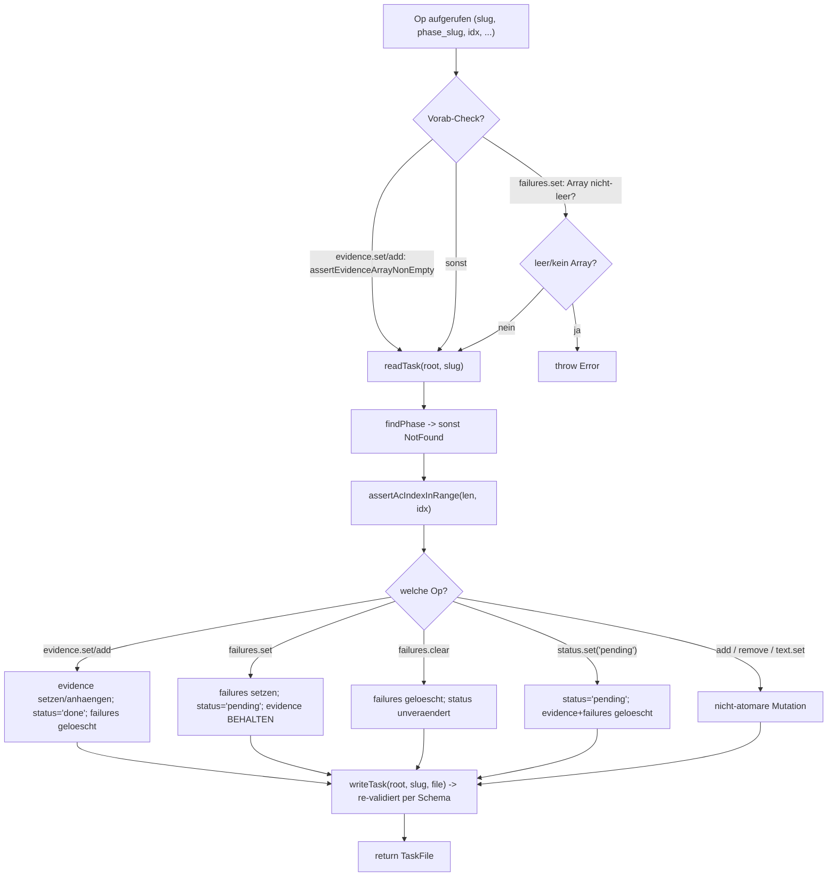

← [ops](_ops.md)

# AC-Ops (Acceptance-Criterion-Ops)

Acht Ops auf Acceptance Criteria (`ac.ts`), die jeweils eine Factory `make…({ root }: Deps)` exportieren. Jede Op, die `status`/`evidence`/`failures` berührt, schreibt diese drei Felder atomar in EINEM `writeTask` — das eliminiert die Klasse von "torn-state"-Bugs (z. B. evidence gefüllt, aber status noch pending). Sie sind die Schreibschicht hinter den AC-bezogenen MCP-Tools und dem build-/refine-Re-Do-Loop.

## Was

- `ac.ts` exportiert acht Factory-Funktionen; jede gibt eine `async`-Funktion zurück, die das geänderte `TaskFile` (nach `writeTask`-Re-Validierung) zurückliefert.
- Geteilter Helper `findPhase(file, phaseSlug)` sucht die Phase per `slug`; fehlt sie, wirft er `NotFound` mit Hinweisen (bekannte Phase-Slugs bzw. `/impl-plan`-Tipp, plus `anchored task read <slug>`).
- Alle indexbasierten Ops rufen `assertAcIndexInRange(phase.acceptance_criteria.length, idx)` vor dem Zugriff.

**Nicht-atomare Helfer:**

| Op | Tut | status | evidence | failures |
|----|-----|--------|----------|----------|
| `makeAcAdd(slug, phase_slug, ac: AcInit)` | hängt neues AC an `phase.acceptance_criteria` an | `ac.status ?? 'pending'` | nur gesetzt, wenn `ac.evidence` vorhanden UND `length > 0` | nur gesetzt, wenn `ac.failures` vorhanden UND `length > 0` |
| `makeAcRemove(slug, phase_slug, idx)` | `splice(idx, 1)` — entfernt das AC | — | — | — |
| `makeAcTextSet(slug, phase_slug, idx, text)` | setzt `ac.text` | unverändert | unverändert | unverändert |

**Atomare Kontrakte (status/evidence/failures gemeinsam in einem Write):**

| Op | status | evidence | failures | Vorab-Check |
|----|--------|----------|----------|-------------|
| `makeAcEvidenceSet(…, idx, evidence: string[])` | → `'done'` | ersetzt durch `[...evidence]` | gelöscht | `assertEvidenceArrayNonEmpty(evidence)` |
| `makeAcEvidenceAdd(…, idx, line: string)` | → `'done'` | `[...(ac.evidence ?? []), line]` (anhängen, Array anlegen falls fehlend) | gelöscht | `assertEvidenceArrayNonEmpty([line])` |
| `makeAcFailuresSet(…, idx, failures: string[])` | → `'pending'` | **BEHALTEN** (für Retry-Kontext) | ersetzt durch `[...failures]` | wirft `Error`, wenn nicht Array oder leer |
| `makeAcFailuresClear(…, idx)` | **unverändert** | unverändert | gelöscht | — |
| `makeAcStatusSet(…, idx, status: 'pending')` | → `'pending'` | gelöscht | gelöscht | Parameter ist auf `'pending'` typ-eingeschränkt (`void status`) |

- `makeAcEvidenceAdd` setzt `ac.status = 'done'` **unbedingt** (Evidence ist der Beweis, dass das AC erfüllt ist); Doc-Kommentar und Tool-`description` formulieren das gleichlautend.
- `AcInit` = `{ text: string; status?; evidence?: string[]; failures?: string[] }`; Default-status `'pending'`, evidence/failures default abwesend (pending-ACs dürfen laut Schema-refine keine evidence haben).
- `makeAcRemove` lässt das Leeren auf 0 ACs bewusst zu — die Schema-`min(1)`-Regel ist das Gate und schlägt erst in `writeTask` zu, nicht in der Op-Schicht.

## Wie

### Benutzung

Jede Op wird per Factory mit `Deps` (`{ root }`) gebunden und dann mit `(slug, phase_slug, …)` aufgerufen. Beispiel-Signaturen:

```ts
const acEvidenceSet = makeAcEvidenceSet({ root });
await acEvidenceSet(slug, phase_slug, idx, ['proof line']);
// → evidence=['proof line'], status='done', failures entfernt

const acFailuresSet = makeAcFailuresSet({ root });
await acFailuresSet(slug, phase_slug, idx, ['gate caught X']);
// → failures=['gate caught X'], status='pending', evidence BEHALTEN
```

Geteilte Bausteine: `readTask`/`writeTask`/`Deps` aus `./task.js`, `findPhase` lokal, Asserts aus `../../ops/validate.js`, `NotFound` aus `../errors.js`. Verwandte Ops im selben Ordner: [task-level-ops](./task-level-ops.md), [phase-ops](./phase-ops.md), [question-ops](./question-ops.md), [context-ops](./context-ops.md), [custom-field-ops](./custom-field-ops.md).

### Funktion

Jede Op folgt demselben Read-Mutate-Write-Ablauf; die Verzweigung liegt darin, welche der drei Felder geschrieben werden.



## Warum

- **Atomarität in einem Write** (Datei-Kommentar Z. 1–16): verhindert "torn-state" — evidence gefüllt bei status pending, oder failures, die nach gesetztem evidence übrig bleiben.
- **`failures.set` BEHÄLT evidence** (Kommentar Z. 190–197): Der implement-agent-Re-Do-Loop liest beide Felder — evidence zeigt, was zuvor als bewiesen behauptet wurde, failures, was das Validation-Gate fing; die Kombination ist der Retry-Kontext.
- **`failures.clear` lässt status unverändert** (Kommentar Z. 221–228): Nach erfolgreichem Retry räumt der Orchestrator failures weg, ohne status anzufassen — den flippt erst `evidence.set` auf `'done'`.
- **`status.set` ist auf `'pending'` beschränkt** (Kommentar Z. 248–259): Der Übergang nach `'done'` muss über `evidence.set` laufen, damit evidence atomar mit dem status-Flip gefüllt wird. `status.set('pending')` ist bewusst der Clean-Slate-Reset (z. B. Plan-Stage-Scope-Änderung an AC-Text), abgegrenzt von `failures.set`, das evidence behält.
- **`remove` darf auf 0 ACs leeren** (Kommentar Z. 100–106): Das Schema ist das Gate (`min(1)`), nicht die Op-Schicht — der Fehler wird durch `writeTask`-Re-Validierung sichtbar gemacht.
