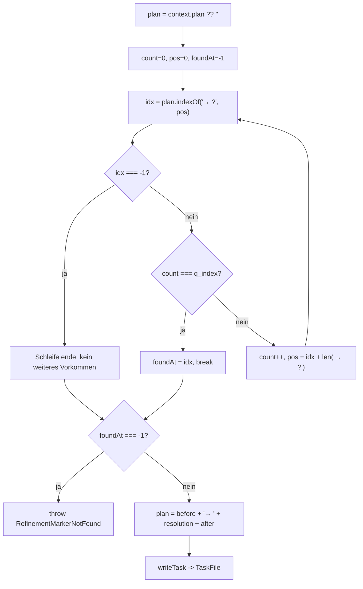

← [ops](_ops.md)

# context-ops — Mutationen am `context`-Block der Task-Datei

Sechs Op-Fabriken in `context.ts` mutieren den `context`-Block einer Task-Datei: `intro`, `plan` (anhängen), den Refinement-Marker-Resolver, sowie die `build`- und `wrap`-Subsections. Jede Op liest die Task-Datei, mutiert ein Feld unter `file.context` und schreibt sie zurück — sie sind die Schreibseite zu den `context.*`-Feldern, die in [task-level-ops](./task-level-ops.md) angelegt werden.

## Was

- Alle Ops folgen demselben Muster: `readTask(root, slug)` → `file.context`-Mutation → `writeTask(root, slug, file)`, das das aktualisierte `TaskFile` zurückgibt.
- Jede Funktion ist eine Fabrik der Form `make…({ root }: Deps)`, die die eigentliche Op-Funktion zurückliefert (Closure über `root`).
- `makeContextIntroSet` setzt `file.context.intro = content` (überschreibend, kein Trim).
- `makeContextPlanAppend` hängt an `file.context.plan` an: `content` wird getrimmt; bei leerem Trim-Ergebnis passiert keine Inhaltsänderung; sonst wird mit `\n` an bestehenden Plan angehängt bzw. als erster Eintrag gesetzt.
- `makeContextPlanRefinementResolve` ersetzt das `q_index`-te Vorkommen des Markers `→ ?` in `context.plan` durch `→ <resolution>`.
  - Marker werden in Dokumentreihenfolge (oben nach unten) gezählt, beginnend bei `q_index = 0`.
  - Wird das `q_index`-te Vorkommen nicht gefunden, wird `RefinementMarkerNotFound` geworfen — mit Meldung inkl. Gesamtzahl gefundener Marker und drei Handlungs-Suggestions.
  - Die Ersetzung trifft genau dieses eine Vorkommen; andere `→ ?`-Marker davor oder danach bleiben unberührt.
  - Ist `context.plan` nicht gesetzt, wird mit `''` gearbeitet (keine Marker, daher Fehler bei jedem `q_index`).
- `makeContextBuildSubsection(name)` liefert ein Paar `{ append, set }` für die Subsection `name` unter `file.context.build`:
  - `append`: trimmt `content`; bei leerem Trim keine Änderung; legt `file.context.build = {}` an, falls nötig; hängt mit `\n` an bestehenden Subsection-Inhalt an bzw. setzt ihn neu.
  - `set`: legt `file.context.build = {}` an, falls nötig; setzt `file.context.build[name] = content` (überschreibend, kein Trim).
- `makeContextWrapIntroSet` legt `file.context.wrap = {}` an, falls nötig, und setzt `file.context.wrap.intro = content`.
- `makeContextWrapSubsection(name)` liefert ein Paar `{ append, set }` für `file.context.wrap.subsections[name]`:
  - Beide legen bei Bedarf `file.context.wrap = {}` und `file.context.wrap.subsections = {}` an.
  - `append`: gleiche Trim-/Leer-/`\n`-Anhänge-Semantik wie bei `build.append`.
  - `set`: überschreibt `subsections[name] = content` ohne Trim.
- Schema-Verankerung (`task-file.ts`): `context.intro` ist Pflicht (`string`), `context.plan` optional, `context.build` und `context.wrap.subsections` sind `SubsectionMap = z.record(string, string)`, `context.wrap.intro` optional.

## Wie

### Benutzung

Konstruktor-Signaturen (alle bekommen `{ root }: Deps`):

- `makeContextIntroSet({ root }) → (slug, content) => Promise<TaskFile>`
- `makeContextPlanAppend({ root }) → (slug, content) => Promise<TaskFile>`
- `makeContextPlanRefinementResolve({ root }) → (slug, q_index, resolution) => Promise<TaskFile>`
- `makeContextBuildSubsection({ root }) → (name) => { append(slug, content), set(slug, content) }`
- `makeContextWrapIntroSet({ root }) → (slug, content) => Promise<TaskFile>`
- `makeContextWrapSubsection({ root }) → (name) => { append(slug, content), set(slug, content) }`

Die Subsection-Fabriken sind zweistufig: zuerst mit `name` binden, dann `append`/`set` mit `(slug, content)` aufrufen. Laut Kommentar im Code rufen die `plan-check`/`rules-check`-Gates `refinement.resolve(slug, i, "yes — cache for 5min")` auf, um den `i`-ten `→ ?`-Marker zu schließen.

### Funktion

Der Marker-Resolver durchläuft die `→ ?`-Vorkommen, bis das `q_index`-te erreicht ist:

`before`/`after` werden per `plan.slice(0, foundAt)` und `plan.slice(foundAt + marker.length)` gebildet, sodass nur die Marker-Zeichenfolge ersetzt wird.

## Warum

- Die `append`-Varianten überspringen leeren Inhalt (`trimmed === ''`) bewusst — ein Leer-Append erzeugt weder einen führenden `\n` noch verändert es bestehenden Inhalt; nur nicht-leerer Text wird per `\n` angehängt.
- `intro`/`set`-Varianten trimmen NICHT und überschreiben vorbehaltlos — sie sind „Setzen", nicht „Wachsen lassen" (vgl. Modul-Kommentar: `append` = Subsection wachsen lassen, `set` = ganz ersetzen).
- Der Resolver ersetzt punktgenau das `q_index`-te Vorkommen, damit gleichlautende offene Marker (`→ ?`) an anderen Stellen nicht versehentlich mitaufgelöst werden (Kommentar Z. 53–55).
