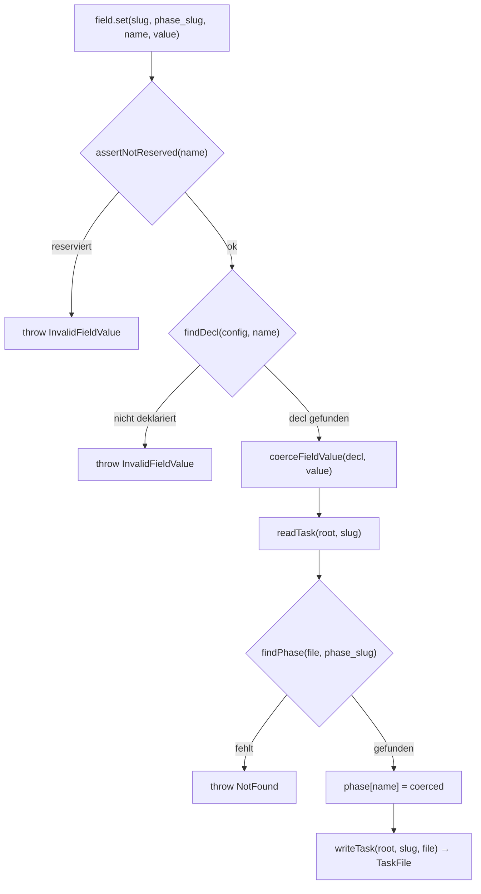

← [ops](_ops.md)

# Custom-Field-Ops (`field.ts`)

Drei Ops auf benutzerdefinierten Per-Phase-Feldern, die in `anchored.yml` unter `task.phase.fields` deklariert werden: `field.list` (liest nur die Config), `field.set` (validiert + coerciert + schreibt) und `field.get` (liest mit derselben Namens-Validierung). Sie sind die generische Erweiterungs-Oberfläche neben den getypten Built-in-Ops wie [phase-ops](./phase-ops.md), [context-ops](./context-ops.md) und [ac-ops](./ac-ops.md).

## Was

- Jedes Feld muss in `anchored.yml` unter `config.task.phase.fields` deklariert sein; eine Deklaration (`PhaseFieldDecl`) hat die Form `{ name, type }` mit `type` aus `string` / `number` / `boolean` / `enum`.
- `RESERVED_FIELD_NAMES` ist eine hartcodierte `Set`-Liste der Built-in-Phase-Keys: `name`, `slug`, `status`, `context`, `rules`, `acceptance_criteria`, `retry_count`.
- `field.set` und `field.get` lehnen jeden reservierten Namen über `assertNotReserved` mit einem `InvalidFieldValue`-Fehler ab — diese Keys müssen über ihre eigenen getypten Ops laufen.
- `field.set` validiert in fester Reihenfolge: (1) nicht reserviert, (2) in `anchored.yml` deklariert (`findDecl`), (3) Wert wird via `coerceFieldValue(decl, value)` aus `validate.ts` auf den deklarierten Typ coerciert.
- `field.set` schreibt den coercierten Wert direkt als Property auf das gefundene Phase-Objekt (`phase[name] = coerced`) und persistiert über `writeTask`.
- `field.get` ist ein reiner Read: gleiche Reserved-/Declared-Gates, dann Rückgabe von `phase[name]` (kann `undefined` sein, wenn das Feld noch nie gesetzt wurde).
- `field.list` ist config-only und macht kein IO; es mappt `config.task.phase.fields` auf `{ name, type }[]`.
- `findDecl` wirft `InvalidFieldValue` mit der Liste der bekannten Feldnamen, wenn der Name nicht deklariert ist.
- `findPhase` wirft `NotFound`, wenn der `phase_slug` nicht in der Task-Datei existiert.
- Alle drei Ops sind Factories (`makeFieldList` / `makeFieldSet` / `makeFieldGet`), die ihre Dependencies über `FieldDeps` (= `TaskDeps` plus `config: AnchoredYml`) injiziert bekommen.

## Wie

### Benutzung

Die Ops werden über Factories erzeugt, denen `FieldDeps` (`root` + `config`) übergeben wird:

- `makeFieldList({ config })` → `() => { name: string; type: string }[]`
- `makeFieldSet({ config, root })` → `async (slug, phase_slug, name, value: unknown) => Promise<TaskFile>`
- `makeFieldGet({ config, root })` → `async (slug, phase_slug, name) => Promise<unknown>`

`field.set` und `field.get` adressieren ein Feld über das Tripel (`slug` der Task, `phase_slug` der Phase, `name` des Feldes); `field.set` nimmt zusätzlich den noch un-coercierten `value: unknown`.

### Funktion

`field.set` durchläuft eine feste Validierungs-Pipeline, bevor geschrieben wird:

`field.get` durchläuft dieselben `assertNotReserved`- und `findDecl`-Gates (das `findDecl`-Ergebnis wird verworfen, es dient nur der Validierung), liest dann `readTask` + `findPhase` und gibt `phase[name]` zurück. `field.list` umgeht diesen Pfad komplett und liest ausschließlich `config.task.phase.fields`.

## Warum

- Die Doc-Kommentare nennen den Grund für `RESERVED_FIELD_NAMES`: Würde man Built-in-Keys durch die generische Feld-Oberfläche schleusen, würde das die State-Machine- und Completeness-Gates der getypten Ops umgehen (`field.set` kennt z. B. keinen Status-Übergang).
- `field.get` validiert den Namen mit demselben Gate wie `field.set` ("same surface as set"), damit lesender und schreibender Zugriff dieselbe deklarierte Feld-Menge sehen.
