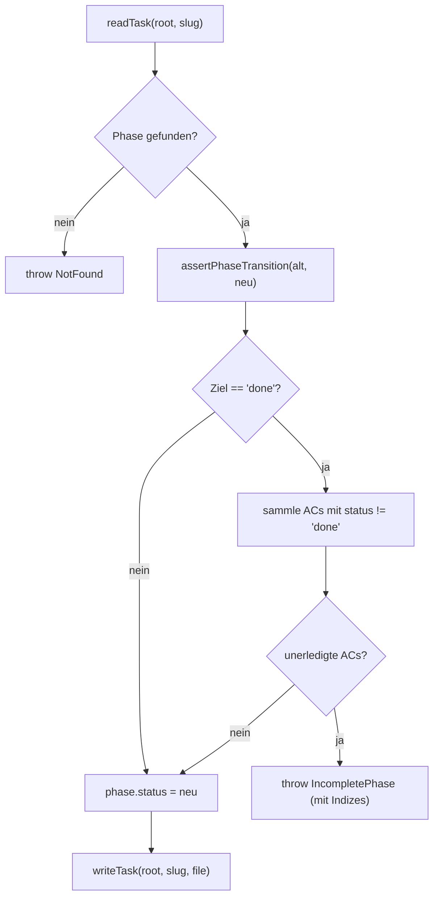
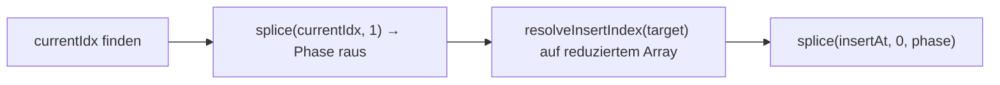

← [ops](_ops.md)

# Phase-Ops

Die Phase-Ops bündeln alle Lese- und Schreiboperationen auf den `phases` eines Task-Files: auflisten, die nächste zu bearbeitende Phase ermitteln, hinzufügen/entfernen/verschieben sowie die Mutationen von Status, Name, Context, Rules und `retry_count`. Jede Op ist eine Factory `make…({ root })`, die eine Closure über das Task-Verzeichnis liefert und intern dem Muster readTask → mutieren → writeTask folgt.

## Was

- Die Datei exportiert **dreizehn** Factory-Funktionen. Die einleitende BLUF des Scans („Neun Ops") zählt zu grob: zusätzlich zu list/next/add/remove/move/status.set/name/context/retry_count existieren `rules.set`, `rules.add` und `rules.remove` (also drei separate Rules-Ops), plus `context.set` — in Summe 13 Factories.
- `makePhaseList(slug)` liefert ein Array aus `{ name, slug, status }` für jede Phase, in Reihenfolge des `phases`-Arrays. Reine Leseoperation, kein Schreibzugriff.
- `makePhaseNext(slug)` ist **resume-safe**: es gibt zuerst die erste Phase mit `status === 'in-progress'` zurück, erst danach die erste mit `status === 'pending'`; gibt es keine, liefert es `null`. Eine begonnene Phase hat damit Vorrang vor einer noch nicht gestarteten.
- `PhasePosition` ist eine Union: `{ after: string }` | `{ before: string }` | `{ to: 'start' | 'end' }`. `resolveInsertIndex` löst sie auf: `to:'start'` → 0, `to:'end'` → Länge des Arrays, `after:x` → Index von x + 1, `before:x` → Index von x.
- `makePhaseAdd(slug, init, position = { to:'end' })` fügt eine Phase ein. Bei kollidierendem `init.slug` wirft es `DuplicateSlug`. Default-`status` ist `'pending'`. Fehlen `acceptance_criteria`, wird ein einzelnes Platzhalter-AC `{ text: 'TBD — fill in during plan stage', status: 'pending' }` gesetzt (Schema verlangt min. 1 AC pro Phase). `context` und `rules` werden nur gesetzt, wenn übergeben.
- `makePhaseRemove(slug, phase_slug, opts)` entfernt eine Phase. Ist deren `status === 'done'` und **nicht** `opts.force === true`, wirft es `DonePhaseImmutable` — eine erledigte Phase wird sonst nicht gelöscht.
- `makePhaseMove(slug, phase_slug, target)` entfernt die Phase erst aus dem Array und löst den Zielindex **danach** auf (`after:'foo'` meint die Position nach foo im bereits reduzierten Array).
- `makePhaseStatusSet(slug, phase_slug, status)` ruft zuerst `assertPhaseTransition(phase.status, status)` (Übergangsvalidierung). Beim Zielstatus `'done'` greift das **AC-Completeness-Gate**: jede AC muss `status === 'done'` sein, sonst wirft es `IncompletePhase` und nennt die Indizes der noch nicht erledigten ACs. Andere Zielstatus (z. B. blocked, deferred) unterliegen diesem Gate nicht.
- `makePhaseNameSet` / `makePhaseContextSet` setzen `phase.name` bzw. `phase.context` ohne weitere Prüfung (außer dass die Phase existiert).
- `makePhaseRulesSet` überschreibt `phase.rules` vollständig mit der gemappten Liste `{ path, why }`. `makePhaseRulesAdd` hängt eine Regel an (initialisiert `phase.rules` bei Bedarf). `makePhaseRulesRemove(…, idx)` löscht per Index und wirft `NotFound`, wenn `idx` kein Integer oder außerhalb `[0, length-1]` liegt.
- `makePhaseRetryCountIncrement(slug, phase_slug)` erhöht `phase.retry_count` (Default 0) um 1, schreibt und gibt den **neuen** Wert zurück — Inkrement und Write in einem readTask→mutate→writeTask-Zyklus.
- Alle Lookups laufen über `findPhaseOrThrow` / `findIndexOrThrow`; eine unbekannte `phase_slug` führt zu `NotFound` mit den bekannten Slugs als Hinweis.

## Wie

### Benutzung

Jede Op ist eine **Factory** nach dem `Deps`-Muster: `makePhaseX({ root })` gibt eine async-Funktion zurück, die als ersten Parameter den Task-`slug` und (außer list/next) die `phase_slug` nimmt. Schreibende Ops liefern das vollständige, neu geschriebene `TaskFile`; `makePhaseList` ein Status-Array; `makePhaseNext` `{ name, slug } | null`; `makePhaseRetryCountIncrement` die neue Zahl.

Signaturen (Kern):

- `makePhaseList(slug) → { name, slug, status }[]`
- `makePhaseNext(slug) → { name, slug } | null`
- `makePhaseAdd(slug, init: PhaseInit, position?: PhasePosition) → TaskFile`
- `makePhaseRemove(slug, phase_slug, { force? }) → TaskFile`
- `makePhaseMove(slug, phase_slug, target: PhasePosition) → TaskFile`
- `makePhaseStatusSet(slug, phase_slug, status) → TaskFile`
- `makePhaseRetryCountIncrement(slug, phase_slug) → number`

Verwandte Op-Gruppen auf benachbarten Einheiten: [task-level-ops](./task-level-ops.md), [ac-ops](./ac-ops.md), [question-ops](./question-ops.md), [context-ops](./context-ops.md), [custom-field-ops](./custom-field-ops.md). Insbesondere füllt das in `IncompletePhase` empfohlene `ac evidence set` (siehe [ac-ops](./ac-ops.md)) eine AC atomar auf `done` und macht damit das Gate von `status.set('done')` passierbar.

### Funktion

Der gemeinsame Ablauf am Beispiel `status.set` mit dem AC-Gate:

Der Positions-Mechanismus für add/move teilt sich `resolveInsertIndex`. Bei `move` ist entscheidend, dass `splice`-Entfernung **vor** der Index-Auflösung passiert:

## Warum

- **Resume-Safety in `next`** (Kommentar „Resume-safety first"): `in-progress` vor `pending`, damit eine nach Crash/Compaction unterbrochene Phase wieder aufgegriffen wird, statt eine neue zu starten.
- **`done`-Phasen sind immutable gegen remove** ohne `force`: Das Entfernen verwirft laut Fehlertext „proven work / proven evidence"; `force` ist die explizite Bestätigung.
- **AC-Completeness-Gate (V0.2-Kommentar)**: Eine Phase gilt nur als `done`, wenn jede AC bereits `done` ist — was per Schema-Invariante bedeutet, dass jede AC nicht-leere Evidence trägt. Das verhindert ein „done" ohne Belege.
- **Atomares `retry_count.increment`**: Inkrement + Write in einem Zyklus, Rückgabe des neuen Werts; die build-Skill vergleicht ihn gegen `anchored.yml.build.retry_limit`, um die Retry-Schleife abzubrechen und ggf. eine manuelle Intervention anzufordern (Doc-Kommentar).
