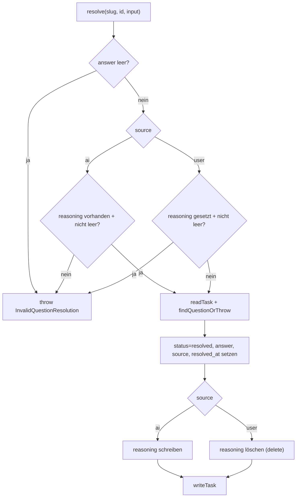
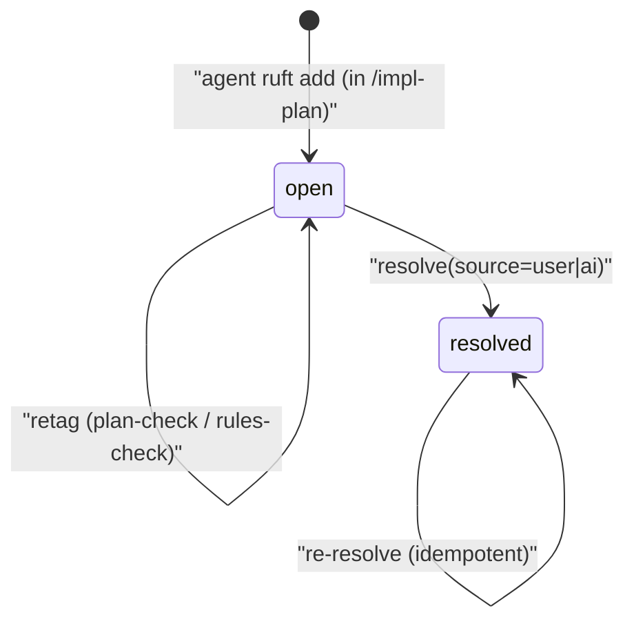

← [ops](_ops.md)

# question-ops

Vier Ops auf dem top-level `questions[]`-Array der Task-Datei: `add`, `list`, `resolve`, `retag`. Sie bilden den strukturierten Q&A-Kanal der V0.3 (ersetzt die V0.2-Freitext-Marker `→ ?` in `context.plan`): Agenten melden Mehrdeutigkeiten als getaggte Items, Orchestrator-Skills fahren darüber den Q&A-Loop, und Auflösungen halten fest, ob User oder AI geantwortet haben.

## Was

- Alle vier Ops sind als Factory-Funktionen (`makeQuestionAdd`/`makeQuestionList`/`makeQuestionResolve`/`makeQuestionRetag`) implementiert, die jeweils `{ root }: Deps` schließen und eine async-Funktion zurückgeben.
- Jede Op liest die Task-Datei via `readTask(root, slug)` und schreibt (bei Mutation) via `writeTask(root, slug, file)` — geteilt mit den übrigen Ops über `./task.js`.
- **add**: hängt eine neue `Question` an `file.questions` an. Die ID wird sequentiell vergeben: `nextQuestionId` scannt vorhandene IDs nach dem größten `q<N>` und liefert `q<N+1>`; bei leerem/fehlendem Array `q1`.
- **add** setzt `status: 'open'`, `created_at` (ISO-Zeitstempel), übernimmt `text`, `priority`, `origin` aus dem Input und fügt `phase` nur hinzu, wenn `input.phase !== undefined`.
- **add** gibt `{ id, file }` zurück — die zugewiesene ID separat, damit Caller die gerade hinzugefügte Frage referenzieren können, ohne das Array erneut zu scannen.
- **list**: liefert Fragen in Einfüge-Reihenfolge (= On-Disk-Reihenfolge). Ohne Filter eine flache Kopie (`[...questions]`); mit Filter ein `filter()` über die Felder `priority`, `status`, `phase` (UND-verknüpft, jedes Kriterium nur aktiv wenn `!== undefined`).
- **resolve**: löst eine Frage auf (oder löst sie erneut auf) — idempotent. Setzt `status: 'resolved'`, `answer`, `source`, `resolved_at` (ISO-Zeitstempel).
- **resolve** validiert drei Invarianten VOR dem Datei-Zugriff und wirft `InvalidQuestionResolution`:
  - leere `answer` (nach `trim()`) → abgelehnt.
  - `source === 'ai'` ohne nicht-leeres `reasoning` → abgelehnt.
  - `source === 'user'` MIT nicht-leerem `reasoning` → abgelehnt.
- **resolve** schreibt bei `source === 'ai'` das `reasoning`-Feld; bei `source === 'user'` wird ein evtl. vorhandenes `reasoning` (aus einer vorigen AI-Auflösung) via `delete` entfernt.
- **retag**: ändert ausschließlich `question.priority`. `text`, `answer`, `status` bleiben unberührt.
- **resolve** und **retag** lokalisieren die Frage über `findQuestionOrThrow`, das bei unbekannter ID `QuestionNotFound` mit kontextabhängigen Vorschlägen wirft (leeres Array → Hinweis auf `task.question.add`; sonst → Liste der bekannten IDs + `task.question.list({ status: 'open' })`).
- `context.plan` (der menschenlesbare Freitext-Verlauf) wird von keiner dieser Ops angefasst — Fragen sind der parallele strukturierte Kanal.

## Wie

### Benutzung

Input-Shapes (caller-facing):

- `QuestionAddInput`: `{ text, priority, origin, phase? }`
- `QuestionResolveInput`: `{ answer, source, reasoning? }` — `reasoning` ist Pflicht bei `source='ai'`, verboten bei `source='user'`.
- `QuestionListFilter`: `{ priority?, status?, phase? }`

Signaturen (jeweils das Ergebnis der Factory):

- `add(slug, input: QuestionAddInput) → Promise<{ id: string; file: TaskFile }>`
- `list(slug, filter?: QuestionListFilter) → Promise<Question[]>`
- `resolve(slug, id, input: QuestionResolveInput) → Promise<TaskFile>`
- `retag(slug, id, priority: QuestionPriority) → Promise<TaskFile>`

Die Factories werden mit `Deps` (`{ root }`) verdrahtet, analog zu den übrigen Ops dieses Ordners ([task-level-ops](./task-level-ops.md), [context-ops](./context-ops.md), [phase-ops](./phase-ops.md), [ac-ops](./ac-ops.md), [custom-field-ops](./custom-field-ops.md)).

### Funktion

`resolve` ist der Op mit der nicht-trivialen Logik: Erst die drei Validierungen (rein input-basiert, ohne Disk-Zugriff), dann lesen, Frage suchen, mutieren, schreiben.

ID-Vergabe in `add` (`nextQuestionId`): maximales `q<N>` ermitteln, `q<N+1>` zurückgeben; bei leerem Array `q1`.

## Warum

- Auflösungen über User und AI laufen bewusst durch denselben Op (`resolve`), unterschieden nur durch `source` — der Kommentar nennt dies explizit als Designentscheidung.
- Das `reasoning`-Feld ist laut Validierungs-Vorschlag der Audit-Trail der AI: Der `/impl-wrap`-Reviewer liest es, um autonome Entscheidungen nachzuvollziehen. Daraus folgt die Asymmetrie — AI muss begründen, User darf nicht (User-Antworten tragen keine Zusatz-Rechtfertigung).
- `retag` existiert laut Kommentar für `plan-check`/`rules-check`, die der vom `plan-agent` ursprünglich vergebenen Priorität widersprechen (z. B. Upgrade `low → medium`); deshalb ändert es nur die Priorität und nichts anderes.

## Wann

Lebenszyklus einer Frage (laut Header-Kommentar):

- **add** wird von Agenten gerufen, um Mehrdeutigkeit zu melden (IDs sequentiell q1, q2, ...).
- **list({ status: 'open' })** treibt den Q&A-Loop in `/impl-refine` Stage 3 und im `/impl-build`-Pre-Flight-Gate.
- **resolve** ist idempotent: erneuter Aufruf auf einer bereits aufgelösten Frage aktualisiert die Felder und frischt `resolved_at` auf.
