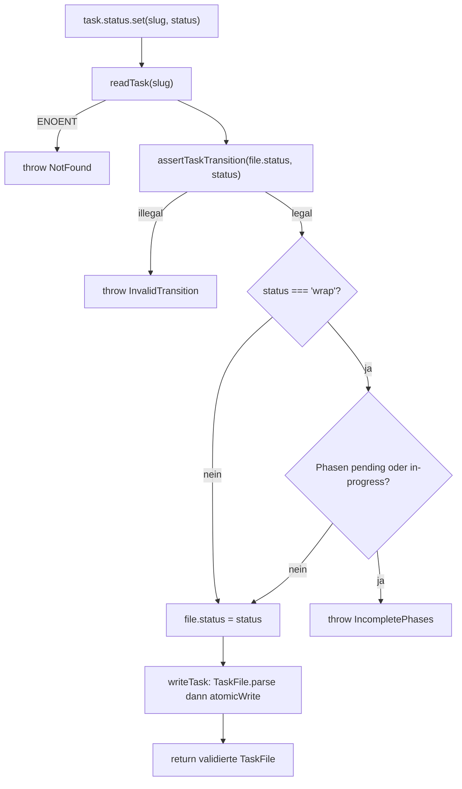
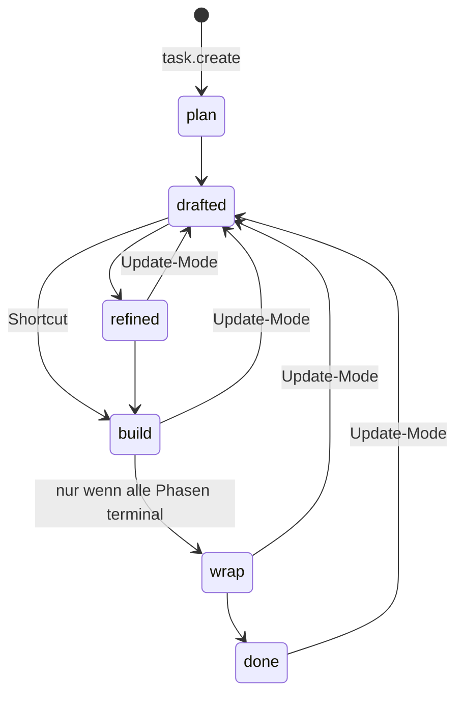

← [ops](_ops.md)

# Task-Level-Ops

Vier Factory-Funktionen bauen den `taskOps`-Teilbaum auf Task-Ebene: `task.create`, `task.read`, `task.status.set` und `task.title.set`. Jede Op folgt dem Muster read → validate → mutate → re-validate → atomicWrite und ist der Einstiegspunkt, an dem eine Task-Datei (`.claude/tasks/<slug>.yml`) entsteht, gelesen oder in ihrem Lebenszyklus weitergeschaltet wird. Feinere Mutationen (Phasen, ACs, Kontext, Felder) übernehmen die Geschwister-Ops wie [phase-ops](./phase-ops.md), [ac-ops](./ac-ops.md), [context-ops](./context-ops.md) und [custom-field-ops](./custom-field-ops.md).

## Was

- Der Pfad einer Task-Datei ist deterministisch: `taskPath(root, slug)` = `<root>/.claude/tasks/<slug>.yml`.
- `task.create(slug, initial)` legt eine neue Task-Datei an und **clobbert niemals**: existiert die Datei bereits, wirft sie `DuplicateSlug`.
- `task.create` füllt Schema-Defaults: `schema_version: 2`, `status: 'plan'`, `created` = `initial.created ?? todayISO()` (UTC, Format `YYYY-MM-DD`), `context.intro` = `initial.intro ?? 'TBD — fill in during plan stage.'`, `phases` = `initial.phases ?? []`.
- In `TaskCreateInput` ist nur `title` strikt erforderlich; `created`, `intro` und `phases` sind optional und werden über Defaults aufgefüllt.
- `task.read(slug)` liest und parst die Datei; bei `ENOENT` wirft sie `NotFound` (nicht den rohen Node-Fehler), bei anderen Lesefehlern reicht sie den Original-Fehler durch.
- `task.status.set(slug, status)` validiert den Übergang über `assertTaskTransition(file.status, status)` bevor mutiert wird — illegale Übergänge werfen `InvalidTransition` und schreiben nichts.
- Der Zielzustand `wrap` ist zusätzlich durch ein Phasen-Gate geschützt: gibt es Phasen mit Status `pending` oder `in-progress`, wirft `task.status.set` `IncompletePhases` und schreibt nichts.
- Die `IncompletePhases`-Meldung listet alle nicht-terminalen Phasen als `"<name>" (<status>)` und liefert kontextabhängige `suggestions` (bei genau einer blockierenden Phase wird diese namentlich genannt).
- `task.title.set(slug, title)` setzt `file.title` ohne weitere Validierung über den `writeTask`-Schema-Check hinaus.
- Jeder Schreibvorgang läuft über `writeTask`, das die **gesamte** Datei erneut gegen `TaskFile.parse` validiert und dann via `atomicWrite` persistiert — eine Mutation, die vom Schema abgedriftet ist, wird hier gefangen.

## Wie

### Benutzung

Jede Op ist eine Factory `make…({ root })`, die eine an `root` gebundene Op-Funktion zurückgibt:

| Factory | zurückgegebene Signatur | wirft |
| --- | --- | --- |
| `makeTaskCreate` | `(slug, initial: TaskCreateInput) => Promise<TaskFile>` | `DuplicateSlug` |
| `makeTaskRead` | `(slug) => Promise<TaskFile>` | `NotFound` |
| `makeTaskStatusSet` | `(slug, status: TaskStatus) => Promise<TaskFile>` | `InvalidTransition`, `IncompletePhases` |
| `makeTaskTitleSet` | `(slug, title) => Promise<TaskFile>` | (nur Schema-Fehler aus `writeTask`) |

Die exportierten Helfer `taskPath`, `readTask`, `writeTask` werden auch von den Geschwister-Ops desselben Ordners geteilt — `readTask`/`writeTask` kapseln das gemeinsame read-/write-Verhalten inklusive `NotFound`-Mapping und Schema-Re-Validierung.

`makeTaskStatusSet` lehnt sich an die existierende `IncompletePhases`-Durchsetzung an und delegiert die Übergangsregeln vollständig an `assertTaskTransition` aus `../../ops/validate.js`.

### Funktion

Alle mutierenden Ops folgen demselben Ablauf; `status.set` zeigt die volle Verzweigung:

`task.create` weicht vor dem Schreiben ab: statt zu lesen prüft es per `access(path, F_OK)`. Existiert die Datei (`access` wirft kein `ENOENT`), wird `DuplicateSlug` geworfen; nur der `ENOENT`-Fall ist der Happy Path, in dem die Default-gefüllte `TaskFile` gebaut und über `writeTask` geschrieben wird. `task.read` endet nach dem `readTask`-Schritt (read + parse, kein Schreiben); `task.title.set` ersetzt den Mutationsschritt durch `file.title = title`.

## Warum

- **Kein Clobber bei `create`** (Kommentar im Code): `task.create` ist ausschließlich für brandneue Tasks gedacht; bestehende Dateien werden über `task.read` plus die dedizierten Mutations-Ops verändert. Überschreiben verlangt explizites Löschen der Datei.
- **`wrap`-Gate**: Der Übergang nach `wrap` wird blockiert, solange Phasen nicht terminal sind, damit eine Task nicht in die Abschlussphase wechselt, während noch offene Arbeit existiert.
- **Re-Validierung in `writeTask`** (Kommentar): die volle `TaskFile.parse` vor dem Persistieren fängt jede Mutation, die vom Schema abgedriftet ist — kein partieller oder ungültiger Zustand landet auf der Platte.

## Wann

`task.status.set` ist der einzige Schaltpunkt der Task-State-Machine. Die hier durchgesetzten Übergänge stammen aus `assertTaskTransition`; der relevante Lebenszyklus:

`task.create` setzt den Initialzustand fix auf `plan`. Selbst-Übergänge (X → X) sind als No-Op erlaubt. Der `wrap`-Gate-Check feuert genau dann, wenn `status === 'wrap'` Ziel ist und mindestens eine Phase `pending` oder `in-progress` ist.
