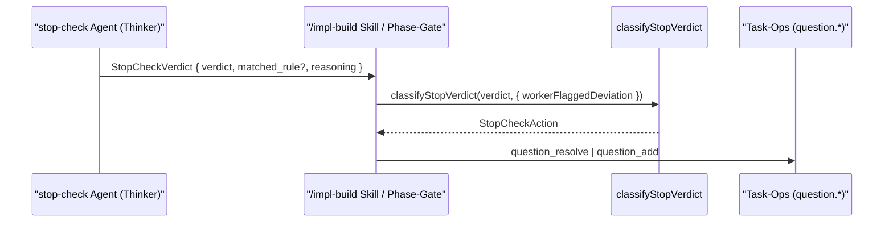
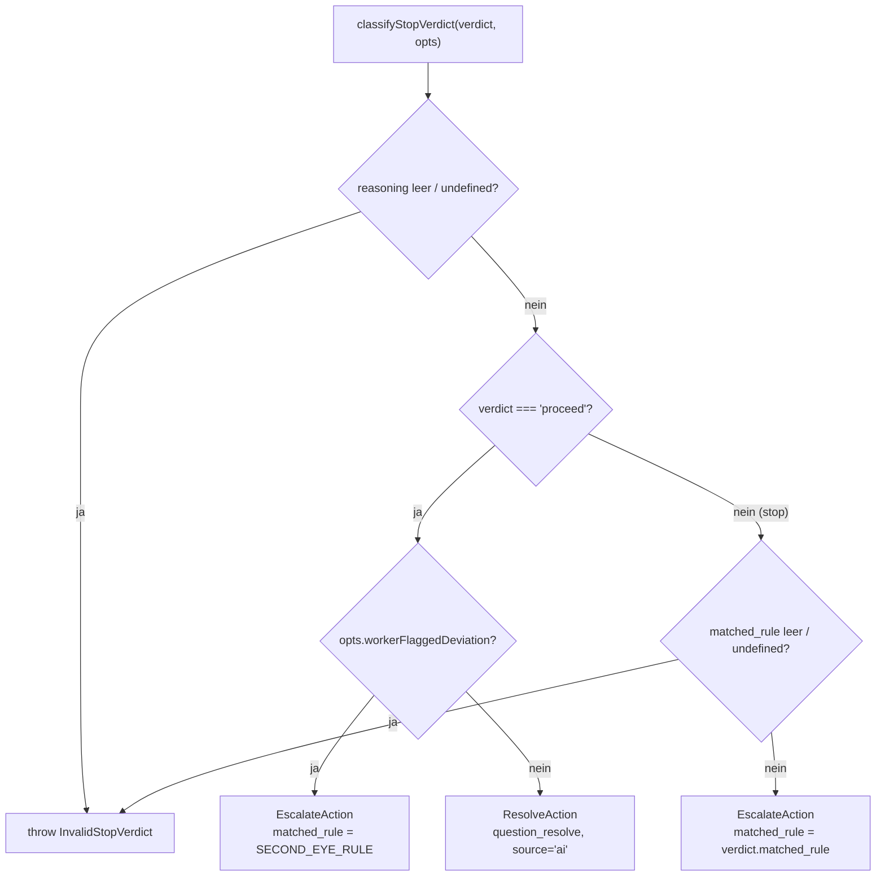

← [core](_core.md)

# stop-check-routing

Deterministischer Router an der Naht zwischen dem `stop-check`-Mini-Agenten (ein reiner Thinker-Prompt) und den MCP-Task-Ops: `classifyStopVerdict` mappt ein Verdikt-Payload (`stop` | `proceed`) in genau **eine** auszuführende Aktion — `question_resolve` bei autonomer Entscheidung, `question_add` bei Halt. Reine Funktion ohne I/O; das Second-Eye-Override erzwingt einen Stop, wenn der Implement-Worker selbst eine Plan-Abweichung gemeldet hat.

## Was

- Die Datei `stop-check.ts` ist die deterministische Naht zwischen dem Agenten `plugin/agents/stop-check.md` (Natural-Language-Richter) und den MCP-Operationen. Der Agent **kann selbst kein MCP aufrufen** (Bug #13605); deshalb ruft die `/impl-build`-Skill (bzw. das Phase-End-Gate des dynamic-workflow-executors) `classifyStopVerdict` auf, um zu erfahren, welche Task-Op laufen soll.
- `classifyStopVerdict(verdict, opts)` ist eine **reine** Funktion: kein I/O, keine MCP-Kenntnis, dadurch unit-testbar ohne Live-LLM.
- Es gibt **zwei** Verdikte, die auf **bestehende** Question-Infrastruktur abgebildet werden (kein neuer Speicher):
  - `proceed` → `ResolveAction` mit `op: 'question_resolve'`, `source: 'ai'`, `reasoning`. Dokumentiert die autonome Entscheidung im Decisions-Log, das `/impl-wrap` reviewt.
  - `stop` → `EscalateAction` mit `op: 'question_add'`, `priority: 'high'`, `origin: 'stop-check'`. Eine NEUE offene Frage; **nicht** auto-resolved — der Build hält an und gibt Kontrolle zurück.
- Das **Second-Eye-Override** wird hier deterministisch erzwungen: Bei `opts.workerFlaggedDeviation === true` wird selbst ein `proceed`-Verdikt zu einem Stop umgeleitet. Es eskaliert unter dem synthetischen `matched_rule` = `SECOND_EYE_RULE`.
- Eingabe-Validierung (wirft `InvalidStopVerdict`):
  - Fehlendes/leeres `reasoning` (nach `trim()`) → Fehler, für **beide** Verdikte. Begründung: `proceed`-reasoning speist die `source='ai'`-Invariante von `question.resolve`; `stop`-reasoning ist die Halt-Erklärung für den Nutzer.
  - `verdict === 'stop'` ohne (nicht-leeres) `matched_rule` → Fehler, damit Eskalation und Audit-Trail die getroffene Regel zitieren können.
- Reihenfolge der Prüfungen: erst `reasoning`-Validierung, dann der `proceed`-Pfad (inkl. Second-Eye), dann der `stop`-Pfad inkl. `matched_rule`-Validierung.
- Exportierte Konstanten (Single Source of Truth, geteilt mit Agent-Prompt, Schema-Default und Tests):
  - `DEFAULT_STOP_RULE = 'a decision deviates from the plan'`
  - `STOP_CHECK_ORIGIN = 'stop-check'`
  - `STOP_ESCALATION_PRIORITY = 'high'`
  - `SECOND_EYE_RULE = 'worker self-reported a plan-deviation (second-eye override)'`
- `partner_voice_summary` im Verdikt ist **reine Kommunikation, kein Routing** — `classifyStopVerdict` ignoriert es; die `/impl-build`-Skill liest es direkt vom Agent-Return und zeigt es im Chat.
- `isEscalateAction(action)` ist ein Narrowing-Helper: liefert `true`, wenn `action.op === 'question_add'`.

## Wie

### Benutzung

Die zentrale Signatur:

```ts
function classifyStopVerdict(
  verdict: StopCheckVerdict,
  opts: { workerFlaggedDeviation?: boolean } = {},
): StopCheckAction
```

- `StopCheckVerdict`: `{ verdict: 'stop' | 'proceed'; matched_rule?: string; reasoning: string; partner_voice_summary?: string }` — spiegelt den "Return contract" von `plugin/agents/stop-check.md`.
- `StopCheckAction = ResolveAction | EscalateAction` — der Aufrufer (Orchestrator) verbindet:
  - `ResolveAction` mit der id der offenen Frage (die anstehende Build-Entscheidung ist selbst eine offene Frage) und der gewählten Antwort, ruft dann `question.resolve` (siehe [config](./config.md)/Ops-Layer).
  - `EscalateAction` (`matched_rule`, `reasoning`, `priority`, `origin`) in `question.add`.
- `isEscalateAction` dient Aufrufern, die auf die Aktionsart verzweigen.

Aufruf-Reihenfolge (wer ruft wen):



### Funktion



## Warum

- **Reine Funktion statt MCP-Aufruf im Agenten**: Der Agent kann wegen Bug #13605 kein MCP aufrufen. Das Trennen von Urteil (Agent) und Plumbing (diese Funktion) macht das Routing ohne Live-LLM unit-testbar.
- **Abbildung auf bestehende Question-Infra**: Bewusst kein neuer Speicher — `proceed` landet als resolved Entscheidung im Decisions-Log (von `/impl-wrap` reviewt), `stop` als offene High-Priority-Frage.
- **Second-Eye als deterministischer, nicht advisory Override**: Asymmetrische Kosten — ein unnötiger Stop ist eine billige Frage, ein falsches `proceed` zementiert eine ungeprüfte Entscheidung. Daher wird eine selbst-gemeldete Abweichung **immer** zum Halt, ohne Ermessensspielraum des Orchestrators.
- **Fail-fast-Validierung an der Naht**: Ein malformiertes Agent-Return scheitert hier laut (`InvalidStopVerdict`), statt eine still-falsche Task-Op zu erzeugen oder einen verwirrenden Fehler erst in der MCP-Schicht auszulösen.

## Wann

- Aufgerufen **build-zeitlich**, wenn eine anstehende Build-Entscheidung ansteht: durch die `/impl-build`-Skill (Phase 4) und durch das Phase-End-Gate des dynamic-workflow-executors (Phase 5), jeweils nachdem der `stop-check`-Agent sein Verdikt-Payload geliefert hat.
- `proceed` lässt den autonomen Lauf weiterlaufen (Entscheidung wird dokumentiert); `stop` (auch via Second-Eye) **hält den Build an** und gibt die Kontrolle an den Nutzer zurück, bis die eskalierte Frage beantwortet ist.
