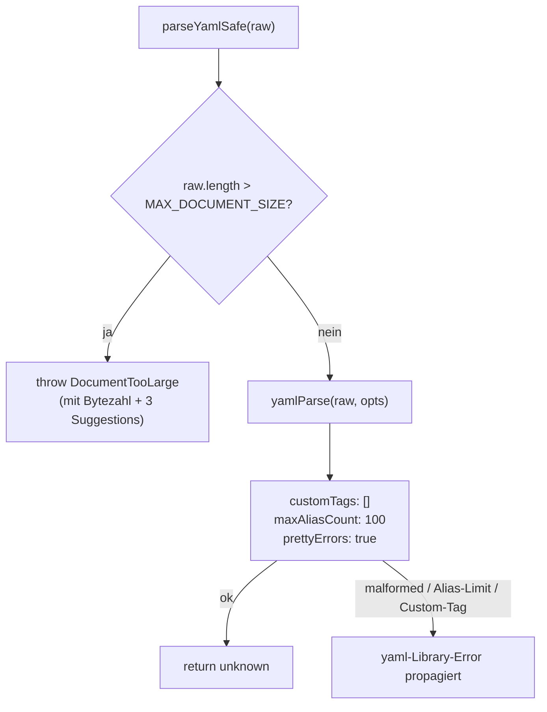

← [core](_core.md)

# yaml-parser (parser.ts)

Zentraler, gehärteter YAML-Parser für untrusted Input. `parseYamlSafe` ist der einzige Eintrittspunkt, durch den nicht vertrauenswürdiges YAML in den Prozess gelangt; jeder YAML-Read im produktiven Pfad (Factory-Ops, MCP-Tools, CLI-Befehle, Config-Loader) läuft über diesen Wrapper statt direkt über `yaml.parse`. Der Wrapper ergänzt drei Sicherheits-Guards rund um die `yaml`-Library, übernimmt aber selbst **keine** Schema-Validierung — die bleibt Aufgabe des Aufrufers.

## Was

- Exportiert die Konstante `MAX_DOCUMENT_SIZE = 1024 * 1024` (1 MB) als harten Cap auf die rohe YAML-Eingabe.
- Exportiert die Funktion `parseYamlSafe(raw: string): unknown`.
- **Guard 1 — Size-Cap:** Ist `raw.length > MAX_DOCUMENT_SIZE`, wirft die Funktion `DocumentTooLarge` (aus [./errors.md](errors.md)), **bevor** der Parser überhaupt aufgerufen wird.
- Der `DocumentTooLarge`-Fehler trägt eine Message mit der tatsächlichen Bytezahl (`got ${raw.length} bytes`) und drei Suggestion-Strings (Audit-History trimmen, Datei manuell inspizieren, Hinweis auf den 1-MB-Defense-in-Depth-Guard).
- **Guard 2 — Billion-Laughs:** Übergibt `maxAliasCount: 100` an `yaml.parse`, begrenzt also die Anzahl Alias-Auflösungen pro Parse.
- **Guard 3 — keine Custom-Tags:** Übergibt `customTags: []`, deaktiviert damit `!!js/function`, `!!js/regexp` und alle benutzerdefinierten Tag-Handler.
- Setzt `prettyErrors: true` für Fehlermeldungen mit Zeilen-/Spalten-Kontext.
- Der Rückgabewert ist `unknown` (eine reine JS-Struktur); der Wrapper deckt nur den Übergang untrusted-bytes → JS-Wert ab.
- Bei Verletzung des Alias-Counts, einem Custom-Tag oder malformedem YAML propagiert der Wrapper den Fehler der zugrundeliegenden `yaml`-Library unverändert.
- Importiert `parse as yamlParse` aus `yaml` und `DocumentTooLarge` aus `./errors.js`.

## Wie

### Benutzung

Aufrufer reichen den rohen YAML-String hinein und erhalten eine untypisierte JS-Struktur zurück, die sie anschließend selbst validieren:

```ts
import { parseYamlSafe } from './parser.js';

const data = parseYamlSafe(raw); // -> unknown
// Caller validiert das Schema separat (z. B. in config.md / factory.md)
```

Der Wrapper ist die einzige erlaubte YAML-Parse-Stelle: Tests stellen sicher, dass es keine weiteren `yaml.parse(`-Callsites in `src/core/`, `src/cli/`, `src/mcp/` und `src/parser/parse.ts` gibt. Konkrete Aufrufer in dieser Folder-Familie sind u. a. [./config.md](config.md) (Config-Loader) und [./factory.md](factory.md) (Factory-Ops).

### Funktion

Der Ablauf ist linear mit genau einer Verzweigung am Size-Cap:



Der Size-Check läuft auf der String-Länge, also vor jeder Parser-Arbeit; erst danach übergibt der Wrapper an `yamlParse` mit den drei fixen Optionen.

## Warum

Die Guards adressieren laut Modul-Docstring drei Klassen von Risiken bei nicht vertrauenswürdiger Eingabe:

- **Size-Cap:** Ein legitimes Task-File liegt im Bereich von zehner-KB; Dokumente über 1 MB deuten entweder auf unbegrenztes Wachstum (Audit-History akkumuliert ohne Schranke) oder auf einen Parse-Bomb-Angriff hin. Der Check vor dem Parsen vermeidet, CPU auf hostile Input zu verschwenden.
- **maxAliasCount: 100:** Die `yaml`-Library erlaubt exponentielle Alias-Expansion über verschachtelte Referenzen (Billion-Laughs). 100 Auflösungen liegen laut Docstring deutlich über jedem legitimen Dokument und deutlich unter der Schwelle, die nennenswert RAM verbraucht.
- **customTags: []:** Task-Files sind reine Daten — es gibt keinen legitimen Grund für ausführbare Payloads oder implementierungsdefinierte Typen.
