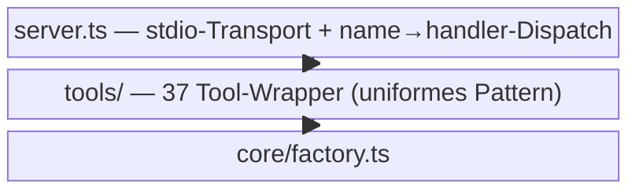

← [src](../_src.md)

# mcp (server)

Die **MCP-Server-Schicht**: exponiert den anchored-Lifecycle als 37 typisierte Tools
über das Model Context Protocol (stdio). `server.ts` registriert alle Tools aus einer
Registry; jedes Tool ist ein dünner Wrapper, der Input via Zod validiert, die
`core`-Factory aufruft und das Ergebnis als JSON bzw. Fehler+suggestions zurückgibt.

| Bereich / Datei | Rolle | Verantwortung (Scope-Grenze) |
|---|---|---|
| [server](server.md) | medio | Der Server selbst: registriert `ALL_TOOLS`, dispatcht Tool-Calls, wrappt Fehler mit typisierten Recovery-suggestions. |
| [tools](tools/_tools.md) | macro | Die 37 Tool-Wrapper + ihr uniformes Pattern. |
