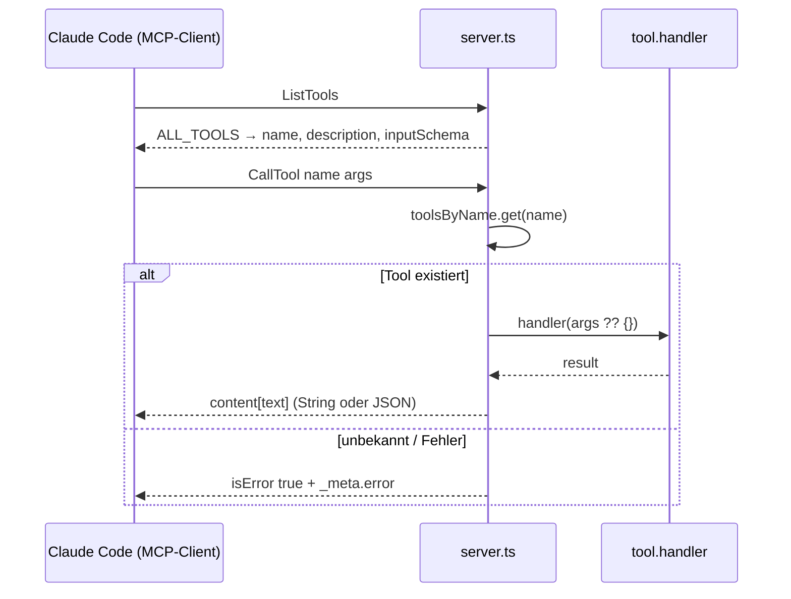
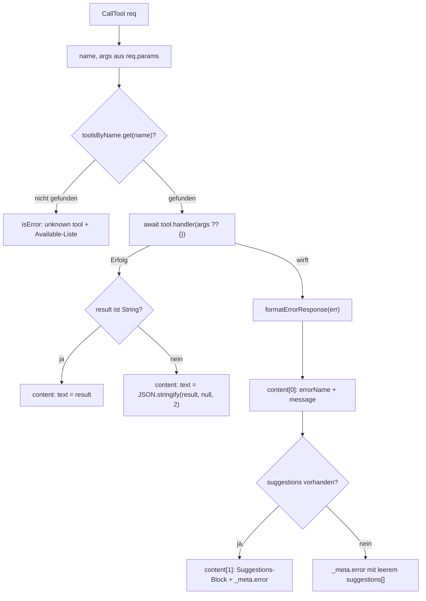

← [mcp (server)](_mcp.md)

# MCP-Server (`server.ts`)

Der MCP-Server registriert die 37 Tools aus `ALL_TOOLS`, kommuniziert über stdio nach dem MCP-Protokoll und dispatcht eingehende Tool-Calls über eine `name → handler`-Map. Geworfene Service-Fehler werden in typisierte MCP-Fehlerantworten mit Recovery-`suggestions` übersetzt. Er ist der Einstiegspunkt, den Claude Code via `npx -y @chaafoo/anchored-mcp` startet.

## Was

- Erstellt eine `Server`-Instanz mit `name: 'task'` und `version: PKG_VERSION`; Capability `tools: {}`.
- `PKG_VERSION` wird beim Start aus `../../package.json` gelesen (via `createRequire(import.meta.url)`) — eine einzige Quelle der Wahrheit für die Version.
- Der `serverInfo.name` ist `'task'` (nicht der Paketname `@chaafoo/anchored-mcp`); dadurch lautet das Tool-Präfix in Claude Code `mcp__task__*`.
- Registriert zwei Request-Handler: `ListToolsRequestSchema` und `CallToolRequestSchema`.
- `ListTools` antwortet mit `ALL_TOOLS`, gemappt auf `{ name, description, inputSchema }`.
- Baut `toolsByName` — eine `Map<string, AnchoredTool>` aus `ALL_TOOLS` — für O(1)-Dispatch beim Call.
- `CallTool` zieht `name` und `arguments` aus `req.params`, schlägt das Tool in `toolsByName` nach.
- Unbekanntes Tool → `isError: true` mit Text `unknown tool: <name>. Available: <komma-getrennte Liste aller Namen>`.
- Bekanntes Tool → `await tool.handler(args ?? {})`; das Resultat wird als String durchgereicht, wenn es ein String ist, sonst als `JSON.stringify(result, null, 2)`.
- Ein im Handler geworfener Fehler wird von `formatErrorResponse(err)` zu einer Fehlerantwort verarbeitet (nicht weitergeworfen).
- `formatErrorResponse` liefert drei Oberflächen:
  - `content[0].text` — menschenlesbare Meldung `<errorName>: <message>`.
  - `content[1].text` — ein `Suggestions:`-Block mit eingerückten Bullets, nur falls `suggestions` vorhanden sind.
  - `_meta.error` — strukturiert `{ name, suggestions: string[] }` für Agenten, die die typisierte Oberfläche dem Text-Parsing vorziehen.
- `suggestions` wird nur übernommen, wenn der Fehler ein Objekt mit Feld `suggestions` ist, das ein Array aus ausschließlich Strings ist; sonst leeres Array.
- `errorName` ist `err.name` bei `Error`-Instanzen, sonst `'Error'`; `message` ist `err.message` bzw. `String(err)`.
- Verbindet einen `StdioServerTransport` via `await server.connect(transport)`.
- Schreibt nach dem Connect `anchored-mcp v<PKG_VERSION> ready` auf **stderr** — stdout ist der MCP-Transport-Kanal.

## Wie

### Benutzung

Der Server wird nicht direkt aufgerufen, sondern als Prozess gestartet und über das MCP-Protokoll über stdio angesprochen. Claude Code (der MCP-Client) ist der Caller:

Die einzelnen Tool-Definitionen und ihr Aufbau (`{ name, description, inputSchema, handler }`) sind in [tools.md](./tools/tools.md) beschrieben.

### Funktion

Beim `CallTool` durchläuft jede Anfrage Lookup, Ausführung und Fehler-Normalisierung:

## Warum

- Der in-chat-Namespace `'task'` weicht bewusst vom Paketnamen ab: kürzer und passend, da jedes Tool auf das Task-File operiert (Kommentar in `server.ts`).
- Die Version wird aus `package.json` gelesen, damit sie eine einzige Quelle der Wahrheit hat und sowohl im lokalen `npm link`-Layout als auch im veröffentlichten Install-Layout korrekt aufgelöst wird.
- `formatErrorResponse` exponiert `_meta.error` zusätzlich zum Text, damit aufrufende Agenten Recovery-`suggestions` programmatisch lesen können, ohne den Meldungstext zu parsen.
