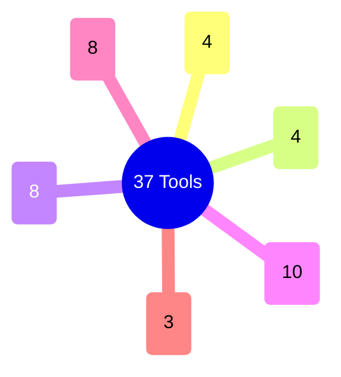

← [mcp (server)](../_mcp.md)

# tools

37 MCP-Tools, jedes ein **dünner Shim** (<25 LOC) über der `core`-Factory. Alle folgen
demselben Pattern aus `_shared.ts`: Zod-`InputSchema` → `withOps(project_root)` →
Factory-Methode → JSON/Fehler-Resultat. Gruppiert nach Lifecycle-Domäne (task,
question, context, phase, ac, field).

| Datei | Rolle | Verantwortung (Scope-Grenze) |
|---|---|---|
| [tools](tools.md) | medio | Das uniforme Wrapper-Pattern: `_shared.ts`-Helfer (BaseSchema/PhaseSchema/AcSchema, `withOps`) und wie ein Tool an die Factory delegiert. |
| [tools.catalog](tools.catalog.md) | micro | Erschöpfende Aufzählung aller 37 Tools, gruppiert nach Domäne, mit dem MCP-Namen + der Factory-Methode je Tool. |
