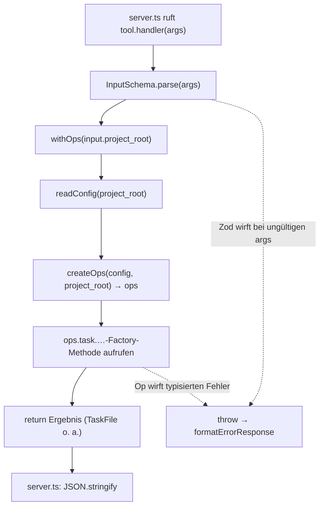

← [tools](_tools.md)

# tools — das Wrapper-Pattern

Die 37 MCP-Tools teilen sich ein uniformes Gerüst: Jedes Tool ist ein dünner Shim über
die Factory aus `src/core/factory.ts` (gleicher Code-Pfad wie die CLI, anderer
Transport). `_shared.ts` liefert das gemeinsame Gerüst — Zod-Basisschemata und den
`withOps`-Einstieg — sodass jede einzelne Tool-Datei unter 25 LOC bleibt. Die
erschöpfende Liste aller Tools steht in [tools.catalog](tools.catalog.md).

## Was

- `_shared.ts` definiert das Interface `AnchoredTool` mit vier Feldern: `name`, `description`, `inputSchema` (JSON Schema) und `handler: (args: unknown) => Promise<unknown>`.
- `withOps(project_root)` lädt per `readConfig(project_root)` die Config und gibt `createOps(config, project_root)` zurück — das fertige `TaskOps`-Objekt.
- `withOps` lädt die Config bei *jedem* Aufruf neu (ein `fs.readFile` + `zod.parse`), nicht einmalig pro Session.
- `_shared.ts` exportiert drei gestaffelte Zod-Schemata, die aufeinander aufbauen:
  - `BaseSchema` — `project_root` (String, min 1) + `slug` (String, min 1).
  - `PhaseSchema` — `BaseSchema` + `phase_slug` (String, min 1).
  - `AcSchema` — `PhaseSchema` + `ac_index` (nicht-negative Ganzzahl).
- Jede Tool-Datei folgt demselben Muster: eigenes `InputSchema` (ein Basisschema via `.extend(...)` erweitert) → `zodToJsonSchema(InputSchema)` als `inputSchema` → im `handler`: `InputSchema.parse(args)` → `withOps(...)` → eine Factory-Methode.
- `index.ts` sammelt alle Tools in `ALL_TOOLS: AnchoredTool[]`, gruppiert in fünf Kategorien: task-lifecycle (4), question (4), context (8), phase (10), ac (8), field (3).
- Der Kommentar in `index.ts` nennt 37 Tools; das Array `ALL_TOOLS` zählt 37 Einträge (4+4+8+10+8+3).
- `index.ts` exportiert zusätzlich `resolveProjectRoot(args)` und `strProp(description)` — laut Kommentar nur noch für Transport-/Test-Code, da die Tool-Dateien `project_root` direkt an `withOps` reichen.
- `resolveProjectRoot` löst die Wurzel in dieser Reihenfolge auf: `args.project_root` → Env-Var `ANCHORED_PROJECT_ROOT` → `process.cwd()`.
- Die Tool-Shims fangen *keine* Fehler ab — sie werfen, und `server.ts` (siehe [../server.md](../server.md)) wandelt den Wurf in eine MCP-Fehlerantwort.

### Beispiel-Tools

- `task__create` (`create.ts`): `InputSchema` = `BaseSchema` + `title` (Pflicht, min 1) + optional `created`, `intro`, `phases`. Legt `.claude/tasks/<slug>.yml` an, überschreibt eine bestehende Datei *nicht*. Ruft `ops.task.create(slug, initial)` und gibt das `TaskFile` zurück.
- `task__add_evidence` (`add-evidence.ts`): `InputSchema` = `AcSchema` + `line` (Pflicht, min 1). Ruft `ops.task.phase.ac.evidence.add(slug, phase_slug, ac_index, line)`. Die Op hängt die Zeile an `ac.evidence` an, setzt `ac.status = 'done'` und löscht das `failures`-Feld.

> Kontrakt: `task__add_evidence` setzt `ac.status = 'done'` **unbedingt** — Evidence ist der Beweis, dass das AC erfüllt ist. Tool-`description` und der Doc-Kommentar zu `makeAcEvidenceAdd` (`src/core/ops/ac.ts`) sind gleichlautend.

## Wie

### Benutzung

Schlüssel-Signaturen aus `_shared.ts`:

```ts
interface AnchoredTool {
  name: string;
  description: string;
  inputSchema: Record<string, unknown>;
  handler: (args: unknown) => Promise<unknown>;
}

function withOps(project_root: string): Promise<TaskOps>;

const BaseSchema  = z.object({ project_root, slug });
const PhaseSchema = BaseSchema.extend({ phase_slug });
const AcSchema    = PhaseSchema.extend({ ac_index });
```

Ein Tool wird nicht direkt aufgerufen; `server.ts` registriert `inputSchema` beim MCP-SDK und ruft bei einem Tool-Call `tool.handler(args)`. Der Rückgabewert wird von `server.ts` JSON-stringifiziert (bzw. als String durchgereicht).

### Funktion



Jeder Shim macht exakt vier Schritte: validieren (`parse`), Factory holen (`withOps`), Argumente an die passende verschachtelte `ops`-Methode weiterreichen, Ergebnis zurückgeben. Branches existieren im Shim selbst nicht — Fehlerfälle entstehen nur durch geworfene Exceptions (Zod-Validierung oder typisierte Op-Fehler) und werden außerhalb in `server.ts` behandelt.

## Warum

- Die gestaffelten Schemata (`Base` → `Phase` → `Ac`) bündeln die immer wiederkehrenden Pflichtargumente, sodass jeder Shim nur seine *zusätzlichen* Felder via `.extend(...)` deklarieren muss — laut Datei-Kommentar das Mittel, um jeden Shim „under 25 LOC" zu halten.
- Der Kommentar zu `withOps` begründet das Neuladen der Config pro Aufruf damit, dass es „cheap" ist und „field declarations stay in sync if anchored.yml changes during a session".
- Der Header-Kommentar in `index.ts` nennt den Grund für die Shim-Dünne: „Same code path as the CLI; different transport." — die Factory ist die einzige Quelle der Wahrheit.
