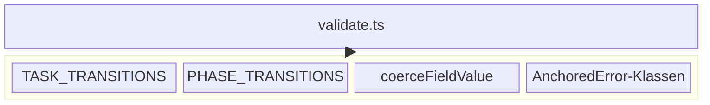

← [src](../_src.md)

# ops (validation)

Die **State-Machine-Durchsetzung**: ein File (`validate.ts`), das die Task- und
Phasen-Statusmaschinen, die Feld-Typ-Coercion und die typisierten Fehlerklassen
zentralisiert. Jede Mutation in der Service-Schicht ruft diese Funktionen vor dem
Persistieren — Caller fangen Fehler und rendern ohne Teil-Writes.

| Datei | Rolle | Verantwortung (Scope-Grenze) |
|---|---|---|
| [validate-state-machines](validate-state-machines.md) | medio | Die zwei Transition-Tabellen + Assertion-Funktionen + Typ-Coercion + Fehlerklassen, die Statuslegalität erzwingen. |

> Nicht zu verwechseln mit [core/ops](../core/ops/_ops.md): dort leben die
> Entity-Mutationen, hier nur die State-Machine-Regeln, die sie gegenprüfen.
