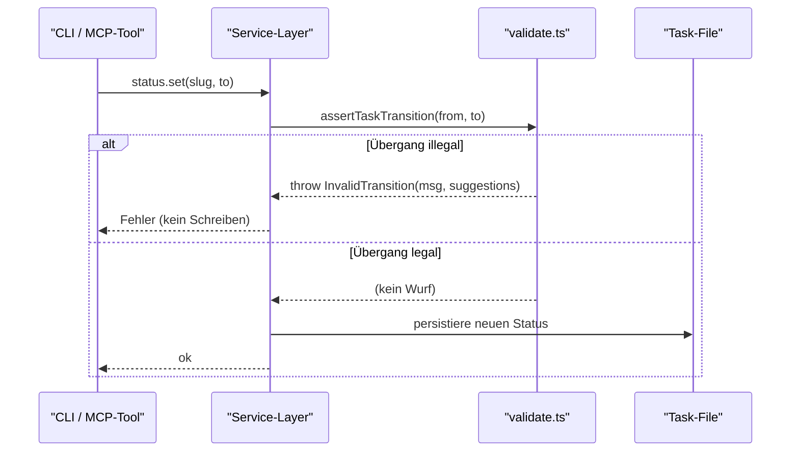
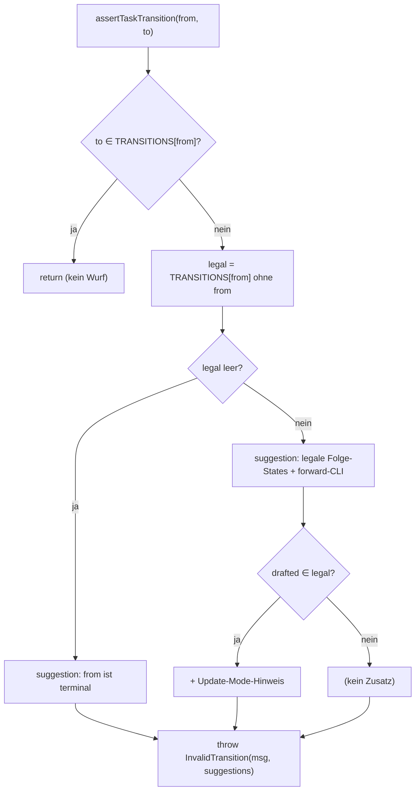

← [ops (validation)](_ops.md)

# validate.ts — State-Machine- und Feld-Validierung

State-machine-Validierung für Status-Übergänge (Task + Phase) und Feld-Typ-Konformität, plus Hilfsfunktionen für AC-Index-, Evidence- und Feldwert-Prüfung und eine Familie typisierter Fehlerklassen. Die Service-Schicht ruft diese Funktionen **vor** jeder Mutation/Persistierung auf; illegale Übergänge werfen typisierte Fehler, sodass Aufrufer (CLI-Commands, MCP-Tools) sie abfangen und melden können, **ohne** partiellen State zu schreiben.

## Was

- **Zwei Transition-Tabellen** definieren die legalen Status-Übergänge:
  - `TASK_TRANSITIONS` (Task-Status, 6 States) und `PHASE_TRANSITIONS` (Phase-Status, 5 States).
- **Task-Status-Übergänge** (`TASK_TRANSITIONS`):

  | von `from` | erlaubte `to` (ohne Self) |
  |---|---|
  | `plan` | `drafted` |
  | `drafted` | `refined`, `build` |
  | `refined` | `build`, `drafted` |
  | `build` | `wrap`, `drafted` |
  | `wrap` | `done`, `drafted` |
  | `done` | `drafted` |

  - Vorwärts-Pipeline: `plan → drafted → refined → build → wrap → done`.
  - Shortcut: `drafted → build` überspringt die Refinement-Stufe.
  - Back-Edge: `refined`, `build`, `wrap` und `done` dürfen je zurück nach `drafted` (Update-Mode zum Revidieren von Scope/ACs/Kontext).
  - Idempotente Self-Transitions `X → X` sind erlaubt (jeder State enthält sich selbst im Set).
- **Phase-Status-Übergänge** (`PHASE_TRANSITIONS`):

  | von `from` | erlaubte `to` (ohne Self) |
  |---|---|
  | `pending` | `in-progress`, `deferred` |
  | `in-progress` | `done`, `blocked`, `deferred` |
  | `blocked` | `pending`, `in-progress` |
  | `done` | — (terminal) |
  | `deferred` | — (terminal) |

  - `blocked` hat einen Retry-Pfad zurück nach `pending`/`in-progress`.
  - `done` und `deferred` sind terminal (Set enthält nur sich selbst).
- `assertTaskTransition(from, to)` / `assertPhaseTransition(from, to)` werfen `InvalidTransition`, wenn `to` nicht im erlaubten Set von `from` liegt; bei terminalem `from` lautet der Hinweis, dass keine weiteren Übergänge erlaubt sind.
- Beide assert-Funktionen befüllen die Fehler-`suggestions` kontextabhängig (legale Folge-States, konkrete CLI-Kommandos, Update-Mode-Hinweis bei verfügbarem `drafted`).
- `coerceFieldValue(decl, value)` validiert einen Wert gegen den deklarierten Feldtyp und liefert den (ggf. koerzierten) Wert zurück oder wirft `InvalidFieldType`:
  - `string`: akzeptiert `string`; koerziert `number`/`boolean` via `String(value)`.
  - `number`: akzeptiert endliche `number` (`Number.isFinite`); koerziert numerische Strings via `Number(...)`, wenn das Ergebnis endlich ist.
  - `boolean`: akzeptiert `boolean`; koerziert die Strings `"true"`/`"false"`.
  - `enum`: stringifiziert den Wert und akzeptiert ihn nur, wenn er in `decl.values` (Fallback `[]`) enthalten ist.
  - Der `default`-Zweig ruft `assertExhaustive(decl.type)` (Compile-Zeit-Vollständigkeit der Typ-Union).
- `assertAcIndexInRange(acCount, acIndex)` wirft `OutOfRange`, wenn `acIndex` keine Ganzzahl ist oder außerhalb `0..acCount-1` liegt; bei `acCount === 0` wird gemeldet, dass die Phase keine ACs hat.
- `assertEvidenceArrayNonEmpty(evidence)` wirft `InvalidEvidence`, wenn das Array fehlt/leer ist oder ein Element kein String, leer/whitespace-only oder das Legacy-Sentinel `'—'` ist.
- `isEvidenceFilled(evidence)` ist das **nicht-werfende** Pendant (reines Prädikat): `null`/`undefined` → `false`; `string[]` → `true` nur, wenn nicht leer und jedes Element ein nicht-leerer String ≠ `'—'`; einzelner `string` → `true`, wenn getrimmt ≠ `''` und ≠ `'—'`; alles andere → `false`.
- **Typisierte Fehlerklassen** erben alle von `AnchoredError` (das ein `suggestions: string[]` mit 1–3 Recovery-Aktionen trägt): `InvalidTransition`, `InvalidFieldType`, `OutOfRange`, `InvalidEvidence`, `NotFound`, `IncompleteEvidence`, `IncompletePhases`.
- `IncompleteEvidence` und `IncompletePhases` sind hier **nur deklariert** (mit dokumentierten Wurf-Stellen `phase.status.set("done")` bzw. `task.status.set("wrap")`); in `validate.ts` selbst werden sie nicht geworfen.
- Das Modul re-exportiert `TaskStatus`, `PhaseStatus` und `PhaseFieldType` als Convenience für historische Aufrufer.

## Wie

### Benutzung

Die Service-Schicht ruft die Validatoren als Guard auf, bevor sie mutiert und persistiert. Ein typischer Status-Set-Ablauf:

Signaturen (Auszug):

- `assertTaskTransition(from: TaskStatus, to: TaskStatus): void`
- `assertPhaseTransition(from: PhaseStatus, to: PhaseStatus): void`
- `coerceFieldValue(decl: PhaseFieldDecl, value: unknown): unknown`
- `assertAcIndexInRange(acCount: number, acIndex: number): void`
- `assertEvidenceArrayNonEmpty(evidence: string[]): void`
- `isEvidenceFilled(evidence: unknown): boolean`

CLI druckt `error.suggestions` als Bullet-Liste unter der Fehlermeldung; MCP-Tools reichen sie in `error.data.suggestions` weiter, damit Agenten sie programmatisch lesen können.

### Funktion

Kern der Übergangs-Validierung: Lookup im Set + Filterung der legalen Folge-States für kontextabhängige `suggestions`.

Die Transition-Sets sind als `Record<Status, ReadonlySet<Status>>` modelliert; die Prüfung ist ein O(1)-`Set.has`. `coerceFieldValue` ist ein `switch` über `decl.type`, dessen `default`-Zweig per `assertExhaustive(_: never)` die Vollständigkeit über die Typ-Union erzwingt — ein neuer Feldtyp ohne `case` schlägt zur Compile-Zeit fehl.

## Warum

- **Validierung vor Persistierung**: Der Datei-Kommentar nennt als Grund, dass illegale Mutationen werfen, sodass Aufrufer sie abfangen, ohne partiellen State zu schreiben.
- **Back-Edge nur nach `drafted`**: Der Kommentar begründet, dass keine weiteren Back-Edges erlaubt sind, weil sie erforderliche Gates überspringen würden; der Rückweg nach `drafted` dient dem Update-Mode (Scope/ACs/Kontext revidieren).
- **Self-Transitions als No-Ops**: Laut Kommentar bewusst erlaubt (`X → X`).
- **`'—'`-Sentinel-Ablehnung**: Evidence-Prüfung weist explizit das Legacy-Em-Dash-Sentinel zurück, um Platzhalter nicht als echten Beweis durchzulassen — dies stützt anchoreds USP, dass eine Phase nur mit konkretem Proof pro AC als `done` gilt (siehe Kommentar zu `IncompleteEvidence`/`isEvidenceFilled`).
