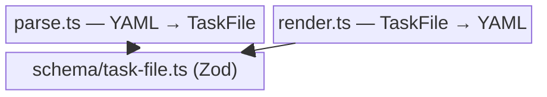

← [src](../_src.md)

# parser

Die **Serialisierungs-Schicht** zwischen rohem YAML und der typisierten `TaskFile`-
Struktur: `parse.ts` für YAML→Zod (mit Schema-Version-Gating + Legacy-Stripping),
`render.ts` für TaskFile→YAML (mit LSP-Schema-Direktive + Block-Scalars).

| Datei | Rolle | Verantwortung (Scope-Grenze) |
|---|---|---|
| [task-file-parser](task-file-parser.md) | medio | Wrappt `yaml.parse()` + `TaskFile.parse()`; gated `schema_version`, strippt Legacy-Felder, re-raised Zod-Fehler mit Pfad. |
| [task-file-renderer](task-file-renderer.md) | medio | Wrappt `yaml.stringify` mit LSP-Direktive (Zeile 1) + Block-Scalar-Config für mehrzeilige Evidence/Context. |
