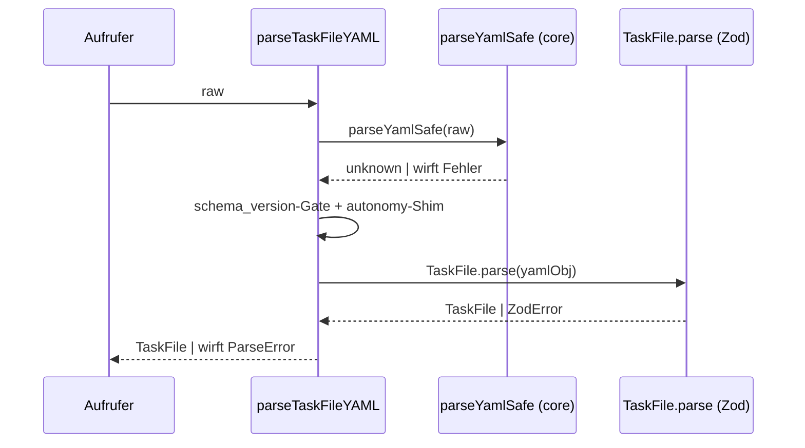
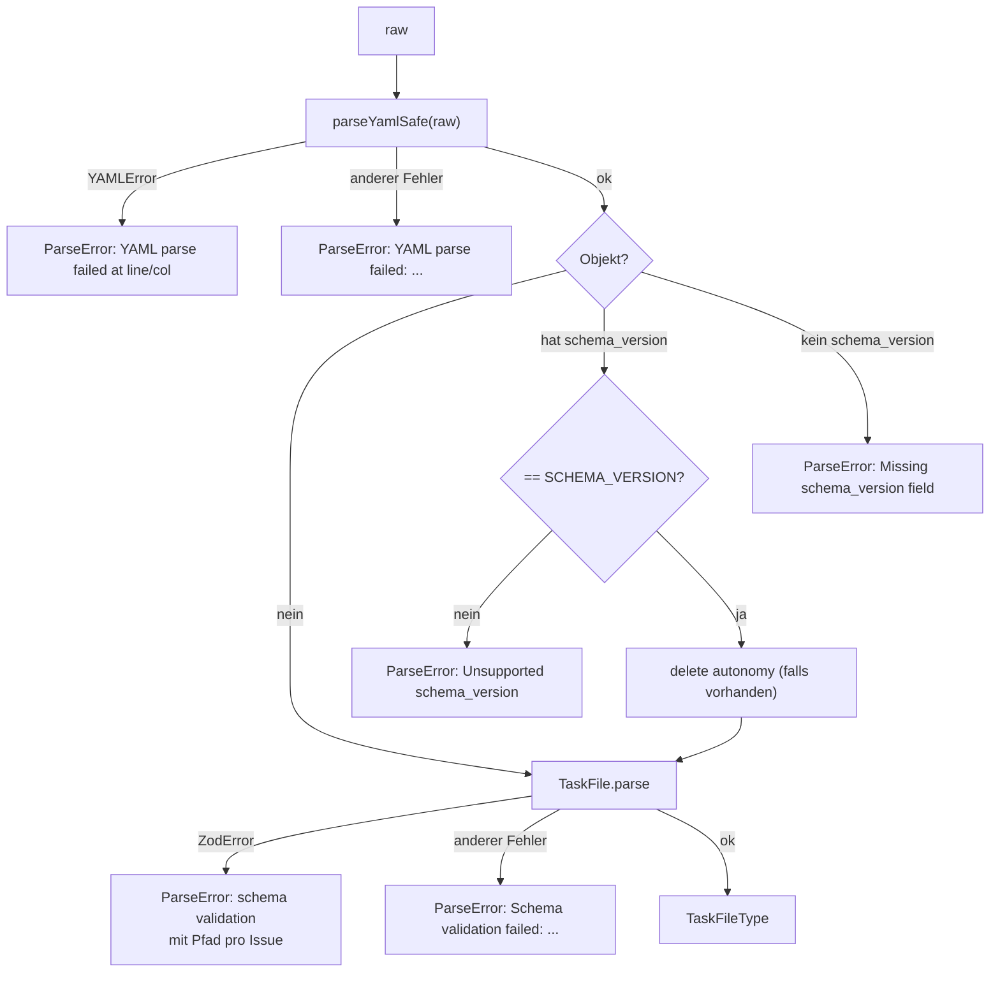

← [parser](_parser.md)

# task-file-parser (parse.ts)

`parseTaskFileYAML(raw)` verwandelt rohen YAML-Text in eine typisierte `TaskFile`-Struktur. Es ist ein dünner Wrapper, der `parseYamlSafe()` (untrusted-bytes → JS-Wert) und das Zod-Schema `TaskFile.parse()` (JS-Wert → typisierte Struktur) verkettet und dazwischen zwei Vorprüfungen einzieht: `schema_version`-Gating und ein Legacy-Feld-Shim. Es ist die Lese-Gegenseite zum [task-file-renderer](./task-file-renderer.md).

## Was

- Exportiert die Funktion `parseTaskFileYAML(raw: string): TaskFileType`.
- Exportiert die Fehlerklasse `ParseError` (erweitert `Error`, `name = 'ParseError'`, optionales `cause`).
- Re-exportiert `SCHEMA_VERSION` aus `../schema/task-file.js`.
- Schritt 1: ruft `parseYamlSafe(raw)` aus `../core/parser.js` auf (Größen-Cap 1 MB, Alias-Guard, keine custom tags) und erhält ein `unknown`.
- Fängt aus Schritt 1 nur `YAMLError` gezielt ab und wirft `ParseError` mit Zeile/Spalte aus `err.linePos?.[0]`; fehlende Positionsangaben werden zu `'?'`.
- Jeder andere Fehler aus Schritt 1 (z. B. das von `parseYamlSafe` geworfene `DocumentTooLarge`) wird über den generischen Zweig als `ParseError` mit Präfix `YAML parse failed:` neu geworfen.
- `schema_version`-Gating: ist das geparste Objekt ein nicht-null-Objekt mit Schlüssel `schema_version`, dessen Wert aber `!== SCHEMA_VERSION` ist, wirft es `ParseError` mit `Unsupported schema_version: ...` (Wert via `JSON.stringify`).
- Fehlt der Schlüssel `schema_version` bei einem nicht-null-Objekt, wirft es `ParseError` mit `Missing schema_version field.`.
- Ist das Ergebnis kein Objekt (z. B. `null`, String, Zahl), greift keiner der Gating-Zweige; der Wert läuft direkt in `TaskFile.parse()`.
- Legacy-Shim: existiert ein top-level Schlüssel `autonomy` auf dem Objekt, wird er mit `delete` entfernt, bevor das Schema läuft.
- Schritt 2: ruft `TaskFile.parse(yamlObj)` auf und gibt das Ergebnis zurück.
- Fängt aus Schritt 2 `z.ZodError` ab und baut eine mehrzeilige Fehlermeldung; jede Issue wird als `  - <pfad>: <message>` formatiert, wobei ein leerer Pfad zu `(root)` wird.
- Jeder andere Fehler aus Schritt 2 wird als `ParseError` mit Präfix `Schema validation failed:` neu geworfen.

## Wie

### Benutzung

`parseTaskFileYAML(raw: string): TaskFileType` ist der einzige Einstiegspunkt. Aufrufer übergeben den rohen Dateiinhalt und erhalten entweder die typisierte `TaskFile`-Struktur oder eine `ParseError`. Alle Fehlerpfade enden in `ParseError`; das ursprüngliche Problem bleibt über `cause` erreichbar (außer bei den beiden Gating-Würfen, die kein `cause` setzen).

### Funktion

Der Ablauf ist strikt sequenziell mit zwei try/catch-Blöcken und einer Gating-Stufe dazwischen.

Das `schema_version`-Gating läuft bewusst VOR `TaskFile.parse()`: zwar enthält das Schema `schema_version: z.literal(SCHEMA_VERSION)`, aber die generische Zod-Meldung wäre für einen reinen Versions-Mismatch wenig hilfreich. Die Vorprüfung liefert stattdessen eine explizite Meldung.

## Warum

- Der Legacy-Shim für `autonomy` ist nötig, weil das `TaskFile`-Schema `.passthrough()` ist: unbekannte top-level Schlüssel überleben sonst den Parse und würden beim nächsten Schreiben re-emittiert. Laut Kommentar wurde das persistierte Feld `autonomy` in V0.3 entfernt (die drei walk-modes existieren nur noch als ephemerer Skill-Prompt); der explizite `delete` sorgt dafür, dass alte Artefakte (z. B. `autonomy: ask_all`) sauber laden und das Feld dabei abfällt.
- Der Modul-Docstring nennt die Bug-Klassen, die der Renderer/Parser-Vertrag per Konstruktion ausschließt: eingebettete Newlines in evidence, fehlende/falsch geschriebene H1- bzw. Section-Namen, sowie Indentation-Drift zwischen Renderer und Parser.
