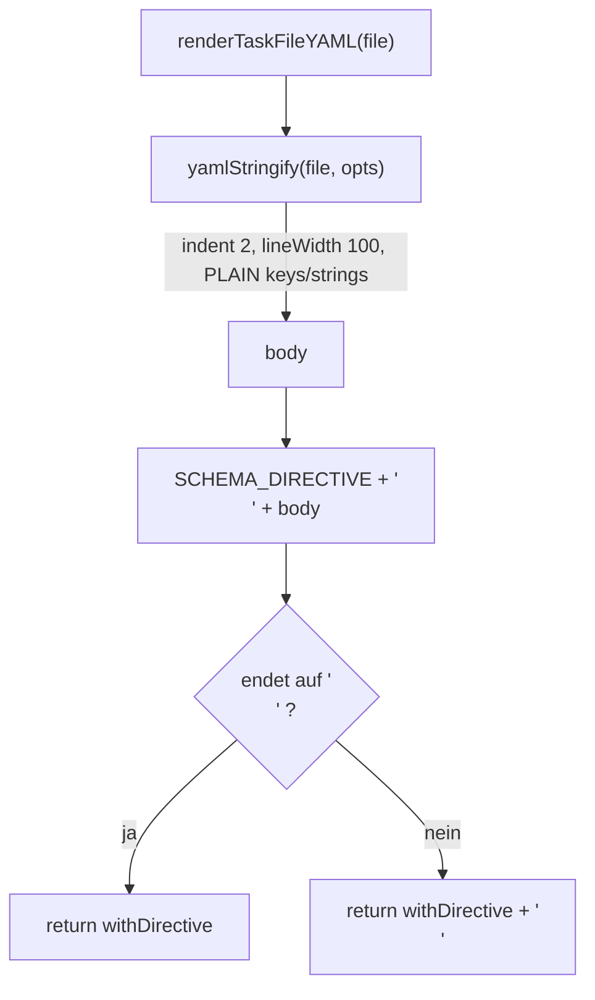

← [parser](_parser.md)

# Task-File Renderer

`render.ts` ist ein dünner Wrapper über `yaml.stringify`, der ein `TaskFile`-Objekt zurück in YAML-Text serialisiert. Seine einzige eigene Logik ist Konfiguration plus das Voranstellen der `yaml-language-server`-Schema-Direktive in Zeile 1 — damit jeder MCP-Write eines Task-Files IDE-Schema-Validierung auslöst. Das Gegenstück zum [task-file-parser](./task-file-parser.md) (lesen → Objekt); hier geht es objekt → text.

## Was

- Exportiert genau zwei Symbole: die Konstante `SCHEMA_DIRECTIVE` und die Funktion `renderTaskFileYAML(file: TaskFile): string`.
- `SCHEMA_DIRECTIVE` ist `# yaml-language-server: $schema=${SCHEMA_URL_TASK_FILE}` — ein YAML-Kommentar, der die Schema-URL aus `../schema/urls.js` einbettet.
- `renderTaskFileYAML` serialisiert das übergebene `TaskFile` mit `yamlStringify` aus dem `yaml`-Paket.
- Die Serialisierung verwendet `indent: 2` (2-Space-Einrückung) und `lineWidth: 100`.
- `defaultStringType: 'PLAIN'` und `defaultKeyType: 'PLAIN'`: kurze Strings/Keys werden unquoted/plain ausgegeben; mehrzeilige Strings wählt die `yaml`-Lib automatisch als Block-Literal (`|`) — kein selbst geschriebener Block-Scalar-Code.
- Die Direktive wird dem Serialisierungs-Body als Zeile 1 vorangestellt: `${SCHEMA_DIRECTIVE}\n${body}`.
- Der Rückgabewert endet garantiert mit genau einem Newline: endet der Text bereits auf `\n`, bleibt er unverändert, sonst wird `\n` angehängt.
- Es gibt keine weitere eigene Logik — der Renderer ist laut Modul-Doc bewusst nur Konfiguration; Validierung lebt im Parser, Mutation im Service-Layer.

## Wie

### Benutzung

Eine einzige reine Funktion: `TaskFile` rein, YAML-`string` raus. Kein I/O, kein State.

```ts
import { renderTaskFileYAML, SCHEMA_DIRECTIVE } from './render.js';

const yamlText = renderTaskFileYAML(taskFile);
// yamlText[0..] beginnt mit SCHEMA_DIRECTIVE und endet auf '\n'
```

`SCHEMA_DIRECTIVE` ist als Single Source of Truth zusätzlich exportiert, damit andere Stellen denselben Direktiven-String referenzieren können.

### Funktion



Der Kern ist die Konfiguration von `yamlStringify`: mehrzeilige Felder (etwa Evidence/Context) landen durch `defaultStringType: 'PLAIN'` als Block-Literale `|`, ohne Escape-Soup. Danach folgt das deterministische Voranstellen der Direktive und die Newline-Normalisierung am Dateiende.

## Warum

- **Direktive im Renderer statt im Datenmodell:** YAML-Kommentare round-trippen laut Modul-Doc nicht durch den Parser. Der Renderer ist deshalb der einzige kanonische Injektionspunkt — jeder MCP-Write emittiert die Direktive neu, unabhängig davon, wie die Datei vorher auf der Platte aussah. So bleibt IDE-Validierung immer aktiv.
- **Block-Literale (`|`) statt Quoting:** vermeidet laut Code-Kommentar die "newline-corruption bug-class" bei mehrzeiligen Strings.
- **PLAIN/Insertion-Order:** keine alphabetische Sortierung, die Key-Reihenfolge der Eingabe bleibt erhalten (Modul-Doc); kurze Werte bleiben unquoted und damit lesbar.
- **Trailing Newline:** POSIX-Textdatei-Konvention (Modul-Doc).
