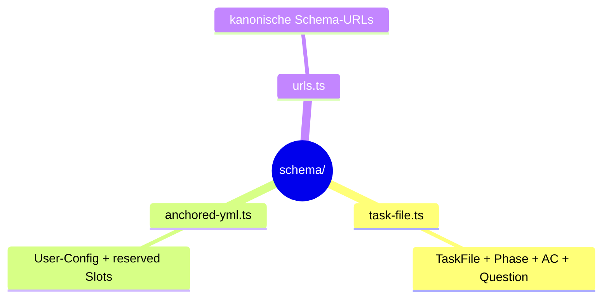

← [src](../_src.md)

# schema

Die **Zod-Typdefinitionen** — die Single Source of Truth für die Form von Task-File
und `anchored.yml`. `core` und beide Transport-Schichten validieren gegen genau diese
Schemas; die publizierten JSON-Schemas (für IDE-Validierung) werden hieraus generiert.

| Datei | Rolle | Verantwortung |
|---|---|---|
| [task-file-schema](task-file-schema.md) | micro | Erschöpfender Feld-Katalog des Task-Files: alle Felder + Typen + Enums + Atomaritäts-Refinements (Evidence/Failures). |
| [anchored-yml-schema](anchored-yml-schema.md) | micro | Erschöpfender Feld-Katalog der User-Config: alle Slots (`task`/`plan`/`refine`/`build`/`wrap`) + reserved-Slot-Striktheit. |
| [schema-urls](schema-urls.md) | medio | Die kanonischen GitHub-raw-URLs der publizierten JSON-Schemas — Teil des Vertrags (verschieben bricht IDE-Validierung). |
