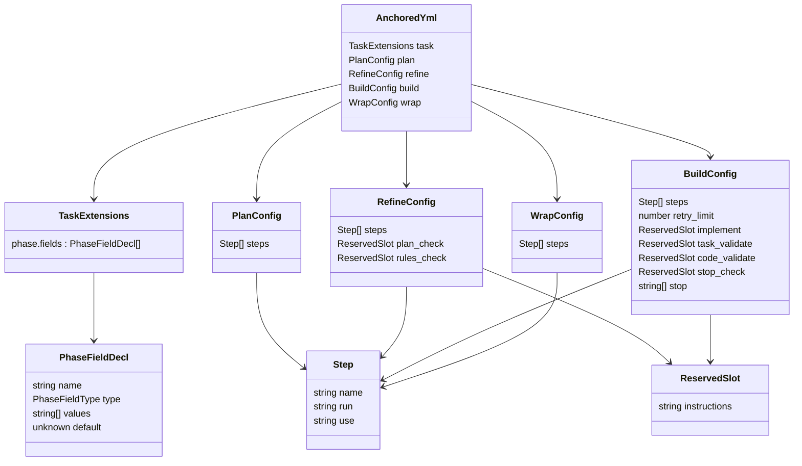

← [schema](_schema.md)

# anchored.yml Schema

Vollständiger Nachschlage-Katalog des Zod-Schemas aus `mcp/src/schema/anchored-yml.ts` — jeder Config-Slot, jedes Feld mit Typ, Default und Constraint. Reine Referenz zum Nachschlagen, nicht zum Durchlesen.

## Top-Level — `AnchoredYml` (`.strict()`)

Unbekannte Top-Level-Keys werden abgelehnt. `parseAnchoredYml`/`safeParseAnchoredYml` parsen `raw ?? {}`, d. h. eine leere/fehlende Datei ergibt das vollständige Default-Objekt.

| Feld | Typ | Default | Bedeutung |
|------|-----|---------|-----------|
| `task` | `TaskExtensions` | `{ phase: { fields: [] } }` | Schema-Erweiterungen (Per-Phase Custom-Fields) |
| `plan` | `PlanConfig` | `{ steps: [] }` | Plan-Stage |
| `refine` | `RefineConfig` | `{ steps: [], plan_check: {}, rules_check: {} }` | Refine-Stage mit Gates |
| `build` | `BuildConfig` | siehe unten | Build-Stage (Implement + Validierung + Stop) |
| `wrap` | `WrapConfig` | `{ steps: [] }` | Wrap-Stage |

## `task` — `TaskExtensions` (`.default`)

| Pfad | Typ | Default | Bedeutung |
|------|-----|---------|-----------|
| `task.phase` | `object` | `{ fields: [] }` | Phasen-Schema-Container |
| `task.phase.fields` | `PhaseFieldDecl[]` | `[]` | Liste benutzerdeklarierter Phasen-Felder |

### `PhaseFieldDecl`

| Feld | Typ | Optional | Constraint |
|------|-----|----------|-----------|
| `name` | `string` | nein | `min(1)`, Regex `^[a-z][a-z0-9_]*$` (snake_case, lowercase + Underscores) |
| `type` | `PhaseFieldType` | nein | siehe Enum |
| `values` | `string[]` | ja | Pflicht (non-empty) wenn `type === 'enum'` |
| `default` | `unknown` | ja | Default-Wert des Feldes |

`.refine`: `type !== 'enum'` ODER (`values !== undefined && values.length > 0`) — Fehlermeldung `"enum-typed fields require a non-empty 'values' array"`.

### `PhaseFieldType` (Enum)

| Wert |
|------|
| `string` |
| `number` |
| `boolean` |
| `enum` |

## `Step` — Schritt-Eintrag (run vs use)

Verwendet in `plan.steps`, `refine.steps`, `build.steps`, `wrap.steps`.

| Feld | Typ | Optional | Constraint |
|------|-----|----------|-----------|
| `name` | `string` | nein | `min(1)` |
| `run` | `string` | ja | `min(1)` — Inline-Prosa-Anweisungen |
| `use` | `string` | ja | `min(1)` — benannte Tool-Referenz (z. B. `anchored/implement`) |

`.refine`: genau eines von `run`/`use` muss gesetzt sein (`Number(run!==undefined) + Number(use!==undefined) === 1`) — Fehlermeldung `'step needs exactly one of run|use'`.

## `ReservedSlot` — Instructions-Only Override (`.strict()`)

| Feld | Typ | Optional |
|------|-----|----------|
| `instructions` | `string` | ja |

`.strict()` lehnt jeden unbekannten Key ab (z. B. Legacy-Flag `enabled`). Default je Verwendung: `{}`.

## `plan` — `PlanConfig` (`.strict()`)

| Feld | Typ | Default |
|------|-----|---------|
| `steps` | `Step[]` | `[]` |

## `refine` — `RefineConfig` (`.strict()`)

| Feld | Typ | Default | Bedeutung |
|------|-----|---------|-----------|
| `steps` | `Step[]` | `[]` | Custom-Schritte |
| `plan_check` | `ReservedSlot` | `{}` | Plan-Validierungs-Gate |
| `rules_check` | `ReservedSlot` | `{}` | Rules-Validierungs-Gate |

## `build` — `BuildConfig` (`.strict()`)

| Feld | Typ | Default | Bedeutung |
|------|-----|---------|-----------|
| `steps` | `Step[]` | `[]` | Custom-Schritte |
| `retry_limit` | `number` | `3` | `int`, `min(1)` — Kappung der Re-Do-Loops bei fehlgeschlagenem Gate |
| `implement` | `ReservedSlot` | `{}` | Per-Phase Implement-Worker (Methodik-Prosa) |
| `task_validate` | `ReservedSlot` | `{}` | AC-Evidence-Gate |
| `code_validate` | `ReservedSlot` | `{}` | Rules/Quality-Gate |
| `stop_check` | `ReservedSlot` | `{}` | Anreicherung des Stop-Condition-Evaluators (Prosa an Default-Brief angehängt) |
| `stop` | `string[]` | `['a decision deviates from the plan']` | Globale Stop-Conditions; je Element `min(1)` |

## Warum

- `stop` ist GLOBAL (eine flache Liste für die gesamte Build-Pipeline), NICHT per-Worker oder per-Phase. Leer/abwesend → vollautonom, kein Selbst-Halt; non-empty → Stopp bei der ERSTEN passenden Bedingung. Ziel ist Minimierung der Stops, daher der mitgelieferte Default mit genau einer Regel.
- `stop_check` (Slot, der den Evaluator anreichert) ist verschieden von `stop` (das Regel-Array, gegen das der Evaluator urteilt).
- Alle Config-Objekte außer `ReservedSlot`-Instanzen und das innere `task.phase` sind `.strict()` — Legacy-Keys (`enabled`, `commit`) und Tippfehler werden mit klarer Fehlermeldung abgewiesen.

