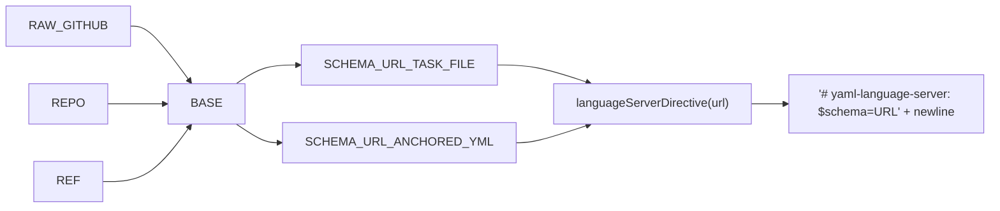

← [schema](_schema.md)

# Schema-URLs

Kanonische GitHub-raw-URLs der publizierten JSON-Schemas (`task-file-v2.schema.json` + `anchored-yml.schema.json`) plus ein Helfer, der daraus die `# yaml-language-server: $schema=...`-Direktive baut, die IDEs zur Auto-Validierung lesen. Diese URLs sind Teil des Vertrags: Verschieben der Schema-Dateien bricht die IDE-Validierung bestehender User-Dateien.

## Was

- `RAW_GITHUB` ist die Konstante `'https://raw.githubusercontent.com'`.
- `REPO` ist `'chafoo/anchored'`, `REF` ist `'main'`.
- `BASE` setzt sich aus `${RAW_GITHUB}/${REPO}/${REF}/plugin/references/schema` zusammen — also `https://raw.githubusercontent.com/chafoo/anchored/main/plugin/references/schema`.
- `SCHEMA_URL_TASK_FILE` ist `${BASE}/task-file-v2.schema.json` und zeigt auf das [task-file-Schema](./task-file-schema.md).
- `SCHEMA_URL_ANCHORED_YML` ist `${BASE}/anchored-yml.schema.json` und zeigt auf das [anchored-yml-Schema](./anchored-yml-schema.md).
- Laut Kommentar behält der URL-Dateiname `task-file-v2.schema.json` das Legacy-Suffix `v2` bewusst bei (für IDE-Cache-Stabilität), während interne Symbole das Suffix fallenlassen.
- `languageServerDirective(schemaUrl: string)` gibt die Zeile `# yaml-language-server: $schema=${schemaUrl}\n` zurück — inklusive abschließendem Zeilenumbruch.
- `RAW_GITHUB`, `REPO`, `REF` und `BASE` sind modul-privat; exportiert sind nur die beiden URL-Konstanten und `languageServerDirective`.

## Wie

### Benutzung

Aufrufer importieren eine der URL-Konstanten und reichen sie an `languageServerDirective` weiter; das Ergebnis wird direkt vor den Datei-Body konkateniert. Laut Modul-Kommentar sind die Konsumenten der plan-agent (bäckt den Header in jede generierte Task-Datei), `anchored init` (für die Default-`anchored.yml`, "when it lands") und die README-Dokumentation.

```javascript
const header = languageServerDirective(SCHEMA_URL_TASK_FILE);
// => "# yaml-language-server: $schema=https://raw.githubusercontent.com/chafoo/anchored/main/plugin/references/schema/task-file-v2.schema.json\n"
const fileContent = header + body;
```

### Funktion

Die URLs sind reine String-Konkatenation aus den festen Bausteinen; `languageServerDirective` umhüllt eine übergebene URL mit der Direktiven-Syntax und dem `\n`.



## Warum

Der Modul-Kommentar nennt zwei nicht-offensichtliche Gründe:

- Die URL zeigt auf `plugin/references/schema`, weil der Build die Schemas von `mcp/dist/schema/` dorthin kopiert, damit sie in Git landen und im Marketplace-Plugin-Payload ausgeliefert werden. Der Pfad ist Teil des Vertrags — das Verschieben der Dateien bricht die IDE-Validierung bestehender User.
- Der Dateiname behält `task-file-v2` für IDE-Cache-Stabilität: bestehende `# yaml-language-server: $schema=...`-Header in publizierten Task-Dateien lösen gegen genau diesen Pfad auf; ein Umbenennen würde deren Validierung invalidieren. Daher trägt das URL-Artefakt das Legacy-Suffix absichtlich weiter, obwohl die internen Symbole es nicht tun.
